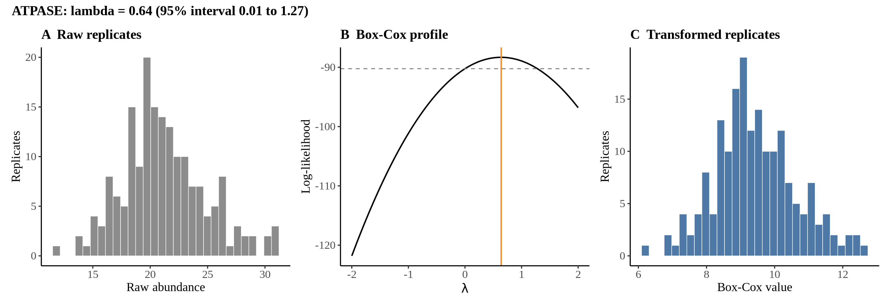
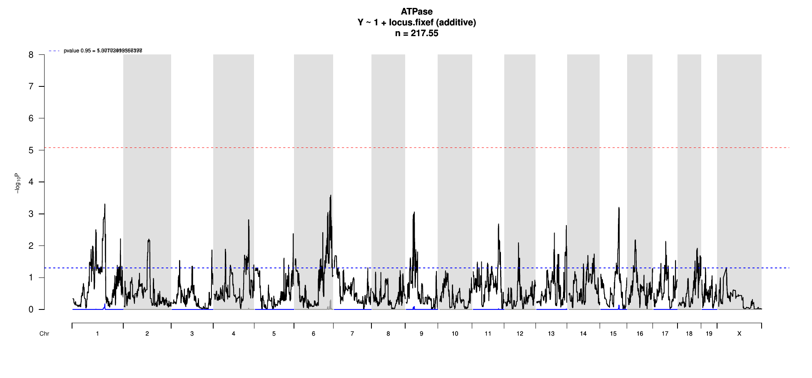

# Protein Overview

The mouse protein ATPase, categorized under the symbol **Atp5a1**, is a component of the ATP synthase complex vital for ATP production in mitochondria. It is also known by various aliases, including **ATPase H+ transporting mitochondrial F1 complex alpha subunit 1** and **F1-ATPase alpha subunit**. The protein plays a crucial role in cellular energy metabolism.

# Data and normalization

Replicate measurements were Box-Cox transformed with a protein-specific λ = **0.64** (95% likelihood interval 0.01 to 1.27), estimated on the individual replicates (`boxcox(y ~ strain)`, no +1 shift). The strain phenotype is the mean of the transformed replicates and the strain noise used for the wisam weights is their variance.

{fig-align="center" width="95%"}

::: {.fig-downloads}
Download: [PNG](figures/repbc_2026-10-01/proteins/ATPase_normalization.png){download="ATPase_normalization.png"} · [PDF](figures/repbc_2026-10-01/proteins/ATPase_normalization.pdf){download="ATPase_normalization.pdf"}
:::

## Heritability

Broad-sense heritability of the protein is **0.33** (95% CI 0.20–0.48; BH-adjusted P 2.69e-06). Its paired transcript is **Atp1a1** (array probe `1423653_PM_at`, paired from the measured peptide `VDNSSLTGESEPQTR`). Transcript H² is **0.51** (95% CI 0.36–0.64; BH-adjusted P 1.49e-12).

# pQTL genome scan

Genome scan of the Box-Cox phenotype with wisam weights (miqtl `scan.h2lmm`, 11 imputations); significance thresholds come from 1000 permutations (GEV fit to the permutation maxima of −log10 P). Strongest locus: chr6:139.86 Mb, P = 2.57e-04, adjusted P = 4.99e-01; 95% threshold = 5.08 (−log10 P).

{fig-align="center" width="95%"}

::: {.fig-downloads}
Download: [PDF](figures/repbc_2026-10-01/per_protein/ATPase/ATPase_genome_scan.pdf){download="ATPase_genome_scan.pdf"} · [PDF](figures/repbc_2026-10-01/per_protein/ATPase/ATPase_scan_by_chromosome.pdf){download="ATPase_scan_by_chromosome.pdf"}
:::

# Significant peak(s)

No genome-wide significant pQTL for this protein (adjusted P ≥ 0.05), so credible intervals, Merge, TIMBR and mediation were not run.
