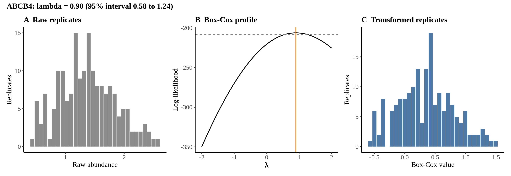
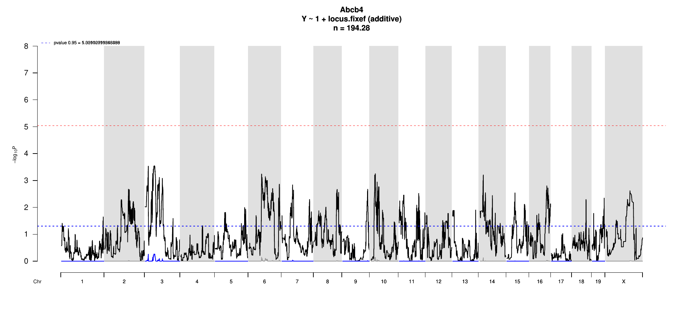

# Protein Overview

The mouse protein Abcb4 (ATP-binding cassette sub-family B member 4) is encoded by the Abcb4 gene. It is also known by aliases such as Mdr2 (Multidrug resistance protein 2) and Abcb4a. This protein is involved in the transport of various substrates across cell membranes and plays a crucial role in the excretion of phospholipids and other compounds in the liver.

# Data and normalization

Replicate measurements were Box-Cox transformed with a protein-specific λ = **0.90** (95% likelihood interval 0.58 to 1.24), estimated on the individual replicates (`boxcox(y ~ strain)`, no +1 shift). The strain phenotype is the mean of the transformed replicates and the strain noise used for the wisam weights is their variance.

{fig-align="center" width="95%"}

::: {.fig-downloads}
Download: [PNG](figures/repbc_2026-10-01/proteins/Abcb4_normalization.png){download="Abcb4_normalization.png"} · [PDF](figures/repbc_2026-10-01/proteins/Abcb4_normalization.pdf){download="Abcb4_normalization.pdf"}
:::

## Heritability

Broad-sense heritability of the protein is **0.46** (95% CI 0.28–0.61; BH-adjusted P 6.58e-11). Its paired transcript is **Abcb4** (array probe `1449818_PM_at`, paired from the measured peptide `IATEAIENIR`). Transcript H² is **0.28** (95% CI 0.10–0.42; BH-adjusted P 1.37e-04).

# pQTL genome scan

Genome scan of the Box-Cox phenotype with wisam weights (miqtl `scan.h2lmm`, 11 imputations); significance thresholds come from 1000 permutations (GEV fit to the permutation maxima of −log10 P). Strongest locus: chr3:46.19 Mb, P = 2.83e-04, adjusted P = 5.42e-01; 95% threshold = 5.04 (−log10 P).

{fig-align="center" width="95%"}

::: {.fig-downloads}
Download: [PDF](figures/repbc_2026-10-01/per_protein/Abcb4/Abcb4_genome_scan.pdf){download="Abcb4_genome_scan.pdf"} · [PDF](figures/repbc_2026-10-01/per_protein/Abcb4/Abcb4_scan_by_chromosome.pdf){download="Abcb4_scan_by_chromosome.pdf"}
:::

# Significant peak(s)

No genome-wide significant pQTL for this protein (adjusted P ≥ 0.05), so credible intervals, Merge, TIMBR and mediation were not run.
