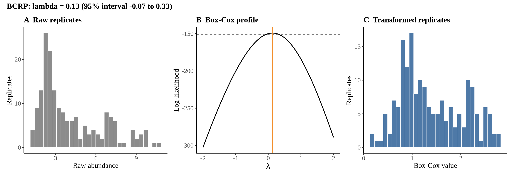
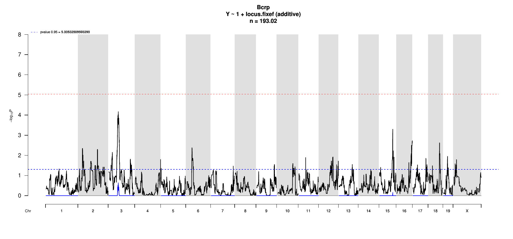

# Protein Overview

The Bcrp protein (Breast cancer resistance protein) in mice is encoded by the **Bcrp** gene, also known by its aliases **Abcg2** and **Bcrp1**. This protein is a member of the ATP-binding cassette (ABC) transporters and plays a significant role in drug transport and multidrug resistance by facilitating the efflux of various substrates across cellular membranes.

# Data and normalization

Replicate measurements were Box-Cox transformed with a protein-specific λ = **0.13** (95% likelihood interval -0.07 to 0.33), estimated on the individual replicates (`boxcox(y ~ strain)`, no +1 shift). The strain phenotype is the mean of the transformed replicates and the strain noise used for the wisam weights is their variance.

{fig-align="center" width="95%"}

::: {.fig-downloads}
Download: [PNG](figures/repbc_2026-10-01/proteins/Bcrp_normalization.png){download="Bcrp_normalization.png"} · [PDF](figures/repbc_2026-10-01/proteins/Bcrp_normalization.pdf){download="Bcrp_normalization.pdf"}
:::

## Heritability

Broad-sense heritability of the protein is **0.87** (95% CI 0.79–0.91; BH-adjusted P 9.70e-49). Its paired transcript is **Abcg2** (array probe `1422906_PM_at`, paired from the measured peptide `SSLLDVLAAR`). Transcript H² is **0.47** (95% CI 0.32–0.60; BH-adjusted P 6.33e-09).

# pQTL genome scan

Genome scan of the Box-Cox phenotype with wisam weights (miqtl `scan.h2lmm`, 11 imputations); significance thresholds come from 1000 permutations (GEV fit to the permutation maxima of −log10 P). Strongest locus: chr3:61.22 Mb, P = 6.73e-05, adjusted P = 2.31e-01; 95% threshold = 5.04 (−log10 P).

{fig-align="center" width="95%"}

::: {.fig-downloads}
Download: [PDF](figures/repbc_2026-10-01/per_protein/Bcrp/Bcrp_genome_scan.pdf){download="Bcrp_genome_scan.pdf"} · [PDF](figures/repbc_2026-10-01/per_protein/Bcrp/Bcrp_scan_by_chromosome.pdf){download="Bcrp_scan_by_chromosome.pdf"}
:::

# Significant peak(s)

No genome-wide significant pQTL for this protein (adjusted P ≥ 0.05), so credible intervals, Merge, TIMBR and mediation were not run.
