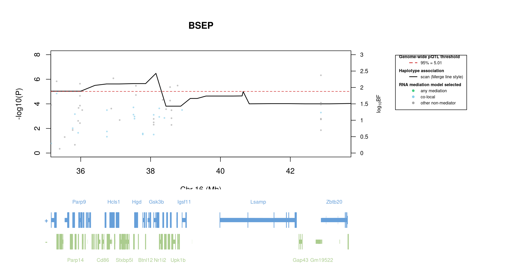

# Protein Overview

The mouse protein Bsep, also known as Bile Salt Export Pump, is encoded by the gene **Abcb11**. It has several aliases, including **Abcb11** and **Bsep**. This protein is primarily involved in the transport of bile acids from the liver to the bile ducts, playing a crucial role in bile formation and overall liver function.

# Data and normalization

Replicate measurements were Box-Cox transformed with a protein-specific λ = **0.55** (95% likelihood interval 0.10 to 1.01), estimated on the individual replicates (`boxcox(y ~ strain)`, no +1 shift). The strain phenotype is the mean of the transformed replicates and the strain noise used for the wisam weights is their variance.

{fig-align="center" width="95%"}

::: {.fig-downloads}
Download: [PNG](figures/repbc_2026-10-01/proteins/Bsep_normalization.png){download="Bsep_normalization.png"} · [PDF](figures/repbc_2026-10-01/proteins/Bsep_normalization.pdf){download="Bsep_normalization.pdf"}
:::

## Heritability

Broad-sense heritability of the protein is **0.58** (95% CI 0.41–0.69; BH-adjusted P 1.69e-16). Its paired transcript is **Abcb11** (array probe `1449817_PM_at`, paired from the measured peptide `STALQLIQR`). Transcript H² is **0.22** (95% CI 0.06–0.36; BH-adjusted P 4.24e-03).

# pQTL genome scan

Genome scan of the Box-Cox phenotype with wisam weights (miqtl `scan.h2lmm`, 11 imputations); significance thresholds come from 1000 permutations (GEV fit to the permutation maxima of −log10 P). Strongest locus: chr16:38.15 Mb, P = 3.32e-07, adjusted P = 1.48e-03; 95% threshold = 5.01 (−log10 P).

{fig-align="center" width="95%"}

::: {.fig-downloads}
Download: [PDF](figures/repbc_2026-10-01/per_protein/Bsep/Bsep_genome_scan.pdf){download="Bsep_genome_scan.pdf"} · [PDF](figures/repbc_2026-10-01/per_protein/Bsep/Bsep_scan_by_chromosome.pdf){download="Bsep_scan_by_chromosome.pdf"}
:::

# Significant peak(s)

## Chromosome 16 peak (UNC26665635)

| Peak position | −log10(P) | Adjusted P | 90% credible interval | Encoding gene | Gene location | pQTL type |
|---|---:|---:|---|---|---|---|
| chr16:38.15 Mb | 6.48 | 1.48e-03 | 35.14–43.74 Mb | Abcb11 | chr2:69.24–69.34 Mb | **trans** |

A pQTL is **cis** when the gene encoding the protein lies within the credible interval and **trans** otherwise.

{fig-align="center" width="95%"}

::: {.fig-downloads}
Download: [PDF](figures/repbc_2026-10-01/per_protein/Bsep/Bsep_ci_scans_full.pdf){download="Bsep_ci_scans_full.pdf"}
:::

{fig-align="center" width="95%"}

::: {.fig-downloads}
Download: [PNG](figures/repbc_2026-10-01/per_protein/Bsep/Bsep_ci_genes_full_chr16.png){download="Bsep_ci_genes_full_chr16.png"}
:::

### Merge / diplotype fine-mapping

{fig-align="center" width="95%"}

::: {.fig-downloads}
Download: [PNG](figures/repbc_2026-10-01/per_protein/Bsep/Bsep_mergeplot_full_UNC26665635.png){download="Bsep_mergeplot_full_UNC26665635.png"}
:::

### TIMBR allelic series

_TIMBR sweep complete; plots will appear once Merge profiles are available._

### RNA mediation

{fig-align="center" width="95%"}

::: {.fig-downloads}
Download: [PNG](figures/repbc_2026-10-01/per_protein/Bsep/Bsep_mediation_overlay_bf_chr16_withgenes.png){download="Bsep_mediation_overlay_bf_chr16_withgenes.png"} · [PNG](figures/repbc_2026-10-01/per_protein/Bsep/Bsep_mediation_overlay_bf_chr16_nogenes.png){download="Bsep_mediation_overlay_bf_chr16_nogenes.png"}
:::

{fig-align="center" width="95%"}

::: {.fig-downloads}
Download: [PDF](figures/repbc_2026-10-01/per_protein/Bsep/Bsep_targeted_mediation_chr16_posterior_bars.pdf){download="Bsep_targeted_mediation_chr16_posterior_bars.pdf"}
:::
