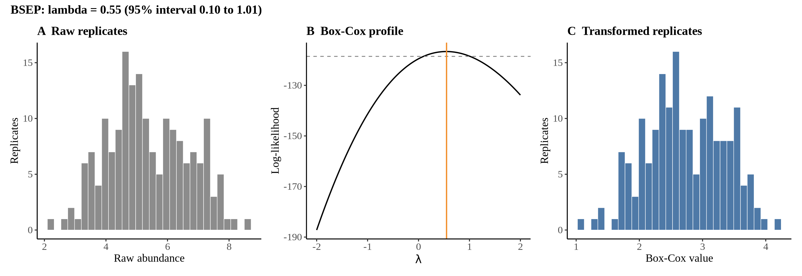
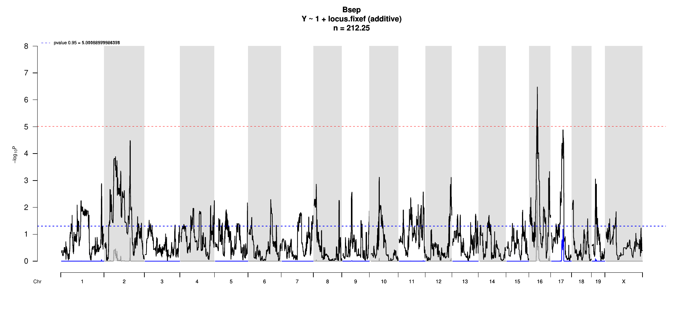
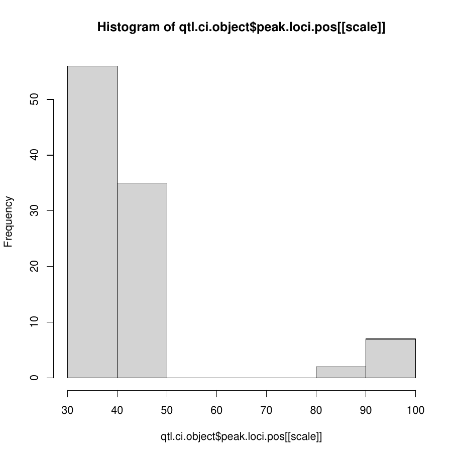
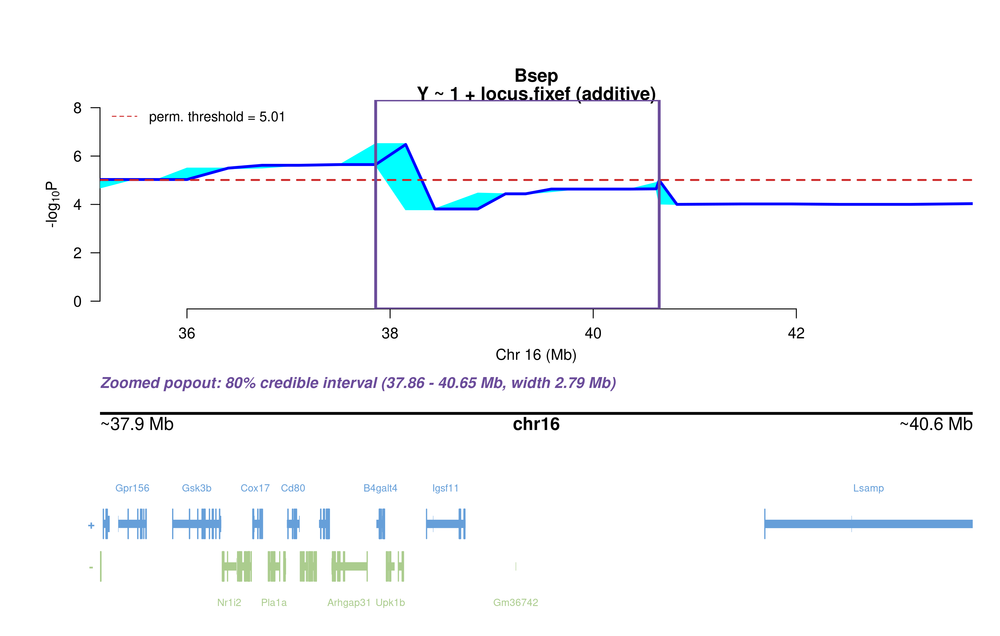
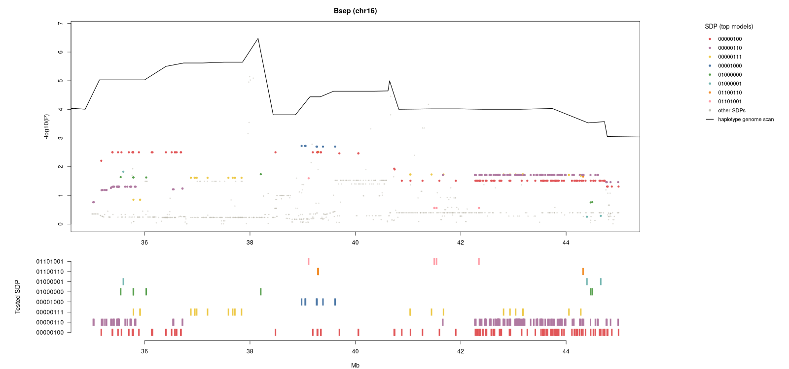
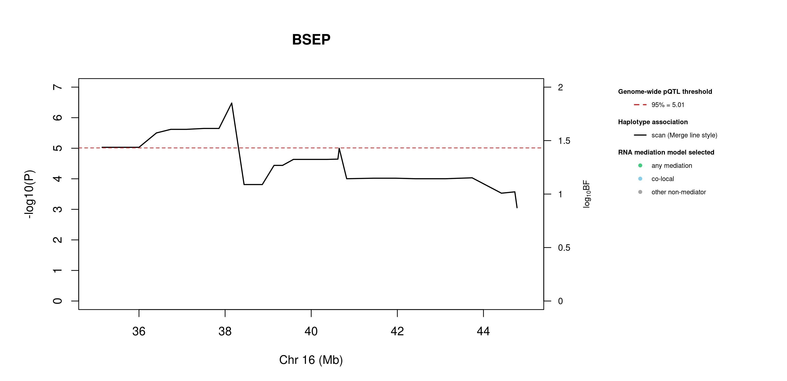
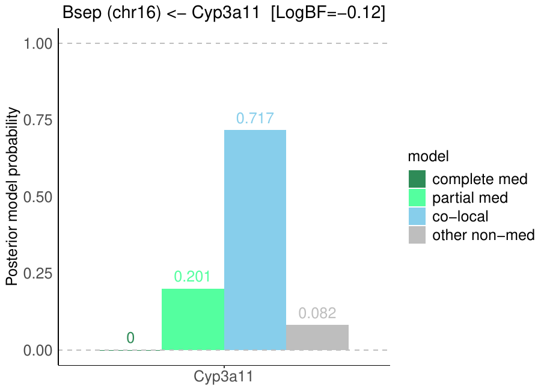

# Protein Overview

The mouse protein Bsep, also known as Bile Salt Export Pump, is encoded by the gene **Abcb11**. It has several aliases, including **Abcb11** and **Bsep**. This protein is primarily involved in the transport of bile acids from the liver to the bile ducts, playing a crucial role in bile formation and overall liver function.

# Data and normalization

Replicate measurements were Box-Cox transformed with a protein-specific λ = **0.55** (95% likelihood interval 0.10 to 1.01), estimated on the individual replicates (`boxcox(y ~ strain)`, no +1 shift). The strain phenotype is the mean of the transformed replicates and the strain noise used for the wisam weights is their variance.

{fig-align="center" width="95%"}

::: {.fig-downloads}
Download: [PNG](figures/repbc_2026-10-01/proteins/Bsep_normalization.png){download="Bsep_normalization.png"} · [PDF](figures/repbc_2026-10-01/proteins/Bsep_normalization.pdf){download="Bsep_normalization.pdf"}
:::

## Heritability

Broad-sense heritability of the protein is **0.58** (95% CI 0.41–0.69; BH-adjusted P 1.69e-16). Its paired transcript is **Abcb11** (array probe `1449817_PM_at`, paired from the measured peptide `STALQLIQR`). Transcript H² is **0.22** (95% CI 0.06–0.36; BH-adjusted P 4.24e-03).

# pQTL genome scan

Genome scan of the Box-Cox phenotype with wisam weights (miqtl `scan.h2lmm`, 11 imputations); significance thresholds come from 1000 permutations (GEV fit to the permutation maxima of −log10 P). Strongest locus: chr16:38.15 Mb, P = 3.32e-07, adjusted P = 1.48e-03; 95% threshold = 5.01 (−log10 P).

{fig-align="center" width="95%"}

::: {.fig-downloads}
Download: [PDF](figures/repbc_2026-10-01/per_protein/Bsep/Bsep_genome_scan.pdf){download="Bsep_genome_scan.pdf"} · [PDF](figures/repbc_2026-10-01/per_protein/Bsep/Bsep_scan_by_chromosome.pdf){download="Bsep_scan_by_chromosome.pdf"}
:::

# Significant peak(s)

## Chromosome 16 peak (UNC26665635)

| Peak position | −log10(P) | Adjusted P | 90% credible interval | Encoding gene | Gene location | pQTL type |
|---|---:|---:|---|---|---|---|
| chr16:38.15 Mb | 6.48 | 1.48e-03 | 35.14–43.74 Mb | Abcb11 | chr2:69.24–69.34 Mb | **trans** |

A pQTL is **cis** when the gene encoding the protein lies within the credible interval and **trans** otherwise.

{fig-align="center" width="95%"}

::: {.fig-downloads}
Download: [PDF](figures/repbc_2026-10-01/per_protein/Bsep/Bsep_ci_scans_full.pdf){download="Bsep_ci_scans_full.pdf"}
:::

{fig-align="center" width="95%"}

::: {.fig-downloads}
Download: [PNG](figures/repbc_2026-10-01/per_protein/Bsep/Bsep_ci_genes_full_chr16.png){download="Bsep_ci_genes_full_chr16.png"}
:::

### Merge / diplotype fine-mapping

{fig-align="center" width="95%"}

::: {.fig-downloads}
Download: [PNG](figures/repbc_2026-10-01/per_protein/Bsep/Bsep_mergeplot_full_UNC26665635.png){download="Bsep_mergeplot_full_UNC26665635.png"}
:::

In plain terms, the strongest Merge strain distribution pattern (SDP) splits the eight founders into **allele 0**: A/J, CAST/EiJ; **allele 3**: NOD/ShiLtJ, NZO/HlLtJ; **allele 1**: C57BL/6J; **allele 2**: 129S1/SvImJ; **allele 4**: PWK/PhJ; **allele 5**: WSB/EiJ. That is 6 functional alleles: founders in the same group are inferred to carry the same functional allele at this locus.

### TIMBR allelic series

{fig-align="center" width="95%"}

::: {.fig-downloads}
Download: [JPG](figures/repbc_2026-10-01/per_protein/Bsep/Bsep_timbr_ci_bf_dot_chr16.jpg){download="Bsep_timbr_ci_bf_dot_chr16.jpg"}
:::

{fig-align="center" width="95%"}

::: {.fig-downloads}
Download: [PNG](figures/repbc_2026-10-01/per_protein/Bsep/Bsep_timbr_ci_bf_dot_chr16.png){download="Bsep_timbr_ci_bf_dot_chr16.png"}
:::

{fig-align="center" width="95%"}

::: {.fig-downloads}
Download: [JPG](figures/repbc_2026-10-01/per_protein/Bsep/Bsep_timbr_ci_dot_chr16.jpg){download="Bsep_timbr_ci_dot_chr16.jpg"}
:::

{fig-align="center" width="95%"}

::: {.fig-downloads}
Download: [PNG](figures/repbc_2026-10-01/per_protein/Bsep/Bsep_timbr_ci_dot_chr16.png){download="Bsep_timbr_ci_dot_chr16.png"}
:::

The highest-posterior TIMBR allelic series at the peak splits the founders into **allele 0**: A/J, 129S1/SvImJ, CAST/EiJ, PWK/PhJ; **allele 1**: C57BL/6J, NOD/ShiLtJ, NZO/HlLtJ, WSB/EiJ. That is 2 functional alleles: founders in the same group are inferred to carry the same functional allele at this locus.

**Number of functional alleles.** At the lead locus (UNC26665635, 38.15 Mb) the posterior probability of a bi-allelic series (two functional alleles) is 0.30, tri-allelic 0.35, and four or more alleles 0.35; a single allele (no QTL effect) has probability 0.00. For comparison, the Chinese-restaurant-process prior gives 0.50 / 0.29 / 0.14 for one / two / three alleles, so the data move weight away from a single allele. The locus in the credible interval whose single best allelic series has the highest posterior probability is JAX00068722 (41.46 Mb; series 0,1,0,1,1,0,0,0, P = 0.29); there bi-allelic = 0.45, tri-allelic = 0.32, four or more = 0.21.

{fig-align="center" width="95%"}

::: {.fig-downloads}
Download: [PNG](figures/repbc_2026-10-01/per_protein/Bsep/Bsep_allele_number_prior_posterior_chr16.png){download="Bsep_allele_number_prior_posterior_chr16.png"} · [PDF](figures/repbc_2026-10-01/per_protein/Bsep/Bsep_allele_number_prior_posterior_chr16.pdf){download="Bsep_allele_number_prior_posterior_chr16.pdf"}
:::

{fig-align="center" width="95%"}

::: {.fig-downloads}
Download: [PNG](figures/repbc_2026-10-01/per_protein/Bsep/Bsep_allele_number_across_ci_chr16.png){download="Bsep_allele_number_across_ci_chr16.png"} · [PDF](figures/repbc_2026-10-01/per_protein/Bsep/Bsep_allele_number_across_ci_chr16.pdf){download="Bsep_allele_number_across_ci_chr16.pdf"}
:::

{fig-align="center" width="95%"}

::: {.fig-downloads}
Download: [PNG](figures/repbc_2026-10-01/per_protein/Bsep/Bsep_haplotype_lead_UNC26665635_chr16.png){download="Bsep_haplotype_lead_UNC26665635_chr16.png"} · [PDF](figures/repbc_2026-10-01/per_protein/Bsep/Bsep_haplotype_lead_UNC26665635_chr16.pdf){download="Bsep_haplotype_lead_UNC26665635_chr16.pdf"}
:::

{fig-align="center" width="95%"}

::: {.fig-downloads}
Download: [PNG](figures/repbc_2026-10-01/per_protein/Bsep/Bsep_haplotype_best_JAX00068722_chr16.png){download="Bsep_haplotype_best_JAX00068722_chr16.png"} · [PDF](figures/repbc_2026-10-01/per_protein/Bsep/Bsep_haplotype_best_JAX00068722_chr16.pdf){download="Bsep_haplotype_best_JAX00068722_chr16.pdf"}
:::

### RNA mediation

{fig-align="center" width="95%"}

::: {.fig-downloads}
Download: [PNG](figures/repbc_2026-10-01/per_protein/Bsep/Bsep_mediation_overlay_bf_chr16_nogenes.png){download="Bsep_mediation_overlay_bf_chr16_nogenes.png"} · [PNG](figures/repbc_2026-10-01/per_protein/Bsep/Bsep_mediation_overlay_bf_chr16_withgenes.png){download="Bsep_mediation_overlay_bf_chr16_withgenes.png"} · [CSV](figures/repbc_2026-10-01/per_protein/Bsep/Bsep_mediation_bf_points_chr16.csv){download="Bsep_mediation_bf_points_chr16.csv"}
:::

0 candidate transcripts lie in the credible interval. **0** have a best-model log10 Bayes factor ≥ 0.5 and mediation has the highest posterior probability among the model classes; these are labelled in the figure: none.. *Mediation* means the transcript is best explained as lying on the path from the QTL to the protein; *co-local* means it shares the QTL without mediating; log10 BF is the evidence for the best-supported model against the null.

{fig-align="center" width="95%"}

::: {.fig-downloads}
Download: [PDF](figures/repbc_2026-10-01/per_protein/Bsep/Bsep_protein_mediation_chr16_posterior_bars.pdf){download="Bsep_protein_mediation_chr16_posterior_bars.pdf"}
:::
