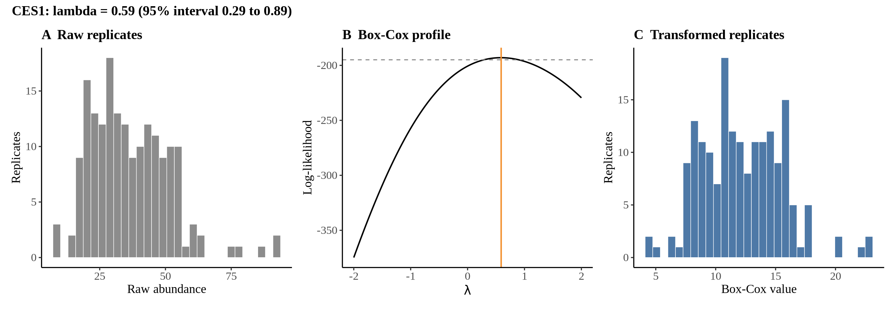
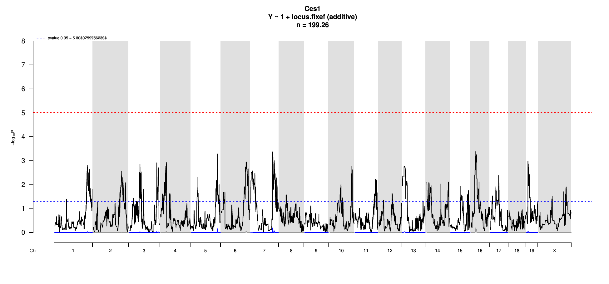

# Protein Overview

The mouse protein Ces1, encoded by the gene **Ces1**, is also known by its aliases **Ces1d** and **Ces1e**. This protein is a member of the carboxylesterase family and is involved in the hydrolysis of ester and amide bonds. Its primary role is associated with lipid metabolism and detoxification processes.

# Data and normalization

Replicate measurements were Box-Cox transformed with a protein-specific λ = **0.59** (95% likelihood interval 0.29 to 0.89), estimated on the individual replicates (`boxcox(y ~ strain)`, no +1 shift). The strain phenotype is the mean of the transformed replicates and the strain noise used for the wisam weights is their variance.

{fig-align="center" width="95%"}

::: {.fig-downloads}
Download: [PNG](figures/repbc_2026-10-01/proteins/Ces1_normalization.png){download="Ces1_normalization.png"} · [PDF](figures/repbc_2026-10-01/proteins/Ces1_normalization.pdf){download="Ces1_normalization.pdf"}
:::

## Heritability

Broad-sense heritability of the protein is **0.65** (95% CI 0.53–0.75; BH-adjusted P 2.70e-21). No transcript pair is defined for this protein (peptide matches Ces1d/Ces1e; the array has no Ces probes).

# pQTL genome scan

Genome scan of the Box-Cox phenotype with wisam weights (miqtl `scan.h2lmm`, 11 imputations); significance thresholds come from 1000 permutations (GEV fit to the permutation maxima of −log10 P). Strongest locus: chr16:28.27 Mb, P = 4.15e-04, adjusted P = 6.35e-01; 95% threshold = 5.01 (−log10 P).

{fig-align="center" width="95%"}

::: {.fig-downloads}
Download: [PDF](figures/repbc_2026-10-01/per_protein/Ces1/Ces1_genome_scan.pdf){download="Ces1_genome_scan.pdf"} · [PDF](figures/repbc_2026-10-01/per_protein/Ces1/Ces1_scan_by_chromosome.pdf){download="Ces1_scan_by_chromosome.pdf"}
:::

# Significant peak(s)

No genome-wide significant pQTL for this protein (adjusted P ≥ 0.05), so credible intervals, Merge, TIMBR and mediation were not run.
