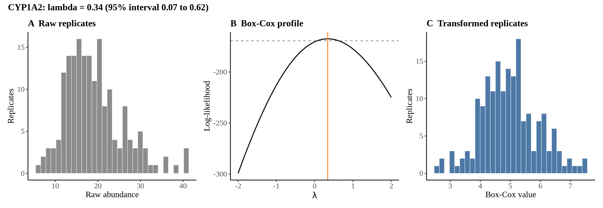
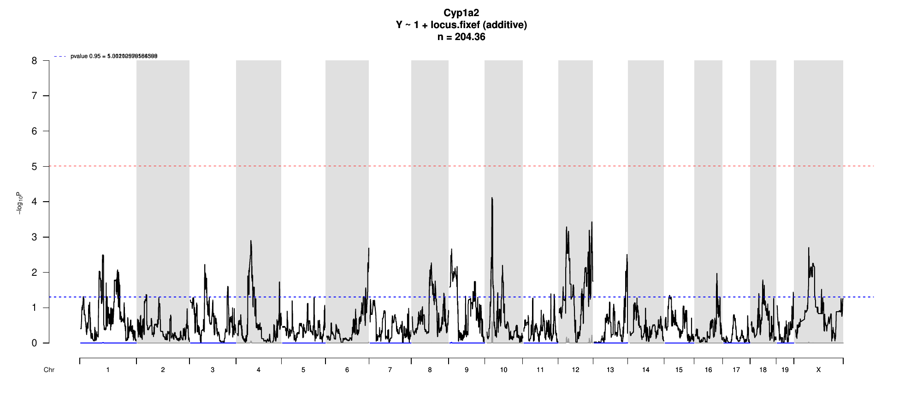

# Protein Overview

The mouse protein Cyp1a2, encoded by the gene **Cyp1a2**, is a member of the cytochrome P450 family involved in the metabolism of various substances, including drugs and endogenous compounds. It is known by several aliases, including **Cyp1a2**. This protein plays a critical role in the detoxification of environmental chemicals and the metabolism of xenobiotics.

# Data and normalization

Replicate measurements were Box-Cox transformed with a protein-specific λ = **0.34** (95% likelihood interval 0.07 to 0.62), estimated on the individual replicates (`boxcox(y ~ strain)`, no +1 shift). The strain phenotype is the mean of the transformed replicates and the strain noise used for the wisam weights is their variance.

{fig-align="center" width="95%"}

::: {.fig-downloads}
Download: [PNG](figures/repbc_2026-10-01/proteins/Cyp1a2_normalization.png){download="Cyp1a2_normalization.png"} · [PDF](figures/repbc_2026-10-01/proteins/Cyp1a2_normalization.pdf){download="Cyp1a2_normalization.pdf"}
:::

## Heritability

Broad-sense heritability of the protein is **0.62** (95% CI 0.49–0.75; BH-adjusted P 1.57e-19). Its paired transcript is **Cyp1a2** (array probe `1450715_PM_at`, paired from the measured peptide `NSIQDITSALFK`). Transcript H² is **0.16** (95% CI 0.02–0.30; BH-adjusted P 1.99e-02).

# pQTL genome scan

Genome scan of the Box-Cox phenotype with wisam weights (miqtl `scan.h2lmm`, 11 imputations); significance thresholds come from 1000 permutations (GEV fit to the permutation maxima of −log10 P). Strongest locus: chr10:24.70 Mb, P = 7.60e-05, adjusted P = 2.48e-01; 95% threshold = 5.01 (−log10 P).

{fig-align="center" width="95%"}

::: {.fig-downloads}
Download: [PDF](figures/repbc_2026-10-01/per_protein/Cyp1a2/Cyp1a2_genome_scan.pdf){download="Cyp1a2_genome_scan.pdf"} · [PDF](figures/repbc_2026-10-01/per_protein/Cyp1a2/Cyp1a2_scan_by_chromosome.pdf){download="Cyp1a2_scan_by_chromosome.pdf"}
:::

# Significant peak(s)

No genome-wide significant pQTL for this protein (adjusted P ≥ 0.05), so credible intervals, Merge, TIMBR and mediation were not run.
