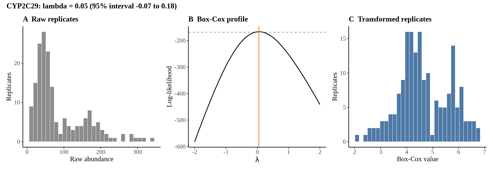
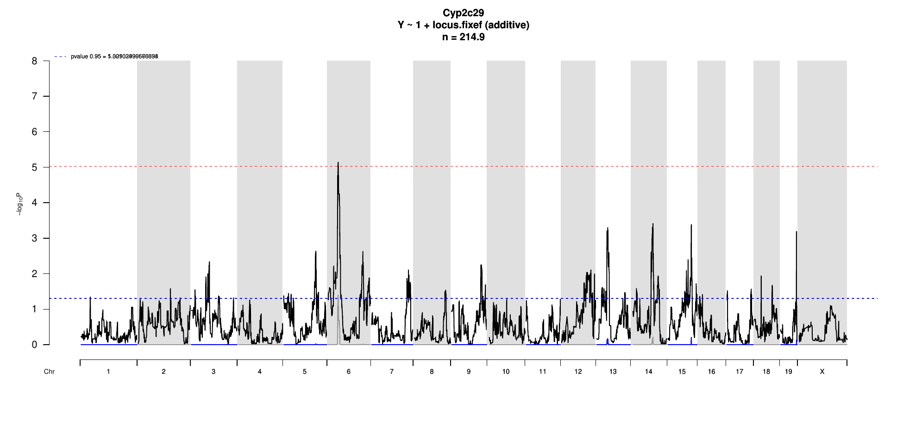
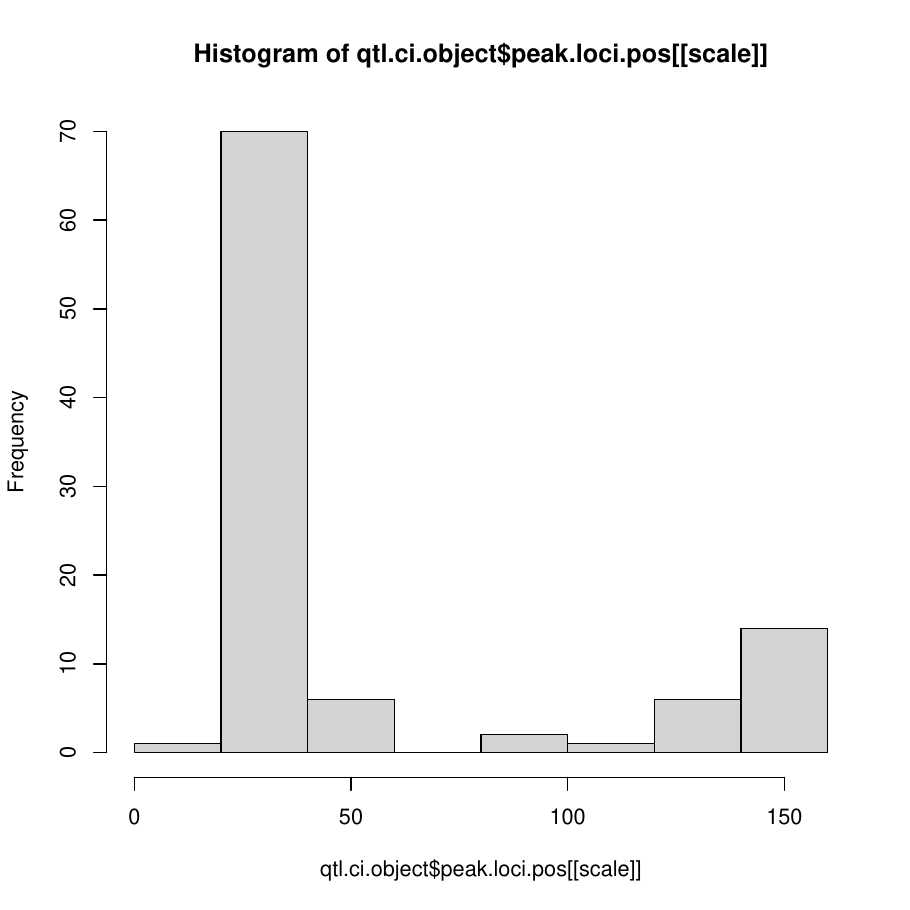
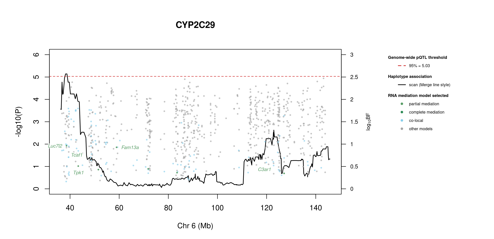
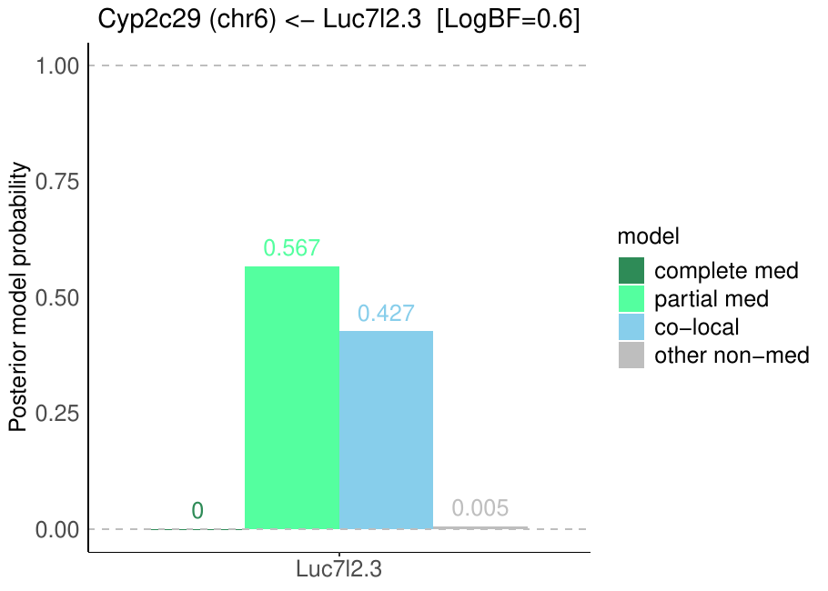

# Protein Overview

The mouse protein Cyp2c29, encoded by the gene **Cyp2c29**, is a member of the cytochrome P450 superfamily of enzymes involved in the metabolism of various substrates, including drugs and fatty acids. Its aliases include **CYP2C29**, **Cyp2c**, and **Cyp2c29a1**. This protein plays a significant role in the oxidative metabolism of xenobiotics and endogenous compounds.

# Data and normalization

Replicate measurements were Box-Cox transformed with a protein-specific λ = **0.05** (95% likelihood interval -0.07 to 0.18), estimated on the individual replicates (`boxcox(y ~ strain)`, no +1 shift). The strain phenotype is the mean of the transformed replicates and the strain noise used for the wisam weights is their variance.

{fig-align="center" width="95%"}

::: {.fig-downloads}
Download: [PNG](figures/repbc_2026-10-01/proteins/Cyp2c29_normalization.png){download="Cyp2c29_normalization.png"} · [PDF](figures/repbc_2026-10-01/proteins/Cyp2c29_normalization.pdf){download="Cyp2c29_normalization.pdf"}
:::

## Heritability

Broad-sense heritability of the protein is **0.93** (95% CI 0.88–0.95; BH-adjusted P 5.69e-65). Its paired transcript is **Cyp2c29** (array probe `1417651_PM_at`, paired from the measured peptide `NISQSFTNFSK`). Transcript H² is **0.33** (95% CI 0.16–0.47; BH-adjusted P 1.47e-05).

# pQTL genome scan

Genome scan of the Box-Cox phenotype with wisam weights (miqtl `scan.h2lmm`, 11 imputations); significance thresholds come from 1000 permutations (GEV fit to the permutation maxima of −log10 P). Strongest locus: chr6:38.19 Mb, P = 7.28e-06, adjusted P = 4.02e-02; 95% threshold = 5.03 (−log10 P).

{fig-align="center" width="95%"}

::: {.fig-downloads}
Download: [PDF](figures/repbc_2026-10-01/per_protein/Cyp2c29/Cyp2c29_genome_scan.pdf){download="Cyp2c29_genome_scan.pdf"} · [PDF](figures/repbc_2026-10-01/per_protein/Cyp2c29/Cyp2c29_scan_by_chromosome.pdf){download="Cyp2c29_scan_by_chromosome.pdf"}
:::

# Significant peak(s)

## Chromosome 6 peak (UNC10908306)

| Peak position | −log10(P) | Adjusted P | 90% credible interval | Encoding gene | Gene location | pQTL type |
|---|---:|---:|---|---|---|---|
| chr6:38.19 Mb | 5.14 | 4.02e-02 | 36.73–144.32 Mb | Cyp2c29 | chr19:39.27–39.33 Mb | **trans** |

A pQTL is **cis** when the gene encoding the protein lies within the credible interval and **trans** otherwise.

{fig-align="center" width="95%"}

::: {.fig-downloads}
Download: [PDF](figures/repbc_2026-10-01/per_protein/Cyp2c29/Cyp2c29_ci_scans_full.pdf){download="Cyp2c29_ci_scans_full.pdf"}
:::

{fig-align="center" width="95%"}

::: {.fig-downloads}
Download: [PNG](figures/repbc_2026-10-01/per_protein/Cyp2c29/Cyp2c29_ci_genes_full_chr6.png){download="Cyp2c29_ci_genes_full_chr6.png"}
:::

### Merge / diplotype fine-mapping

{fig-align="center" width="95%"}

::: {.fig-downloads}
Download: [PNG](figures/repbc_2026-10-01/per_protein/Cyp2c29/Cyp2c29_mergeplot_full_UNC10908306.png){download="Cyp2c29_mergeplot_full_UNC10908306.png"}
:::

In plain terms, the strongest Merge strain distribution pattern (SDP) splits the eight founders into **allele 1**: C57BL/6J, NZO/HlLtJ, CAST/EiJ, PWK/PhJ; **allele 2**: 129S1/SvImJ, NOD/ShiLtJ, WSB/EiJ; **allele 0**: A/J. That is 3 functional alleles: founders in the same group are inferred to carry the same functional allele at this locus.

### TIMBR allelic series

{fig-align="center" width="95%"}

::: {.fig-downloads}
Download: [JPG](figures/repbc_2026-10-01/per_protein/Cyp2c29/Cyp2c29_timbr_ci_bf_dot_chr6.jpg){download="Cyp2c29_timbr_ci_bf_dot_chr6.jpg"}
:::

{fig-align="center" width="95%"}

::: {.fig-downloads}
Download: [PNG](figures/repbc_2026-10-01/per_protein/Cyp2c29/Cyp2c29_timbr_ci_bf_dot_chr6.png){download="Cyp2c29_timbr_ci_bf_dot_chr6.png"}
:::

{fig-align="center" width="95%"}

::: {.fig-downloads}
Download: [JPG](figures/repbc_2026-10-01/per_protein/Cyp2c29/Cyp2c29_timbr_ci_dot_chr6.jpg){download="Cyp2c29_timbr_ci_dot_chr6.jpg"}
:::

{fig-align="center" width="95%"}

::: {.fig-downloads}
Download: [PNG](figures/repbc_2026-10-01/per_protein/Cyp2c29/Cyp2c29_timbr_ci_dot_chr6.png){download="Cyp2c29_timbr_ci_dot_chr6.png"}
:::

The highest-posterior TIMBR allelic series at the peak splits the founders into **allele 1**: C57BL/6J, NOD/ShiLtJ, NZO/HlLtJ, CAST/EiJ, PWK/PhJ, WSB/EiJ; **allele 0**: A/J, 129S1/SvImJ. That is 2 functional alleles: founders in the same group are inferred to carry the same functional allele at this locus.

**Number of functional alleles.** At the lead locus (UNC10908306, 38.19 Mb) the posterior probability of a bi-allelic series (two functional alleles) is 0.25, tri-allelic 0.37, and four or more alleles 0.37; a single allele (no QTL effect) has probability 0.01. For comparison, the Chinese-restaurant-process prior gives 0.50 / 0.29 / 0.14 for one / two / three alleles, so the data move weight away from a single allele. The locus in the credible interval whose single best allelic series has the highest posterior probability is UNC11417253 (77.21 Mb; series 0,0,0,0,0,0,0,0, P = 0.81); there bi-allelic = 0.14, tri-allelic = 0.04, four or more = 0.02.

{fig-align="center" width="95%"}

::: {.fig-downloads}
Download: [PNG](figures/repbc_2026-10-01/per_protein/Cyp2c29/Cyp2c29_allele_number_prior_posterior_chr6.png){download="Cyp2c29_allele_number_prior_posterior_chr6.png"} · [PDF](figures/repbc_2026-10-01/per_protein/Cyp2c29/Cyp2c29_allele_number_prior_posterior_chr6.pdf){download="Cyp2c29_allele_number_prior_posterior_chr6.pdf"}
:::

{fig-align="center" width="95%"}

::: {.fig-downloads}
Download: [PNG](figures/repbc_2026-10-01/per_protein/Cyp2c29/Cyp2c29_allele_number_across_ci_chr6.png){download="Cyp2c29_allele_number_across_ci_chr6.png"} · [PDF](figures/repbc_2026-10-01/per_protein/Cyp2c29/Cyp2c29_allele_number_across_ci_chr6.pdf){download="Cyp2c29_allele_number_across_ci_chr6.pdf"}
:::

{fig-align="center" width="95%"}

::: {.fig-downloads}
Download: [PNG](figures/repbc_2026-10-01/per_protein/Cyp2c29/Cyp2c29_haplotype_lead_UNC10908306_chr6.png){download="Cyp2c29_haplotype_lead_UNC10908306_chr6.png"} · [PDF](figures/repbc_2026-10-01/per_protein/Cyp2c29/Cyp2c29_haplotype_lead_UNC10908306_chr6.pdf){download="Cyp2c29_haplotype_lead_UNC10908306_chr6.pdf"}
:::

{fig-align="center" width="95%"}

::: {.fig-downloads}
Download: [PNG](figures/repbc_2026-10-01/per_protein/Cyp2c29/Cyp2c29_haplotype_best_UNC11417253_chr6.png){download="Cyp2c29_haplotype_best_UNC11417253_chr6.png"} · [PDF](figures/repbc_2026-10-01/per_protein/Cyp2c29/Cyp2c29_haplotype_best_UNC11417253_chr6.pdf){download="Cyp2c29_haplotype_best_UNC11417253_chr6.pdf"}
:::

### RNA mediation

{fig-align="center" width="95%"}

::: {.fig-downloads}
Download: [PNG](figures/repbc_2026-10-01/per_protein/Cyp2c29/Cyp2c29_mediation_overlay_bf_chr6_nogenes.png){download="Cyp2c29_mediation_overlay_bf_chr6_nogenes.png"} · [PNG](figures/repbc_2026-10-01/per_protein/Cyp2c29/Cyp2c29_mediation_overlay_bf_chr6_withgenes.png){download="Cyp2c29_mediation_overlay_bf_chr6_withgenes.png"} · [CSV](figures/repbc_2026-10-01/per_protein/Cyp2c29/Cyp2c29_mediation_bf_points_chr6.csv){download="Cyp2c29_mediation_bf_points_chr6.csv"}
:::

491 candidate transcripts lie in the credible interval. **1** have a partial- or complete-mediation log10 Bayes factor > 0.5; these are labelled in the figure: **partial mediation** (1): Fam13a (0.93). *Partial* and *complete mediation* are shown separately; *co-local* means the transcript shares the QTL without mediating; log10 BF is the evidence for the best-supported model against the null.

::: {.callout-note collapse="true" title="Function of the 1 labelled transcripts (UniProt)"}
Function text is the UniProt (mouse) annotation retrieved on 2026-10-05; reviewed Swiss-Prot entries where available. A dash means UniProt holds no functional annotation for that symbol.

| Transcript | Best model | log10 BF | UniProt protein | Function (UniProt) |
|---|---|---:|---|---|
| *Fam13a* | partial mediation | 0.93 | [Protein FAM13A](https://www.uniprot.org/uniprotkb/Q8BGI4) | (Microbial infection) Plays a role in the clearance of Pseudomonas aeruginosa by macrophages. In complex with ANXA2, promotes activation of Rho GTPases following P.aeruginosa infection |
:::

{fig-align="center" width="95%"}

::: {.fig-downloads}
Download: [PDF](figures/repbc_2026-10-01/per_protein/Cyp2c29/Cyp2c29_protein_mediation_chr6_posterior_bars.pdf){download="Cyp2c29_protein_mediation_chr6_posterior_bars.pdf"}
:::
