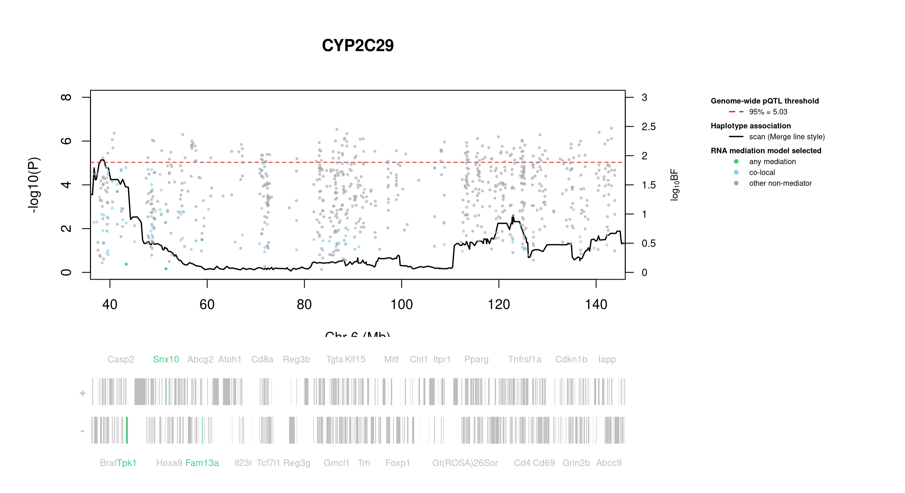

# Protein Overview

The mouse protein Cyp2c29, encoded by the gene **Cyp2c29**, is a member of the cytochrome P450 superfamily of enzymes involved in the metabolism of various substrates, including drugs and fatty acids. Its aliases include **CYP2C29**, **Cyp2c**, and **Cyp2c29a1**. This protein plays a significant role in the oxidative metabolism of xenobiotics and endogenous compounds.

# Data and normalization

Replicate measurements were Box-Cox transformed with a protein-specific λ = **0.05** (95% likelihood interval -0.07 to 0.18), estimated on the individual replicates (`boxcox(y ~ strain)`, no +1 shift). The strain phenotype is the mean of the transformed replicates and the strain noise used for the wisam weights is their variance.

{fig-align="center" width="95%"}

::: {.fig-downloads}
Download: [PNG](figures/repbc_2026-10-01/proteins/Cyp2c29_normalization.png){download="Cyp2c29_normalization.png"} · [PDF](figures/repbc_2026-10-01/proteins/Cyp2c29_normalization.pdf){download="Cyp2c29_normalization.pdf"}
:::

## Heritability

Broad-sense heritability of the protein is **0.93** (95% CI 0.88–0.95; BH-adjusted P 5.69e-65). Its paired transcript is **Cyp2c29** (array probe `1417651_PM_at`, paired from the measured peptide `NISQSFTNFSK`). Transcript H² is **0.33** (95% CI 0.16–0.47; BH-adjusted P 1.47e-05).

# pQTL genome scan

Genome scan of the Box-Cox phenotype with wisam weights (miqtl `scan.h2lmm`, 11 imputations); significance thresholds come from 1000 permutations (GEV fit to the permutation maxima of −log10 P). Strongest locus: chr6:38.19 Mb, P = 7.28e-06, adjusted P = 4.02e-02; 95% threshold = 5.03 (−log10 P).

{fig-align="center" width="95%"}

::: {.fig-downloads}
Download: [PDF](figures/repbc_2026-10-01/per_protein/Cyp2c29/Cyp2c29_genome_scan.pdf){download="Cyp2c29_genome_scan.pdf"} · [PDF](figures/repbc_2026-10-01/per_protein/Cyp2c29/Cyp2c29_scan_by_chromosome.pdf){download="Cyp2c29_scan_by_chromosome.pdf"}
:::

# Significant peak(s)

## Chromosome 6 peak (UNC10908306)

| Peak position | −log10(P) | Adjusted P | 90% credible interval | Encoding gene | Gene location | pQTL type |
|---|---:|---:|---|---|---|---|
| chr6:38.19 Mb | 5.14 | 4.02e-02 | 36.73–144.32 Mb | Cyp2c29 | chr19:39.27–39.33 Mb | **trans** |

A pQTL is **cis** when the gene encoding the protein lies within the credible interval and **trans** otherwise.

{fig-align="center" width="95%"}

::: {.fig-downloads}
Download: [PDF](figures/repbc_2026-10-01/per_protein/Cyp2c29/Cyp2c29_ci_scans_full.pdf){download="Cyp2c29_ci_scans_full.pdf"}
:::

{fig-align="center" width="95%"}

::: {.fig-downloads}
Download: [PNG](figures/repbc_2026-10-01/per_protein/Cyp2c29/Cyp2c29_ci_genes_full_chr6.png){download="Cyp2c29_ci_genes_full_chr6.png"}
:::

### Merge / diplotype fine-mapping

_Merge status: running or not started; the plot is not available yet._

### TIMBR allelic series

_TIMBR sweep complete; plots will appear once Merge profiles are available._

### RNA mediation

{fig-align="center" width="95%"}

::: {.fig-downloads}
Download: [PNG](figures/repbc_2026-10-01/per_protein/Cyp2c29/Cyp2c29_mediation_overlay_bf_chr6_withgenes.png){download="Cyp2c29_mediation_overlay_bf_chr6_withgenes.png"} · [PNG](figures/repbc_2026-10-01/per_protein/Cyp2c29/Cyp2c29_mediation_overlay_bf_chr6_nogenes.png){download="Cyp2c29_mediation_overlay_bf_chr6_nogenes.png"}
:::

{fig-align="center" width="95%"}

::: {.fig-downloads}
Download: [PDF](figures/repbc_2026-10-01/per_protein/Cyp2c29/Cyp2c29_targeted_mediation_chr6_posterior_bars.pdf){download="Cyp2c29_targeted_mediation_chr6_posterior_bars.pdf"}
:::
