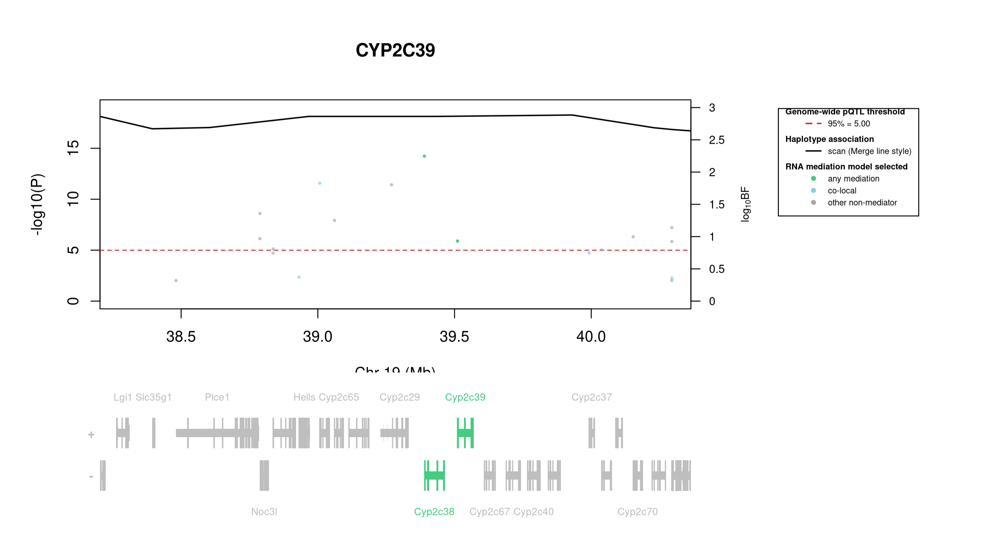

# Protein Overview

The mouse protein Cyp2c39, also known by its gene name **Cyp2c39**, is a member of the cytochrome P450 superfamily. It is involved in the metabolism of various endogenous and exogenous compounds. The protein has aliases such as **Cytochrome P450 2C39**.

# Data and normalization

Replicate measurements were Box-Cox transformed with a protein-specific λ = **0.19** (95% likelihood interval 0.14 to 0.24), estimated on the individual replicates (`boxcox(y ~ strain)`, no +1 shift); because 37 replicate(s) were zero, a small shift of 0.005 was added before transforming. The strain phenotype is the mean of the transformed replicates and the strain noise used for the wisam weights is their variance.

{fig-align="center" width="95%"}

::: {.fig-downloads}
Download: [PNG](figures/repbc_2026-10-01/proteins/Cyp2c39_normalization.png){download="Cyp2c39_normalization.png"} · [PDF](figures/repbc_2026-10-01/proteins/Cyp2c39_normalization.pdf){download="Cyp2c39_normalization.pdf"}
:::

## Heritability

Broad-sense heritability of the protein is **0.90** (95% CI 0.85–0.94; BH-adjusted P 8.48e-57). Its paired transcript is **Cyp2c39** (array probe `1421363_PM_at`, paired from the measured peptide `FINLVPNNIPR`). Transcript H² is **0.69** (95% CI 0.55–0.79; BH-adjusted P 1.38e-23).

# pQTL genome scan

Genome scan of the Box-Cox phenotype with wisam weights (miqtl `scan.h2lmm`, 11 imputations); significance thresholds come from 1000 permutations (GEV fit to the permutation maxima of −log10 P). Strongest locus: chr19:39.93 Mb, P = 5.40e-19, adjusted P = 2.22e-16; 95% threshold = 5.00 (−log10 P).

{fig-align="center" width="95%"}

::: {.fig-downloads}
Download: [PDF](figures/repbc_2026-10-01/per_protein/Cyp2c39/Cyp2c39_genome_scan.pdf){download="Cyp2c39_genome_scan.pdf"} · [PDF](figures/repbc_2026-10-01/per_protein/Cyp2c39/Cyp2c39_scan_by_chromosome.pdf){download="Cyp2c39_scan_by_chromosome.pdf"}
:::

# Significant peak(s)

## Chromosome 19 peak (JAX00214946)

| Peak position | −log10(P) | Adjusted P | 90% credible interval | Encoding gene | Gene location | pQTL type |
|---|---:|---:|---|---|---|---|
| chr19:39.93 Mb | 18.27 | 2.22e-16 | 38.20–40.36 Mb | Cyp2c39 | chr19:39.51–39.57 Mb | **cis** |

A pQTL is **cis** when the gene encoding the protein lies within the credible interval and **trans** otherwise.

{fig-align="center" width="95%"}

::: {.fig-downloads}
Download: [PDF](figures/repbc_2026-10-01/per_protein/Cyp2c39/Cyp2c39_ci_scans_full.pdf){download="Cyp2c39_ci_scans_full.pdf"}
:::

{fig-align="center" width="95%"}

::: {.fig-downloads}
Download: [PNG](figures/repbc_2026-10-01/per_protein/Cyp2c39/Cyp2c39_ci_genes_full_chr19.png){download="Cyp2c39_ci_genes_full_chr19.png"}
:::

### Merge / diplotype fine-mapping

{fig-align="center" width="95%"}

::: {.fig-downloads}
Download: [PNG](figures/repbc_2026-10-01/per_protein/Cyp2c39/Cyp2c39_mergeplot_full_JAX00214946.png){download="Cyp2c39_mergeplot_full_JAX00214946.png"}
:::

### TIMBR allelic series

_TIMBR sweep complete; plots will appear once Merge profiles are available._

### RNA mediation

{fig-align="center" width="95%"}

::: {.fig-downloads}
Download: [PNG](figures/repbc_2026-10-01/per_protein/Cyp2c39/Cyp2c39_mediation_overlay_bf_chr19_withgenes.png){download="Cyp2c39_mediation_overlay_bf_chr19_withgenes.png"} · [PNG](figures/repbc_2026-10-01/per_protein/Cyp2c39/Cyp2c39_mediation_overlay_bf_chr19_nogenes.png){download="Cyp2c39_mediation_overlay_bf_chr19_nogenes.png"}
:::

{fig-align="center" width="95%"}

::: {.fig-downloads}
Download: [PDF](figures/repbc_2026-10-01/per_protein/Cyp2c39/Cyp2c39_targeted_mediation_chr19_posterior_bars.pdf){download="Cyp2c39_targeted_mediation_chr19_posterior_bars.pdf"}
:::

# Zero-inflated subset scan

Cyp2c39 has strains with no detectable protein (all replicates zero). A second scan was run on the strains with measurable variation (normalized within-strain variance > 0.01), re-normalized with its own Box-Cox λ, with its own permutation threshold. The binary (detected vs. not detected) scan has not been re-run with the new normalization.

{fig-align="center" width="95%"}

::: {.fig-downloads}
Download: [PDF](figures/repbc_2026-10-01/per_protein/Cyp2c39/Cyp2c39_sub_scan.pdf){download="Cyp2c39_sub_scan.pdf"}
:::

## Chromosome 19 peak (JAX00214946) — zero-inflated subset scan

| Peak position | −log10(P) | Adjusted P | 90% credible interval | Encoding gene | Gene location | pQTL type |
|---|---:|---:|---|---|---|---|
| chr19:39.93 Mb | 9.33 | 5.79e-07 | 37.99–41.30 Mb | Cyp2c39 | chr19:39.51–39.57 Mb | **cis** |

A pQTL is **cis** when the gene encoding the protein lies within the credible interval and **trans** otherwise.

{fig-align="center" width="95%"}

::: {.fig-downloads}
Download: [PDF](figures/repbc_2026-10-01/per_protein/Cyp2c39/Cyp2c39_ci_scans_sub.pdf){download="Cyp2c39_ci_scans_sub.pdf"}
:::

{fig-align="center" width="95%"}

::: {.fig-downloads}
Download: [PNG](figures/repbc_2026-10-01/per_protein/Cyp2c39/Cyp2c39_ci_genes_sub_chr19.png){download="Cyp2c39_ci_genes_sub_chr19.png"}
:::

### Merge / diplotype fine-mapping

{fig-align="center" width="95%"}

::: {.fig-downloads}
Download: [PNG](figures/repbc_2026-10-01/per_protein/Cyp2c39/Cyp2c39_mergeplot_sub_JAX00214946.png){download="Cyp2c39_mergeplot_sub_JAX00214946.png"}
:::

### TIMBR allelic series

_TIMBR was not run for the zero-inflated subset peak._

### RNA mediation

_RNA mediation was not run for the zero-inflated subset peak._
