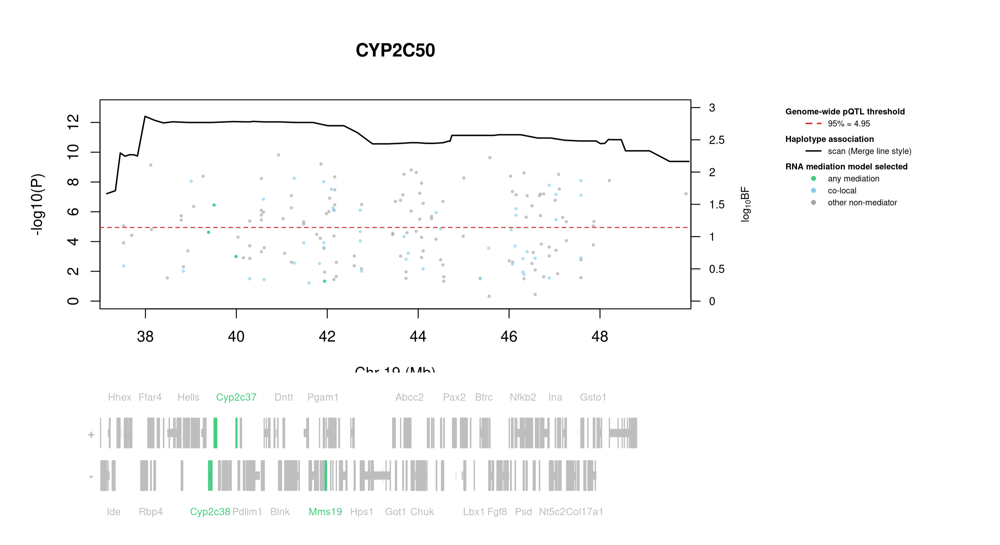
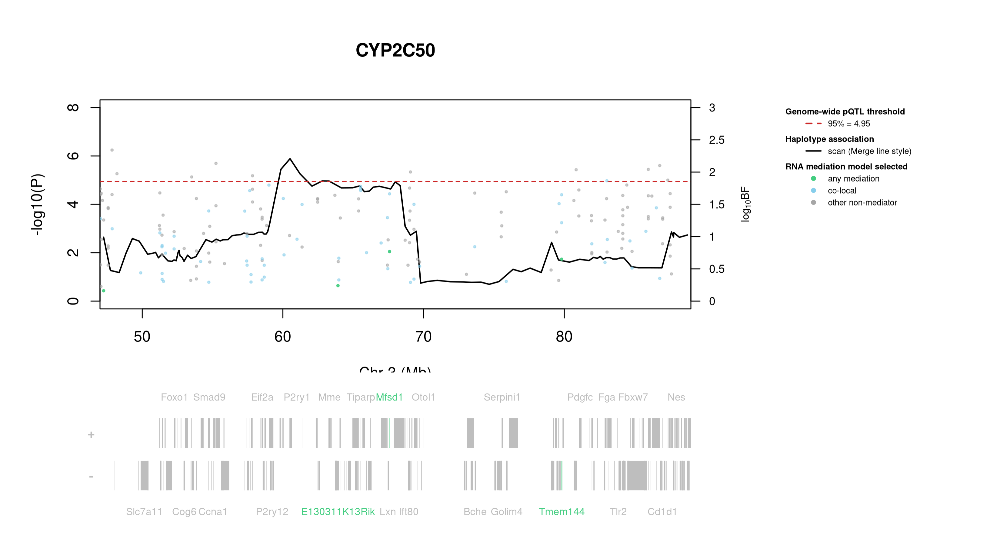

# Protein Overview

Cyp2c50, also known as Cytochrome P450 2C50, is a mouse protein encoded by the gene **Cyp2c50**. This protein belongs to the cytochrome P450 family and plays a role in the metabolism of various compounds. The gene has several aliases, including **CYP2C50**, reflecting its involvement in metabolic processes in the liver and other tissues.

# Data and normalization

Replicate measurements were Box-Cox transformed with a protein-specific λ = **0.21** (95% likelihood interval 0.08 to 0.34), estimated on the individual replicates (`boxcox(y ~ strain)`, no +1 shift); because 17 replicate(s) were zero, a small shift of 796 was added before transforming. The strain phenotype is the mean of the transformed replicates and the strain noise used for the wisam weights is their variance.

{fig-align="center" width="95%"}

::: {.fig-downloads}
Download: [PNG](figures/repbc_2026-10-01/proteins/Cyp2c50_normalization.png){download="Cyp2c50_normalization.png"} · [PDF](figures/repbc_2026-10-01/proteins/Cyp2c50_normalization.pdf){download="Cyp2c50_normalization.pdf"}
:::

## Heritability

Broad-sense heritability of the protein is **0.85** (95% CI 0.78–0.90; BH-adjusted P 4.53e-44). Its paired transcript is **Cyp2c50 +1** (array probe `1418653_PM_at`, paired from the measured peptide `GTNVITSLSSVLR`). Transcript H² is **0.42** (95% CI 0.24–0.56; BH-adjusted P 1.70e-08). This is a shared multi-gene probe, so the transcript signal is not gene-specific.

# pQTL genome scan

Genome scan of the Box-Cox phenotype with wisam weights (miqtl `scan.h2lmm`, 11 imputations); significance thresholds come from 1000 permutations (GEV fit to the permutation maxima of −log10 P). Strongest locus: chr19:37.99 Mb, P = 3.89e-13, adjusted P = 2.22e-16; 95% threshold = 4.95 (−log10 P).

{fig-align="center" width="95%"}

::: {.fig-downloads}
Download: [PDF](figures/repbc_2026-10-01/per_protein/Cyp2c50/Cyp2c50_genome_scan.pdf){download="Cyp2c50_genome_scan.pdf"} · [PDF](figures/repbc_2026-10-01/per_protein/Cyp2c50/Cyp2c50_scan_by_chromosome.pdf){download="Cyp2c50_scan_by_chromosome.pdf"}
:::

# Significant peak(s)

## Chromosome 19 peak (UNC30282360)

| Peak position | −log10(P) | Adjusted P | 90% credible interval | Encoding gene | Gene location | pQTL type |
|---|---:|---:|---|---|---|---|
| chr19:37.99 Mb | 12.41 | 2.22e-16 | 37.45–48.47 Mb | Cyp2c50 | chr19:40.09–40.11 Mb | **cis** |

A pQTL is **cis** when the gene encoding the protein lies within the credible interval and **trans** otherwise.

{fig-align="center" width="95%"}

::: {.fig-downloads}
Download: [PDF](figures/repbc_2026-10-01/per_protein/Cyp2c50/Cyp2c50_ci_scans_full.pdf){download="Cyp2c50_ci_scans_full.pdf"}
:::

{fig-align="center" width="95%"}

::: {.fig-downloads}
Download: [PNG](figures/repbc_2026-10-01/per_protein/Cyp2c50/Cyp2c50_ci_genes_full_chr19.png){download="Cyp2c50_ci_genes_full_chr19.png"}
:::

### Merge / diplotype fine-mapping

{fig-align="center" width="95%"}

::: {.fig-downloads}
Download: [PNG](figures/repbc_2026-10-01/per_protein/Cyp2c50/Cyp2c50_mergeplot_full_UNC30282360.png){download="Cyp2c50_mergeplot_full_UNC30282360.png"}
:::

### TIMBR allelic series

_TIMBR sweep complete; plots will appear once Merge profiles are available._

### RNA mediation

{fig-align="center" width="95%"}

::: {.fig-downloads}
Download: [PNG](figures/repbc_2026-10-01/per_protein/Cyp2c50/Cyp2c50_mediation_overlay_bf_chr19_withgenes.png){download="Cyp2c50_mediation_overlay_bf_chr19_withgenes.png"} · [PNG](figures/repbc_2026-10-01/per_protein/Cyp2c50/Cyp2c50_mediation_overlay_bf_chr19_nogenes.png){download="Cyp2c50_mediation_overlay_bf_chr19_nogenes.png"}
:::

{fig-align="center" width="95%"}

::: {.fig-downloads}
Download: [PDF](figures/repbc_2026-10-01/per_protein/Cyp2c50/Cyp2c50_targeted_mediation_chr19_posterior_bars.pdf){download="Cyp2c50_targeted_mediation_chr19_posterior_bars.pdf"}
:::

## Chromosome 3 peak (UNC5366241)

| Peak position | −log10(P) | Adjusted P | 90% credible interval | Encoding gene | Gene location | pQTL type |
|---|---:|---:|---|---|---|---|
| chr3:60.51 Mb | 5.89 | 5.32e-03 | 47.17–87.62 Mb | Cyp2c50 | chr19:40.09–40.11 Mb | **trans** |

A pQTL is **cis** when the gene encoding the protein lies within the credible interval and **trans** otherwise.

{fig-align="center" width="95%"}

::: {.fig-downloads}
Download: [PDF](figures/repbc_2026-10-01/per_protein/Cyp2c50/Cyp2c50_ci_scans_full.pdf){download="Cyp2c50_ci_scans_full.pdf"}
:::

{fig-align="center" width="95%"}

::: {.fig-downloads}
Download: [PNG](figures/repbc_2026-10-01/per_protein/Cyp2c50/Cyp2c50_ci_genes_full_chr3.png){download="Cyp2c50_ci_genes_full_chr3.png"}
:::

### Merge / diplotype fine-mapping

_Merge status: complete; the plot is not available yet._

### TIMBR allelic series

_TIMBR sweep complete; plots will appear once Merge profiles are available._

### RNA mediation

{fig-align="center" width="95%"}

::: {.fig-downloads}
Download: [PNG](figures/repbc_2026-10-01/per_protein/Cyp2c50/Cyp2c50_mediation_overlay_bf_chr3_withgenes.png){download="Cyp2c50_mediation_overlay_bf_chr3_withgenes.png"} · [PNG](figures/repbc_2026-10-01/per_protein/Cyp2c50/Cyp2c50_mediation_overlay_bf_chr3_nogenes.png){download="Cyp2c50_mediation_overlay_bf_chr3_nogenes.png"}
:::

{fig-align="center" width="95%"}

::: {.fig-downloads}
Download: [PDF](figures/repbc_2026-10-01/per_protein/Cyp2c50/Cyp2c50_targeted_mediation_chr3_posterior_bars.pdf){download="Cyp2c50_targeted_mediation_chr3_posterior_bars.pdf"}
:::

# Zero-inflated subset scan

Cyp2c50 has strains with no detectable protein (all replicates zero). A second scan was run on the strains with measurable variation (normalized within-strain variance > 0.01), re-normalized with its own Box-Cox λ, with its own permutation threshold. The binary (detected vs. not detected) scan has not been re-run with the new normalization.

{fig-align="center" width="95%"}

::: {.fig-downloads}
Download: [PDF](figures/repbc_2026-10-01/per_protein/Cyp2c50/Cyp2c50_sub_scan.pdf){download="Cyp2c50_sub_scan.pdf"}
:::

The subset scan has no genome-wide significant peak.
