# Protein Overview

Cyp2c50, also known as Cytochrome P450 2C50, is a mouse protein encoded by the gene **Cyp2c50**. This protein belongs to the cytochrome P450 family and plays a role in the metabolism of various compounds. The gene has several aliases, including **CYP2C50**, reflecting its involvement in metabolic processes in the liver and other tissues.

# Data and normalization

Replicate measurements were Box-Cox transformed with a protein-specific λ = **0.21** (95% likelihood interval 0.08 to 0.34), estimated on the individual replicates (`boxcox(y ~ strain)`, no +1 shift); because 17 replicate(s) were zero, a small shift of 796 was added before transforming. The strain phenotype is the mean of the transformed replicates and the strain noise used for the wisam weights is their variance.

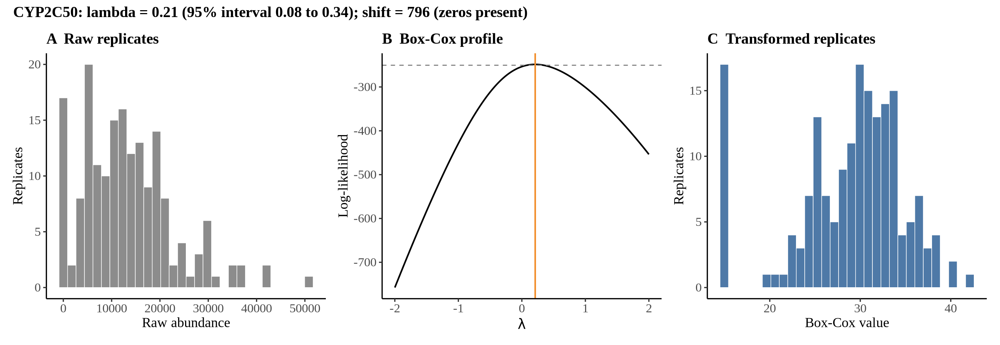{fig-align="center" width="95%"}

::: {.fig-downloads}
Download: [PNG](figures/repbc_2026-10-01/proteins/Cyp2c50_normalization.png){download="Cyp2c50_normalization.png"} · [PDF](figures/repbc_2026-10-01/proteins/Cyp2c50_normalization.pdf){download="Cyp2c50_normalization.pdf"}
:::

## Heritability

Broad-sense heritability of the protein is **0.85** (95% CI 0.78–0.90; BH-adjusted P 4.53e-44). Its paired transcript is **Cyp2c50 +1** (array probe `1418653_PM_at`, paired from the measured peptide `GTNVITSLSSVLR`). Transcript H² is **0.42** (95% CI 0.24–0.56; BH-adjusted P 1.70e-08). This is a shared multi-gene probe, so the transcript signal is not gene-specific.

# pQTL genome scan

Genome scan of the Box-Cox phenotype with wisam weights (miqtl `scan.h2lmm`, 11 imputations); significance thresholds come from 1000 permutations (GEV fit to the permutation maxima of −log10 P). Strongest locus: chr19:37.99 Mb, P = 3.89e-13, adjusted P = 2.22e-16; 95% threshold = 4.95 (−log10 P).

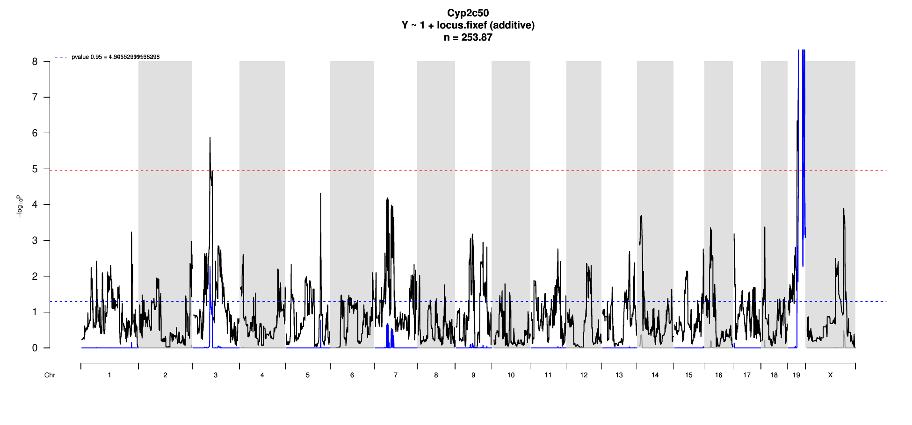{fig-align="center" width="95%"}

::: {.fig-downloads}
Download: [PDF](figures/repbc_2026-10-01/per_protein/Cyp2c50/Cyp2c50_genome_scan.pdf){download="Cyp2c50_genome_scan.pdf"} · [PDF](figures/repbc_2026-10-01/per_protein/Cyp2c50/Cyp2c50_scan_by_chromosome.pdf){download="Cyp2c50_scan_by_chromosome.pdf"}
:::

# Significant peak(s)

## Chromosome 19 peak (UNC30282360)

| Peak position | −log10(P) | Adjusted P | 90% credible interval | Encoding gene | Gene location | pQTL type |
|---|---:|---:|---|---|---|---|
| chr19:37.99 Mb | 12.41 | 2.22e-16 | 37.45–48.47 Mb | Cyp2c50 | chr19:40.09–40.11 Mb | **cis** |

A pQTL is **cis** when the gene encoding the protein lies within the credible interval and **trans** otherwise.

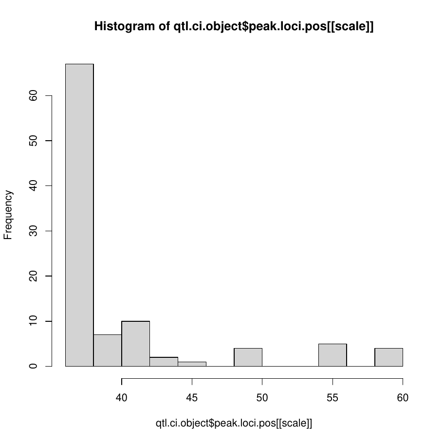{fig-align="center" width="95%"}

::: {.fig-downloads}
Download: [PDF](figures/repbc_2026-10-01/per_protein/Cyp2c50/Cyp2c50_ci_scans_full.pdf){download="Cyp2c50_ci_scans_full.pdf"}
:::

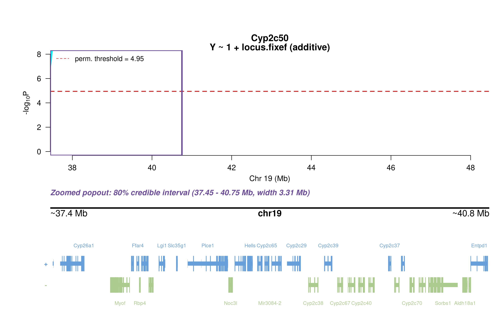{fig-align="center" width="95%"}

::: {.fig-downloads}
Download: [PNG](figures/repbc_2026-10-01/per_protein/Cyp2c50/Cyp2c50_ci_genes_full_chr19.png){download="Cyp2c50_ci_genes_full_chr19.png"}
:::

### Merge / diplotype fine-mapping

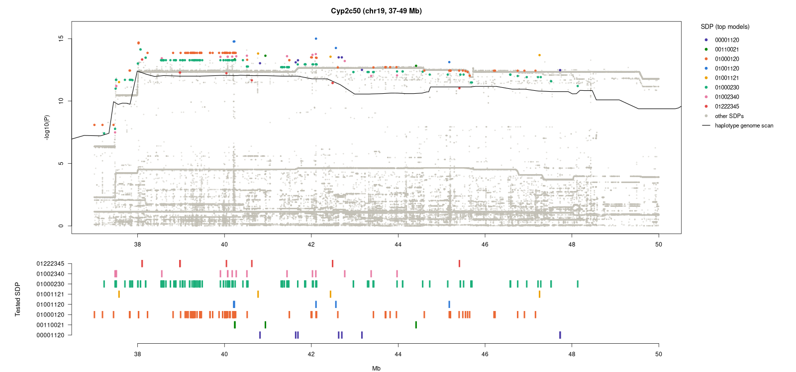{fig-align="center" width="95%"}

::: {.fig-downloads}
Download: [PNG](figures/repbc_2026-10-01/per_protein/Cyp2c50/Cyp2c50_mergeplot_full_UNC30282360.png){download="Cyp2c50_mergeplot_full_UNC30282360.png"}
:::

_The top allelic series (SDP) from Merge is added to the book once the follow-up summary has been generated._

### TIMBR allelic series

{fig-align="center" width="95%"}

::: {.fig-downloads}
Download: [JPG](figures/repbc_2026-10-01/per_protein/Cyp2c50/Cyp2c50_timbr_ci_bf_dot_chr19.jpg){download="Cyp2c50_timbr_ci_bf_dot_chr19.jpg"}
:::

{fig-align="center" width="95%"}

::: {.fig-downloads}
Download: [JPG](figures/repbc_2026-10-01/per_protein/Cyp2c50/Cyp2c50_timbr_ci_dot_chr19.jpg){download="Cyp2c50_timbr_ci_dot_chr19.jpg"}
:::

The highest-posterior TIMBR allelic series at the peak splits the founders into **allele 0**: A/J, 129S1/SvImJ, NOD/ShiLtJ, NZO/HlLtJ, WSB/EiJ; **allele 1**: C57BL/6J, CAST/EiJ; **allele 2**: PWK/PhJ. That is 3 functional alleles: founders in the same group are inferred to carry the same functional allele at this locus.

**Number of functional alleles.** At the lead locus (UNC30282360, 37.99 Mb) the posterior probability of a bi-allelic series (two functional alleles) is 0.14, tri-allelic 0.53, and four or more alleles 0.33; a single allele (no QTL effect) has probability 0.00. For comparison, the Chinese-restaurant-process prior gives 0.50 / 0.29 / 0.14 for one / two / three alleles, so the data move weight away from a single allele. The locus in the credible interval whose single best allelic series has the highest posterior probability is UNC30361747 (43.83 Mb; series 0,0,0,0,0,0,1,0, P = 0.71); there bi-allelic = 0.71, tri-allelic = 0.23, four or more = 0.06.

{fig-align="center" width="95%"}

::: {.fig-downloads}
Download: [PNG](figures/repbc_2026-10-01/per_protein/Cyp2c50/Cyp2c50_allele_number_prior_posterior_chr19.png){download="Cyp2c50_allele_number_prior_posterior_chr19.png"} · [PDF](figures/repbc_2026-10-01/per_protein/Cyp2c50/Cyp2c50_allele_number_prior_posterior_chr19.pdf){download="Cyp2c50_allele_number_prior_posterior_chr19.pdf"}
:::

{fig-align="center" width="95%"}

::: {.fig-downloads}
Download: [PNG](figures/repbc_2026-10-01/per_protein/Cyp2c50/Cyp2c50_allele_number_across_ci_chr19.png){download="Cyp2c50_allele_number_across_ci_chr19.png"} · [PDF](figures/repbc_2026-10-01/per_protein/Cyp2c50/Cyp2c50_allele_number_across_ci_chr19.pdf){download="Cyp2c50_allele_number_across_ci_chr19.pdf"}
:::

{fig-align="center" width="95%"}

::: {.fig-downloads}
Download: [PNG](figures/repbc_2026-10-01/per_protein/Cyp2c50/Cyp2c50_haplotype_lead_UNC30282360_chr19.png){download="Cyp2c50_haplotype_lead_UNC30282360_chr19.png"} · [PDF](figures/repbc_2026-10-01/per_protein/Cyp2c50/Cyp2c50_haplotype_lead_UNC30282360_chr19.pdf){download="Cyp2c50_haplotype_lead_UNC30282360_chr19.pdf"}
:::

{fig-align="center" width="95%"}

::: {.fig-downloads}
Download: [PNG](figures/repbc_2026-10-01/per_protein/Cyp2c50/Cyp2c50_haplotype_best_UNC30361747_chr19.png){download="Cyp2c50_haplotype_best_UNC30361747_chr19.png"} · [PDF](figures/repbc_2026-10-01/per_protein/Cyp2c50/Cyp2c50_haplotype_best_UNC30361747_chr19.pdf){download="Cyp2c50_haplotype_best_UNC30361747_chr19.pdf"}
:::

### RNA mediation

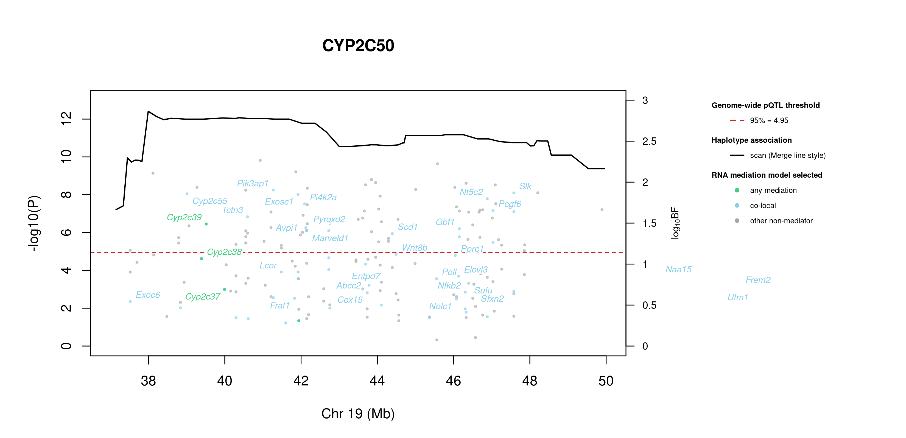{fig-align="center" width="95%"}

::: {.fig-downloads}
Download: [PNG](figures/repbc_2026-10-01/per_protein/Cyp2c50/Cyp2c50_mediation_overlay_bf_chr19_nogenes.png){download="Cyp2c50_mediation_overlay_bf_chr19_nogenes.png"} · [PNG](figures/repbc_2026-10-01/per_protein/Cyp2c50/Cyp2c50_mediation_overlay_bf_chr19_withgenes.png){download="Cyp2c50_mediation_overlay_bf_chr19_withgenes.png"} · [CSV](figures/repbc_2026-10-01/per_protein/Cyp2c50/Cyp2c50_mediation_bf_points_chr19.csv){download="Cyp2c50_mediation_bf_points_chr19.csv"}
:::

195 candidate transcripts lie in the credible interval. **29** have a best-model log10 Bayes factor ≥ 0.5 with mediation or co-local as the best-supported model and are labelled in the figure (152 more reach 0.5 only for the non-mediator model and are not labelled): **mediation** (3): Cyp2c39 (1.49), Cyp2c38 (1.07), Cyp2c37 (0.69); **co-local** (26): Pik3ap1 (1.90), Slk (1.87), Cyp2c55 (1.86), Exosc1 (1.85), Nt5c2 (1.80), Pi4k2a (1.73), Pcgf6 (1.65), Tctn3 (1.58), Avpi1 (1.45), Pyroxd2 (1.41), Scd1 (1.37), Wnt8b (1.12) …. *Mediation* means the transcript is best explained as lying on the path from the QTL to the protein; *co-local* means it shares the QTL without mediating; log10 BF is the evidence for the best-supported model against the null.

::: {.callout-note collapse="true" title="Function of the 29 labelled transcripts (UniProt)"}
Function text is the UniProt (mouse) annotation retrieved on 2026-10-03; reviewed Swiss-Prot entries where available. A dash means UniProt holds no functional annotation for that symbol.

| Transcript | Best model | log10 BF | UniProt protein | Function (UniProt) |
|---|---|---:|---|---|
| *Cyp2c39* | mediation | 1.49 | [Cytochrome P450 2C39](https://www.uniprot.org/uniprotkb/P56656) | A cytochrome P450 monooxygenase that primarily catalyzes the epoxidation of 11,12 and 14,15 double bonds of (5Z,8Z,11Z,14Z)-eicosatetraenoic acid (arachidonate) forming 11,12- and 14,15-epoxyeicosatrienoic acids (11,12- and 14,15-EET) regioisomers. |
| *Cyp2c38* | mediation | 1.07 | [Cytochrome P450 2C38](https://www.uniprot.org/uniprotkb/P56655) | A cytochrome P450 monooxygenase that primarily catalyzes the epoxidation of 11,12 double bond of (5Z,8Z,11Z,14Z)-eicosatetraenoic acid (arachidonate) forming 11,12-epoxyeicosatrienoic acid (11,12-EET) regioisomer. |
| *Cyp2c37* | mediation | 0.69 | [Cytochrome P450 2C37](https://www.uniprot.org/uniprotkb/P56654) | A cytochrome P450 monooxygenase that metabolizes (5Z,8Z,11Z,14Z)-eicosatetraenoic acid (arachidonate) to primarily produce 12-hydroxyeicosatetraenoic acid (12-HETE). Mechanistically, uses molecular oxygen inserting one oxygen atom into a substrate, and reducing the second into a water molecule, with two electrons provided by NADPH via cytochrome P450 reductase (CPR; |
| *Pik3ap1* | co-local | 1.90 | [Phosphoinositide 3-kinase adapter protein 1](https://www.uniprot.org/uniprotkb/Q9EQ32) | Signaling adapter that contributes to B-cell development by linking B-cell receptor (BCR) signaling to the phosphoinositide 3-kinase (PI3K)-Akt signaling pathway. Has a complementary role to the BCR coreceptor CD19, coupling BCR and PI3K activation by providing a docking site for the PI3K subunit PIK3R1. |
| *Slk* | co-local | 1.87 | [STE20-like serine/threonine-protein kinase](https://www.uniprot.org/uniprotkb/O54988) | Mediates apoptosis and actin stress fiber dissolution |
| *Cyp2c55* | co-local | 1.86 | [Cytochrome P450 2C55](https://www.uniprot.org/uniprotkb/Q9D816) | Metabolizes arachidonic acid mainly to 19-hydroxyeicosatetraenoic acid (HETE) |
| *Exosc1* | co-local | 1.85 | [Exosome complex component CSL4](https://www.uniprot.org/uniprotkb/Q9DAA6) | Non-catalytic component of the RNA exosome complex which has 3'->5' exoribonuclease activity and participates in a multitude of cellular RNA processing and degradation events. |
| *Nt5c2* | co-local | 1.80 | [Cytosolic purine 5'-nucleotidase](https://www.uniprot.org/uniprotkb/Q3V1L4) | Broad specificity cytosolic 5'-nucleotidase that catalyzes the dephosphorylation of 6-hydroxypurine nucleoside 5'-monophosphates. In addition, possesses a phosphotransferase activity by which it can transfer a phosphate from a donor nucleoside monophosphate to an acceptor nucleoside, preferably inosine, deoxyinosine and guanosine. |
| *Pi4k2a* | co-local | 1.73 | [Phosphatidylinositol 4-kinase type 2-alpha](https://www.uniprot.org/uniprotkb/Q2TBE6) | Membrane-bound phosphatidylinositol-4 kinase (PI4-kinase) that catalyzes the phosphorylation of phosphatidylinositol (PI) to phosphatidylinositol 4-phosphate (PI4P), a lipid that plays important roles in endocytosis, Golgi function, protein sorting and membrane trafficking and is required for prolonged survival of neurons. |
| *Pcgf6* | co-local | 1.65 | [Polycomb group RING finger protein 6](https://www.uniprot.org/uniprotkb/Q99NA9) | Transcriptional repressor. May modulate the levels of histone H3K4Me3 by activating KDM5D histone demethylase. Component of a Polycomb group (PcG) multiprotein PRC1-like complex, a complex class required to maintain the transcriptionally repressive state of many genes, including Hox genes, throughout development. |
| *Tctn3* | co-local | 1.58 | [Tectonic-3](https://www.uniprot.org/uniprotkb/Q8R2Q6) | Part of the tectonic-like complex which is required for tissue-specific ciliogenesis and may regulate ciliary membrane composition. May be involved in apoptosis regulation. Necessary for signal transduction through the sonic hedgehog (Shh) signaling pathway |
| *Avpi1* | co-local | 1.45 | [Arginine vasopressin-induced protein 1](https://www.uniprot.org/uniprotkb/Q9D7H4) | May be involved in MAP kinase activation, epithelial sodium channel (ENaC) down-regulation and cell cycling |
| *Pyroxd2* | co-local | 1.41 | [Pyridine nucleotide-disulfide oxidoreductase domain-containing protein 2](https://www.uniprot.org/uniprotkb/Q3U4I7) | Probable oxidoreductase that may play a role as regulator of mitochondrial function |
| *Scd1* | co-local | 1.37 | [Acyl-CoA desaturase 1](https://www.uniprot.org/uniprotkb/P13516) | Stearoyl-CoA desaturase that utilizes O(2) and electrons from reduced cytochrome b5 to introduce the first double bond into saturated fatty acyl-CoA substrates. Catalyzes the insertion of a cis double bond at the Delta-9 position into fatty acyl-CoA substrates including palmitoyl-CoA and stearoyl-CoA. Gives rise to a mixture of 16:1 and 18:1 unsaturated fatty acids. |
| *Wnt8b* | co-local | 1.12 | [Protein Wnt-8b](https://www.uniprot.org/uniprotkb/Q9WUD6) | Ligand for members of the frizzled family of seven transmembrane receptors. May play an important role in the development and differentiation of certain forebrain structures, notably the hippocampus |
| *Pprc1* | co-local | 1.11 | [Peroxisome proliferator-activated receptor gamma coactivator-related protein 1](https://www.uniprot.org/uniprotkb/Q6NZN1) | Acts as a coactivator during transcriptional activation of nuclear genes related to mitochondrial biogenesis and cell growth. Involved in the transcription coactivation of CREB and NRF1 target genes |
| *Fnip2* | co-local | 1.02 | [Folliculin-interacting protein 2](https://www.uniprot.org/uniprotkb/Q80TD3) | Binding partner of the GTPase-activating protein FLCN: involved in the cellular response to amino acid availability by regulating the non-canonical mTORC1 signaling cascade controlling the MiT/TFE factors TFEB and TFE3. Required to promote FLCN recruitment to lysosomes and interaction with Rag GTPases, leading to activation of the non-canonical mTORC1 signaling. |
| *Frem2* | co-local | 0.89 | [FRAS1-related extracellular matrix protein 2](https://www.uniprot.org/uniprotkb/Q6NVD0) | Extracellular matrix protein required for maintenance of the integrity of the skin epithelium and for maintenance of renal epithelia. Required for epidermal adhesion. Involved in the development of eyelids and the anterior segment of the eyeballs |
| *Elovl3* | co-local | 0.85 | [Very long chain fatty acid elongase 3](https://www.uniprot.org/uniprotkb/O35949) | Catalyzes the first and rate-limiting reaction of the four reactions that constitute the long-chain fatty acids elongation cycle. This endoplasmic reticulum-bound enzymatic process allows the addition of 2 carbons to the chain of long- and very long-chain fatty acids (VLCFAs) per cycle. |
| *Pdgfc* | co-local | 0.83 | [Platelet-derived growth factor C](https://www.uniprot.org/uniprotkb/Q8CI19) | Growth factor that plays an essential role in the regulation of embryonic development, cell proliferation, cell migration, survival and chemotaxis. Potent mitogen and chemoattractant for cells of mesenchymal origin. |
| *Poll* | co-local | 0.82 | [DNA polymerase lambda](https://www.uniprot.org/uniprotkb/Q9QXE2) | DNA polymerase that functions in several pathways of DNA repair. Involved in base excision repair (BER) responsible for repair of lesions that give rise to abasic (AP) sites in DNA. Also contributes to DNA double-strand break repair by non-homologous end joining and homologous recombination. |
| *Abcc2* | co-local | 0.74 | [ATP-binding cassette sub-family C member 2](https://www.uniprot.org/uniprotkb/Q8VI47) | ATP-dependent transporter of the ATP-binding cassette (ABC) family that hydrolyzes ATP to enable active transport of substrates conjugated with glucuronate, glutathione or sulfate. Operates at apical membranes of polarized cells such as hepatocytes, renal and intestinal epithelial cells where it mediates hepatobiliary and renal excretion of conjugated substrates. |
| *Sucnr1* | co-local | 0.72 | [Succinate receptor 1](https://www.uniprot.org/uniprotkb/Q99MT6) | G protein-coupled receptor for succinate able to mediate signaling through Gq/GNAQ or Gi/GNAI second messengers depending on the cell type and the processes regulated. Succinate-SUCNR1 signaling serves as a link between metabolic stress, inflammation and energy homeostasis. In macrophages, plays a range of immune-regulatory roles. |
| *Sfxn2* | co-local | 0.66 | [Sideroflexin-2](https://www.uniprot.org/uniprotkb/Q925N2) | Mitochondrial amino-acid transporter that mediates transport of serine into mitochondria. Involved in mitochondrial iron homeostasis by regulating heme biosynthesis |
| *Nfkb2* | co-local | 0.66 | [Nuclear factor NF-kappa-B p100 subunit](https://www.uniprot.org/uniprotkb/Q9WTK5) | NF-kappa-B is a pleiotropic transcription factor present in almost all cell types and is the endpoint of a series of signal transduction events that are initiated by a vast array of stimuli related to many biological processes such as inflammation, immunity, differentiation, cell growth, tumorigenesis and apoptosis. |
| *Cox15* | co-local | 0.65 | [Heme A synthase COX15](https://www.uniprot.org/uniprotkb/Q8BJ03) | Catalyzes the second reaction in the biosynthesis of heme A, a prosthetic group of mitochondrial cytochrome c oxidase (CcO). Heme A is synthesized from heme B by two sequential enzymatic reactions catalyzed by heme O synthase (HOS) and heme A synthase (HAS). |
| *Frat1* | co-local | 0.58 | [Proto-oncogene FRAT1](https://www.uniprot.org/uniprotkb/P70339) | Positively regulates the Wnt signaling pathway by stabilizing beta-catenin through the association with GSK-3. May play a role in tumor progression and collaborate with PIM1 and MYC in lymphomagenesis |
| *Serp1* | co-local | 0.55 | [Stress-associated endoplasmic reticulum protein 1](https://www.uniprot.org/uniprotkb/Q9Z1W5) | Interacts with target proteins during their translocation into the lumen of the endoplasmic reticulum. Protects unfolded target proteins against degradation during ER stress. May facilitate glycosylation of target proteins after termination of ER stress. May modulate the use of N-glycosylation sites on target proteins |
| *Vmn2r1* | co-local | 0.50 | [Vomeronasal type-2 receptor 1](https://www.uniprot.org/uniprotkb/O70410) | Putative pheromone receptor |
:::

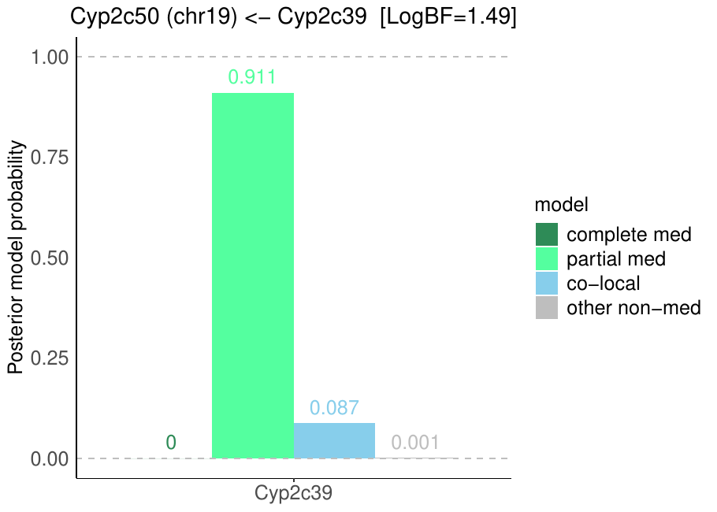{fig-align="center" width="95%"}

::: {.fig-downloads}
Download: [PDF](figures/repbc_2026-10-01/per_protein/Cyp2c50/Cyp2c50_targeted_mediation_chr19_posterior_bars.pdf){download="Cyp2c50_targeted_mediation_chr19_posterior_bars.pdf"}
:::

## Chromosome 3 peak (UNC5366241)

| Peak position | −log10(P) | Adjusted P | 90% credible interval | Encoding gene | Gene location | pQTL type |
|---|---:|---:|---|---|---|---|
| chr3:60.51 Mb | 5.89 | 5.32e-03 | 47.17–87.62 Mb | Cyp2c50 | chr19:40.09–40.11 Mb | **trans** |

A pQTL is **cis** when the gene encoding the protein lies within the credible interval and **trans** otherwise.

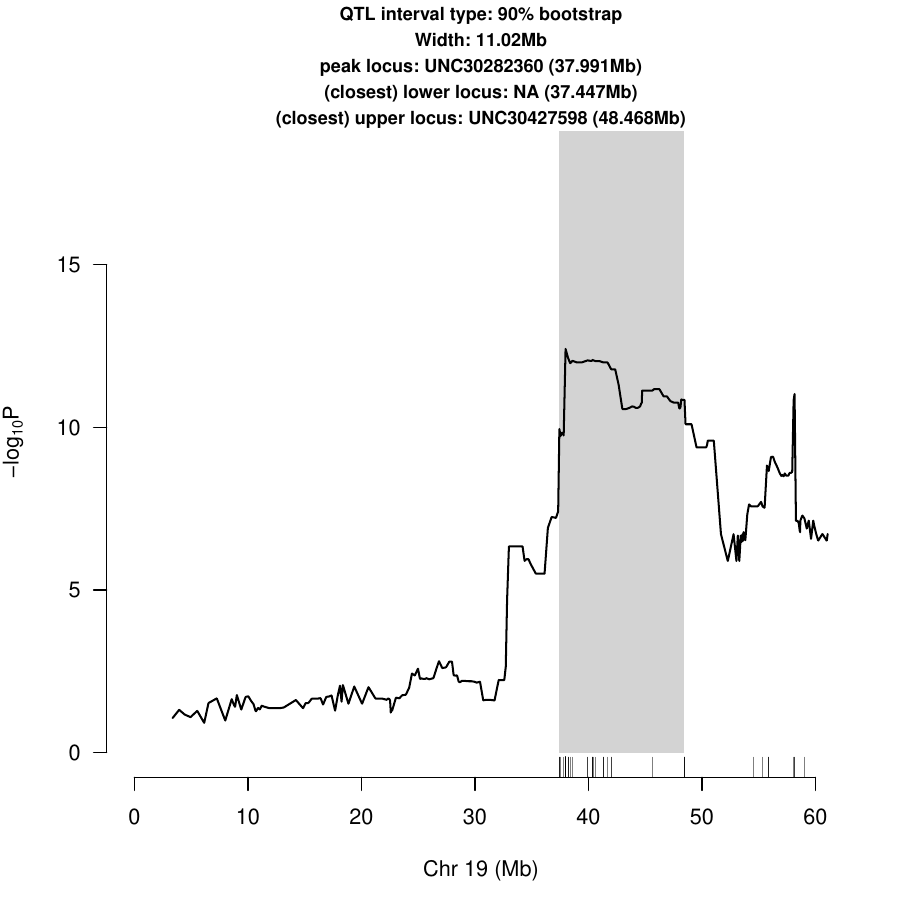{fig-align="center" width="95%"}

::: {.fig-downloads}
Download: [PDF](figures/repbc_2026-10-01/per_protein/Cyp2c50/Cyp2c50_ci_scans_full.pdf){download="Cyp2c50_ci_scans_full.pdf"}
:::

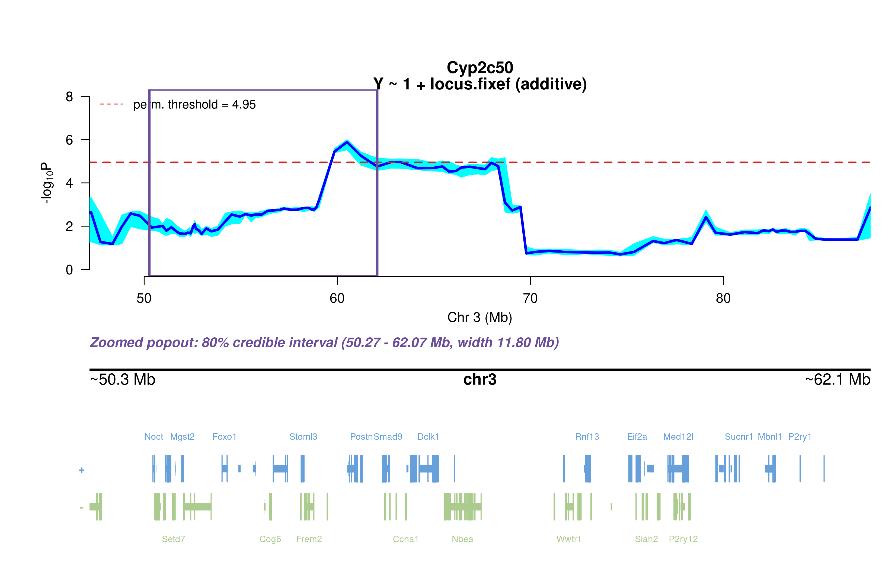{fig-align="center" width="95%"}

::: {.fig-downloads}
Download: [PNG](figures/repbc_2026-10-01/per_protein/Cyp2c50/Cyp2c50_ci_genes_full_chr3.png){download="Cyp2c50_ci_genes_full_chr3.png"}
:::

### Merge / diplotype fine-mapping

{fig-align="center" width="95%"}

::: {.fig-downloads}
Download: [PNG](figures/repbc_2026-10-01/per_protein/Cyp2c50/Cyp2c50_mergeplot_full_UNC5366241.png){download="Cyp2c50_mergeplot_full_UNC5366241.png"}
:::

_The top allelic series (SDP) from Merge is added to the book once the follow-up summary has been generated._

### TIMBR allelic series

{fig-align="center" width="95%"}

::: {.fig-downloads}
Download: [JPG](figures/repbc_2026-10-01/per_protein/Cyp2c50/Cyp2c50_timbr_ci_bf_dot_chr3.jpg){download="Cyp2c50_timbr_ci_bf_dot_chr3.jpg"}
:::

{fig-align="center" width="95%"}

::: {.fig-downloads}
Download: [JPG](figures/repbc_2026-10-01/per_protein/Cyp2c50/Cyp2c50_timbr_ci_dot_chr3.jpg){download="Cyp2c50_timbr_ci_dot_chr3.jpg"}
:::

The highest-posterior TIMBR allelic series at the peak splits the founders into **allele 1**: C57BL/6J, 129S1/SvImJ, NOD/ShiLtJ, NZO/HlLtJ, CAST/EiJ, WSB/EiJ; **allele 0**: A/J, PWK/PhJ. That is 2 functional alleles: founders in the same group are inferred to carry the same functional allele at this locus.

**Number of functional alleles.** At the lead locus (UNC5366241, 60.51 Mb) the posterior probability of a bi-allelic series (two functional alleles) is 0.58, tri-allelic 0.30, and four or more alleles 0.12; a single allele (no QTL effect) has probability 0.00. For comparison, the Chinese-restaurant-process prior gives 0.50 / 0.29 / 0.14 for one / two / three alleles, so the data move weight away from a single allele. The locus in the credible interval whose single best allelic series has the highest posterior probability is JAX00109064 (74.66 Mb; series 0,0,0,0,0,0,0,0, P = 0.66); there bi-allelic = 0.22, tri-allelic = 0.08, four or more = 0.04.

{fig-align="center" width="95%"}

::: {.fig-downloads}
Download: [PNG](figures/repbc_2026-10-01/per_protein/Cyp2c50/Cyp2c50_allele_number_prior_posterior_chr3.png){download="Cyp2c50_allele_number_prior_posterior_chr3.png"} · [PDF](figures/repbc_2026-10-01/per_protein/Cyp2c50/Cyp2c50_allele_number_prior_posterior_chr3.pdf){download="Cyp2c50_allele_number_prior_posterior_chr3.pdf"}
:::

{fig-align="center" width="95%"}

::: {.fig-downloads}
Download: [PNG](figures/repbc_2026-10-01/per_protein/Cyp2c50/Cyp2c50_allele_number_across_ci_chr3.png){download="Cyp2c50_allele_number_across_ci_chr3.png"} · [PDF](figures/repbc_2026-10-01/per_protein/Cyp2c50/Cyp2c50_allele_number_across_ci_chr3.pdf){download="Cyp2c50_allele_number_across_ci_chr3.pdf"}
:::

{fig-align="center" width="95%"}

::: {.fig-downloads}
Download: [PNG](figures/repbc_2026-10-01/per_protein/Cyp2c50/Cyp2c50_haplotype_lead_UNC5366241_chr3.png){download="Cyp2c50_haplotype_lead_UNC5366241_chr3.png"} · [PDF](figures/repbc_2026-10-01/per_protein/Cyp2c50/Cyp2c50_haplotype_lead_UNC5366241_chr3.pdf){download="Cyp2c50_haplotype_lead_UNC5366241_chr3.pdf"}
:::

{fig-align="center" width="95%"}

::: {.fig-downloads}
Download: [PNG](figures/repbc_2026-10-01/per_protein/Cyp2c50/Cyp2c50_haplotype_best_JAX00109064_chr3.png){download="Cyp2c50_haplotype_best_JAX00109064_chr3.png"} · [PDF](figures/repbc_2026-10-01/per_protein/Cyp2c50/Cyp2c50_haplotype_best_JAX00109064_chr3.pdf){download="Cyp2c50_haplotype_best_JAX00109064_chr3.pdf"}
:::

### RNA mediation

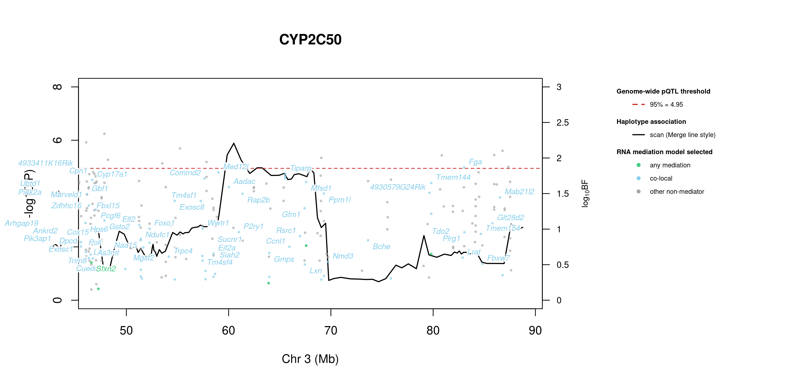{fig-align="center" width="95%"}

::: {.fig-downloads}
Download: [PNG](figures/repbc_2026-10-01/per_protein/Cyp2c50/Cyp2c50_mediation_overlay_bf_chr3_nogenes.png){download="Cyp2c50_mediation_overlay_bf_chr3_nogenes.png"} · [PNG](figures/repbc_2026-10-01/per_protein/Cyp2c50/Cyp2c50_mediation_overlay_bf_chr3_withgenes.png){download="Cyp2c50_mediation_overlay_bf_chr3_withgenes.png"} · [CSV](figures/repbc_2026-10-01/per_protein/Cyp2c50/Cyp2c50_mediation_bf_points_chr3.csv){download="Cyp2c50_mediation_bf_points_chr3.csv"}
:::

195 candidate transcripts lie in the credible interval. **48** have a best-model log10 Bayes factor ≥ 0.5 with mediation or co-local as the best-supported model and are labelled in the figure (130 more reach 0.5 only for the non-mediator model and are not labelled): **mediation** (1): Sfxn2 (0.53); **co-local** (47): Fga (1.87), Med12l (1.80), 4933411K16Rik (1.79), Tiparp (1.78), Cpn1 (1.74), Ubtd1 (1.73), Commd2 (1.71), Cyp17a1 (1.69), Mfsd1 (1.66), Tmem144 (1.65), Aadac (1.59), 4930579G24Rik (1.51) …. *Mediation* means the transcript is best explained as lying on the path from the QTL to the protein; *co-local* means it shares the QTL without mediating; log10 BF is the evidence for the best-supported model against the null.

::: {.callout-note collapse="true" title="Function of the 48 labelled transcripts (UniProt)"}
Function text is the UniProt (mouse) annotation retrieved on 2026-10-03; reviewed Swiss-Prot entries where available. A dash means UniProt holds no functional annotation for that symbol.

| Transcript | Best model | log10 BF | UniProt protein | Function (UniProt) |
|---|---|---:|---|---|
| *Sfxn2* | mediation | 0.53 | [Sideroflexin-2](https://www.uniprot.org/uniprotkb/Q925N2) | Mitochondrial amino-acid transporter that mediates transport of serine into mitochondria. Involved in mitochondrial iron homeostasis by regulating heme biosynthesis |
| *Fga* | co-local | 1.87 | [Fibrinogen alpha chain](https://www.uniprot.org/uniprotkb/E9PV24) | Cleaved by the protease thrombin to yield monomers which, together with fibrinogen beta (FGB) and fibrinogen gamma (FGG), polymerize to form an insoluble fibrin matrix. Fibrin has a major function in hemostasis as one of the primary components of blood clots. |
| *Med12l* | co-local | 1.80 | [Mediator of RNA polymerase II transcription subunit 12-like protein](https://www.uniprot.org/uniprotkb/Q8BQM9) | May be a component of the Mediator complex, a coactivator involved in the regulated transcription of nearly all RNA polymerase II-dependent genes. Mediator functions as a bridge to convey information from gene-specific regulatory proteins to the basal RNA polymerase II transcription machinery. |
| *4933411K16Rik* | co-local | 1.79 | — | — |
| *Tiparp* | co-local | 1.78 | [Protein mono-ADP-ribosyltransferase TIPARP](https://www.uniprot.org/uniprotkb/Q8C1B2) | ADP-ribosyltransferase that mediates mono-ADP-ribosylation of glutamate, aspartate and cysteine residues on target proteins. Acts as a negative regulator of AHR by mediating mono-ADP-ribosylation of AHR, leading to inhibit transcription activator activity of AHR (Probable) |
| *Cpn1* | co-local | 1.74 | [Carboxypeptidase N catalytic chain](https://www.uniprot.org/uniprotkb/Q9JJN5) | Protects the body from potent vasoactive and inflammatory peptides containing C-terminal Arg or Lys (such as kinins or anaphylatoxins) which are released into the circulation |
| *Ubtd1* | co-local | 1.73 | [Ubiquitin domain-containing protein 1](https://www.uniprot.org/uniprotkb/Q91WB7) | May be involved in the regulation of cellular senescence through a positive feedback loop with TP53. Is a TP53 downstream target gene that increases the stability of TP53 protein by promoting the ubiquitination and degradation of MDM2 |
| *Commd2* | co-local | 1.71 | [COMM domain-containing protein 2](https://www.uniprot.org/uniprotkb/Q8BXC6) | Scaffold protein in the commander complex that is essential for endosomal recycling of transmembrane cargos; the commander complex is composed of the CCC subcomplex and the retriever subcomplex. May modulate activity of cullin-RING E3 ubiquitin ligase (CRL) complexes. May down-regulate activation of NF-kappa-B |
| *Cyp17a1* | co-local | 1.69 | [Steroid 17-alpha-hydroxylase/17,20 lyase](https://www.uniprot.org/uniprotkb/P27786) | A cytochrome P450 monooxygenase involved in corticoid and androgen biosynthesis. Catalyzes 17-alpha hydroxylation of C21 steroids, which is common for both pathways. A second oxidative step, required only for androgen synthesis, involves an acyl-carbon cleavage. |
| *Mfsd1* | co-local | 1.66 | [Lysosomal dipeptide transporter MFSD1](https://www.uniprot.org/uniprotkb/Q9DC37) | Lysosomal dipeptide uniporter that selectively exports lysine, arginine or histidine-containing dipeptides with a net positive charge from the lysosome lumen into the cytosol. Could play a role in a specific type of protein O-glycosylation indirectly regulating macrophages migration and tissue invasion. Also essential for liver homeostasis |
| *Tmem144* | co-local | 1.65 | [Transmembrane protein 144](https://www.uniprot.org/uniprotkb/Q8VEH0) | — |
| *Aadac* | co-local | 1.59 | [Deacylase AADAC](https://www.uniprot.org/uniprotkb/Q99PG0) | Catalyzes the hydrolysis of ester and amide bonds and is largely involved in prodrugs activation, xenobiotic detoxification or toxicity, and, in some contexts, lipid and indole metabolism. Prefers compounds with relatively small acyl groups, especially compounds with acetyl group. |
| *4930579G24Rik* | co-local | 1.51 | — | — |
| *Ppm1l* | co-local | 1.50 | [Protein phosphatase 1L](https://www.uniprot.org/uniprotkb/Q8BHN0) | Acts as a suppressor of the SAPK signaling pathways by associating with and dephosphorylating MAP3K7/TAK1 and MAP3K5, and by attenuating the association between MAP3K7/TAK1 and MAP2K4 or MAP2K6 |
| *Rap2b* | co-local | 1.50 | [Ras-related protein Rap-2b](https://www.uniprot.org/uniprotkb/P61226) | Small GTP-binding protein which cycles between a GDP-bound inactive and a GTP-bound active form. Involved in EGFR and CHRM3 signaling pathways through stimulation of PLCE1. May play a role in cytoskeletal rearrangements and regulate cell spreading through activation of the effector TNIK. May regulate membrane vesiculation in red blood cells |
| *Gbf1* | co-local | 1.49 | [Prostaglandin E synthase 2](https://www.uniprot.org/uniprotkb/Q8BWM0) | Isomerase that catalyzes the conversion of PGH2 into the more stable prostaglandin E2 (PGE2) (in vitro). The biological function and the GSH-dependent property of PTGES2 is still under debate. |
| *Mab21l2* | co-local | 1.45 | [Protein mab-21-like 2](https://www.uniprot.org/uniprotkb/Q8BPP1) | Required for several aspects of embryonic development including normal development of the eye, notochord, neural tube and other organ tissues, and for embryonic turning |
| *Pi4k2a* | co-local | 1.44 | [Phosphatidylinositol 4-kinase type 2-alpha](https://www.uniprot.org/uniprotkb/Q2TBE6) | Membrane-bound phosphatidylinositol-4 kinase (PI4-kinase) that catalyzes the phosphorylation of phosphatidylinositol (PI) to phosphatidylinositol 4-phosphate (PI4P), a lipid that plays important roles in endocytosis, Golgi function, protein sorting and membrane trafficking and is required for prolonged survival of neurons. |
| *Marveld1* | co-local | 1.41 | [MARVEL domain-containing protein 1](https://www.uniprot.org/uniprotkb/Q7TQJ1) | Microtubule-associated protein that exhibits cell cycle-dependent localization and can inhibit cell proliferation and migration |
| *Exosc8* | co-local | 1.40 | [Exosome complex component RRP43](https://www.uniprot.org/uniprotkb/Q9D753) | Non-catalytic component of the RNA exosome complex which has 3'->5' exoribonuclease activity and participates in a multitude of cellular RNA processing and degradation events. |
| *Tm4sf1* | co-local | 1.39 | [Transmembrane 4 L6 family member 1](https://www.uniprot.org/uniprotkb/Q64302) | — |
| *Zdhhc16* | co-local | 1.33 | [Palmitoyltransferase ZDHHC16](https://www.uniprot.org/uniprotkb/Q9ESG8) | Palmitoyl acyltransferase that mediates palmitoylation of proteins such as PLN and ZDHHC6. Required during embryonic heart development and cardiac function, possibly by mediating palmitoylation of PLN, thereby affecting PLN phosphorylation and homooligomerization. Also required for eye development. |
| *Fbxl15* | co-local | 1.33 | [F-box/LRR-repeat protein 15](https://www.uniprot.org/uniprotkb/Q91W61) | Substrate recognition component of a SCF (SKP1-CUL1-F-box protein) E3 ubiquitin-protein ligase complex which mediates the ubiquitination and subsequent proteasomal degradation of SMURF1, thereby acting as a positive regulator of the BMP signaling pathway. Required for dorsal/ventral pattern formation and bone mass maintenance. Also mediates ubiquitination of SMURF2 and WWP2 |
| *Gfm1* | co-local | 1.29 | [Elongation factor G, mitochondrial](https://www.uniprot.org/uniprotkb/Q8K0D5) | Mitochondrial GTPase that catalyzes the GTP-dependent ribosomal translocation step during translation elongation. During this step, the ribosome changes from the pre-translocational (PRE) to the post-translocational (POST) state as the newly formed A-site-bound peptidyl-tRNA and P-site-bound deacylated tRNA move to the P and E sites, respectively. |
| *Arhgap19* | co-local | 1.17 | [Rho GTPase-activating protein 19](https://www.uniprot.org/uniprotkb/Q8BRH3) | Has GTPase activator activity toward RHOA; RHOA activation results in GTP hydrolysis and conversion from an active GTP-bound to an inactive GDP-bound state. Lacks GTPase activator activity toward RAC1 or CDC42 |
| *Ankrd2* | co-local | 1.12 | [Ankyrin repeat domain-containing protein 2](https://www.uniprot.org/uniprotkb/Q9WV06) | Functions as a negative regulator of myocyte differentiation. May interact with both sarcoplasmic structural proteins and nuclear proteins to regulate gene expression during muscle development and in response to muscle stress |
| *Gsto2* | co-local | 1.12 | [Glutathione S-transferase omega-2](https://www.uniprot.org/uniprotkb/Q8K2Q2) | Exhibits glutathione-dependent thiol transferase activity. Has high dehydroascorbate reductase activity and may contribute to the recycling of ascorbic acid. Participates in the biotransformation of inorganic arsenic and reduces monomethylarsonic acid (MMA) |
| *Hps6* | co-local | 1.09 | [BLOC-2 complex member HPS6](https://www.uniprot.org/uniprotkb/Q8BLY7) | May regulate the synthesis and function of lysosomes and of highly specialized organelles, such as melanosomes and platelet dense granules. Acts as a cargo adapter for the dynein-dynactin motor complex to mediate the transport of lysosomes from the cell periphery to the perinuclear region. |
| *Glt28d2* | co-local | 1.08 | [UDP-N-acetylglucosamine transferase subunit ALG13](https://www.uniprot.org/uniprotkb/Q8BML3) | — |
| *P2ry1* | co-local | 0.96 | [P2Y purinoceptor 1](https://www.uniprot.org/uniprotkb/P49650) | Receptor for extracellular adenine nucleotides such as ADP. In platelets, binding to ADP leads to mobilization of intracellular calcium ions via activation of phospholipase C, a change in platelet shape, and ultimately platelet aggregation |
| *Plrg1* | co-local | 0.95 | [Pleiotropic regulator 1](https://www.uniprot.org/uniprotkb/Q922V4) | Involved in pre-mRNA splicing as component of the spliceosome. Component of the PRP19-CDC5L complex that forms an integral part of the spliceosome and is required for activating pre-mRNA splicing. As a component of the minor spliceosome, involved in the splicing of U12-type introns in pre-mRNAs |
| *Tmem154* | co-local | 0.93 | [Transmembrane protein 154](https://www.uniprot.org/uniprotkb/Q8C4Q9) | — |
| *Rsrc1* | co-local | 0.90 | [Serine/Arginine-related protein 53](https://www.uniprot.org/uniprotkb/Q9DBU6) | Plays a role in pre-mRNA splicing. Involved in both constitutive and alternative pre-mRNA splicing. May have a role in the recognition of the 3' splice site during the second step of splicing |
| *Tdo2* | co-local | 0.89 | [Tryptophan 2,3-dioxygenase](https://www.uniprot.org/uniprotkb/P48776) | Heme-dependent dioxygenase that catalyzes the oxidative cleavage of the L-tryptophan (L-Trp) pyrrole ring and converts L-tryptophan to N-formyl-L-kynurenine. Catalyzes the oxidative cleavage of the indole moiety |
| *Cox15* | co-local | 0.88 | [Heme A synthase COX15](https://www.uniprot.org/uniprotkb/Q8BJ03) | Catalyzes the second reaction in the biosynthesis of heme A, a prosthetic group of mitochondrial cytochrome c oxidase (CcO). Heme A is synthesized from heme B by two sequential enzymatic reactions catalyzed by heme O synthase (HOS) and heme A synthase (HAS). |
| *Naa15* | co-local | 0.86 | [N-alpha-acetyltransferase 15, NatA auxiliary subunit](https://www.uniprot.org/uniprotkb/Q80UM3) | Auxillary subunit of N-terminal acetyltransferase complexes which display alpha (N-terminal) acetyltransferase (NAT) activity. The NAT activity may be important for vascular, hematopoietic and neuronal growth and development. Required to control retinal neovascularization in adult ocular endothelial cells. |
| *Poll* | co-local | 0.82 | [DNA polymerase lambda](https://www.uniprot.org/uniprotkb/Q9QXE2) | DNA polymerase that functions in several pathways of DNA repair. Involved in base excision repair (BER) responsible for repair of lesions that give rise to abasic (AP) sites in DNA. Also contributes to DNA double-strand break repair by non-homologous end joining and homologous recombination. |
| *Dpcd* | co-local | 0.75 | [Protein DPCD](https://www.uniprot.org/uniprotkb/Q8BPA8) | May play a role in the formation or function of ciliated cells |
| *Ccnl1* | co-local | 0.75 | [Cyclin-L1](https://www.uniprot.org/uniprotkb/Q52KE7) | Regulatory component of the cyclin-L-CDK11 complex that regulates transcription and pre-mRNA splicing. Inhibited by the CDK-specific inhibitor CDKN1A/p21 |
| *Mgst2* | co-local | 0.74 | [Microsomal glutathione S-transferase 2](https://www.uniprot.org/uniprotkb/A2RST1) | Catalyzes several different glutathione-dependent reactions. Catalyzes the glutathione-dependent reduction of lipid hydroperoxides, such as 5-HPETE. Has glutathione transferase activity, toward xenobiotic electrophiles, such as 1-chloro-2, 4-dinitrobenzene (CDNB). Also catalyzes the conjugation of leukotriene A4 with reduced glutathione to form leukotriene C4 (LTC4). |
| *Sucnr1* | co-local | 0.72 | [Succinate receptor 1](https://www.uniprot.org/uniprotkb/Q99MT6) | G protein-coupled receptor for succinate able to mediate signaling through Gq/GNAQ or Gi/GNAI second messengers depending on the cell type and the processes regulated. Succinate-SUCNR1 signaling serves as a link between metabolic stress, inflammation and energy homeostasis. In macrophages, plays a range of immune-regulatory roles. |
| *Ldb1* | co-local | 0.68 | [LIM domain-binding protein 1](https://www.uniprot.org/uniprotkb/P70662) | Binds to the LIM domain of a wide variety of LIM domain-containing transcription factors. May regulate the transcriptional activity of LIM-containing proteins by determining specific partner interactions. Plays a role in the development of interneurons and motor neurons in cooperation with LHX3 and ISL1. |
| *Gmps* | co-local | 0.67 | [GMP synthase [glutamine-hydrolyzing]](https://www.uniprot.org/uniprotkb/Q3THK7) | Catalyzes the conversion of xanthine monophosphate (XMP) to GMP in the presence of glutamine and ATP through an adenyl-XMP intermediate |
| *Tm4sf4* | co-local | 0.62 | [Transmembrane 4 L6 family member 4](https://www.uniprot.org/uniprotkb/Q91XD3) | Regulates the adhesive and proliferative status of intestinal epithelial cells. Can mediate density-dependent cell proliferation |
| *Trpc4* | co-local | 0.61 | [Short transient receptor potential channel 4](https://www.uniprot.org/uniprotkb/Q9QUQ5) | Forms a receptor-activated non-selective calcium permeant cation channel. Acts as a cell-cell contact-dependent endothelial calcium entry channel. Forms a homomeric ion channel or a heteromeric ion channel with TRPC1; the heteromeric ion channel has reduced calcium permeability compared to the homomeric channel. |
| *As3mt* | co-local | 0.59 | [Arsenite methyltransferase](https://www.uniprot.org/uniprotkb/Q91WU5) | Catalyzes the transfer of a methyl group from AdoMet to trivalent arsenicals producing methylated and dimethylated arsenicals. It methylates arsenite to form methylarsonate, Me-AsO(3)H(2), which is reduced by methylarsonate reductase to methylarsonite, Me-As(OH)2. |
| *Siah2* | co-local | 0.56 | [E3 ubiquitin-protein ligase SIAH2](https://www.uniprot.org/uniprotkb/Q06986) | E3 ubiquitin-protein ligase that mediates ubiquitination and subsequent proteasomal degradation of target proteins. E3 ubiquitin ligases accept ubiquitin from an E2 ubiquitin-conjugating enzyme in the form of a thioester and then directly transfers the ubiquitin to targeted substrates. |
| *Lxn* | co-local | 0.50 | [Latexin](https://www.uniprot.org/uniprotkb/P70202) | Hardly reversible, non-competitive, and potent inhibitor of CPA1, CPA2 and CPA4. May play a role in inflammation |
:::

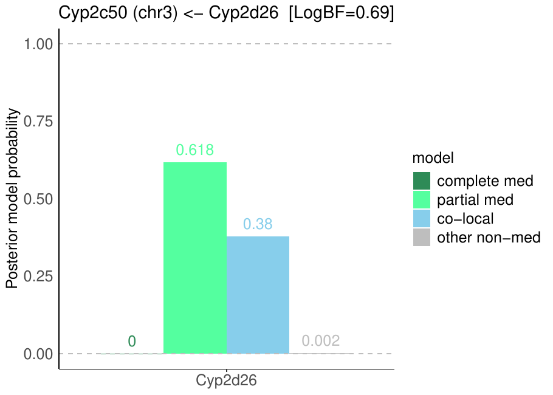{fig-align="center" width="95%"}

::: {.fig-downloads}
Download: [PDF](figures/repbc_2026-10-01/per_protein/Cyp2c50/Cyp2c50_targeted_mediation_chr3_posterior_bars.pdf){download="Cyp2c50_targeted_mediation_chr3_posterior_bars.pdf"}
:::

# Zero-inflated subset scan

Cyp2c50 has strains with no detectable protein (all replicates zero). A second scan was run on the strains with measurable variation (normalized within-strain variance > 0.01), re-normalized with its own Box-Cox λ, with its own permutation threshold. The binary (detected vs. not detected) scan has not been re-run with the new normalization.

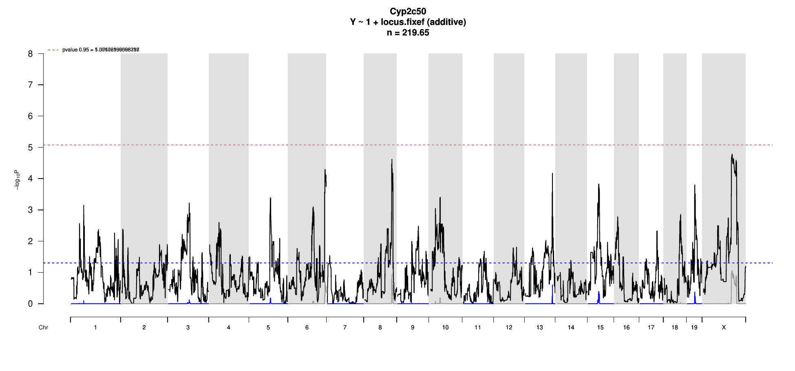{fig-align="center" width="95%"}

::: {.fig-downloads}
Download: [PDF](figures/repbc_2026-10-01/per_protein/Cyp2c50/Cyp2c50_sub_scan.pdf){download="Cyp2c50_sub_scan.pdf"}
:::

The subset scan has no genome-wide significant peak.
