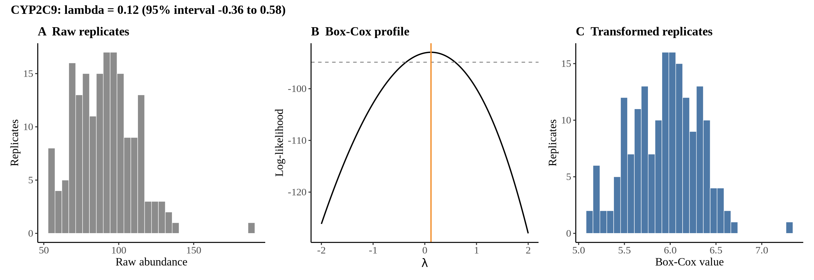
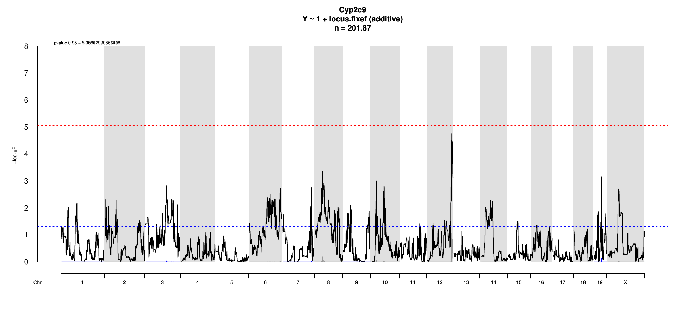

# Protein Overview

The protein Cyp2c9, also known as Cytochrome P450 2C9, is encoded by the gene **Cyp2c9** in mice. Its aliases include **Cyp2c**, **Cytochrome P450 2C**, and **CYP2C9**. This enzyme is involved in the metabolism of various substances, including drugs, and plays a crucial role in the liver's detoxification processes.

# Data and normalization

Replicate measurements were Box-Cox transformed with a protein-specific λ = **0.12** (95% likelihood interval -0.36 to 0.58), estimated on the individual replicates (`boxcox(y ~ strain)`, no +1 shift). The strain phenotype is the mean of the transformed replicates and the strain noise used for the wisam weights is their variance.

{fig-align="center" width="95%"}

::: {.fig-downloads}
Download: [PNG](figures/repbc_2026-10-01/proteins/Cyp2c9_normalization.png){download="Cyp2c9_normalization.png"} · [PDF](figures/repbc_2026-10-01/proteins/Cyp2c9_normalization.pdf){download="Cyp2c9_normalization.pdf"}
:::

## Heritability

Broad-sense heritability of the protein is **0.58** (95% CI 0.42–0.69; BH-adjusted P 1.69e-16). No transcript pair is defined for this protein (no mouse Cyp2c9; peptide SLVDPK is 6 residues (matches Cyp2e1 here) -- not specific enough to pair).

# pQTL genome scan

Genome scan of the Box-Cox phenotype with wisam weights (miqtl `scan.h2lmm`, 11 imputations); significance thresholds come from 1000 permutations (GEV fit to the permutation maxima of −log10 P). Strongest locus: chr12:113.58 Mb, P = 1.73e-05, adjusted P = 8.68e-02; 95% threshold = 5.06 (−log10 P).

{fig-align="center" width="95%"}

::: {.fig-downloads}
Download: [PDF](figures/repbc_2026-10-01/per_protein/Cyp2c9/Cyp2c9_genome_scan.pdf){download="Cyp2c9_genome_scan.pdf"} · [PDF](figures/repbc_2026-10-01/per_protein/Cyp2c9/Cyp2c9_scan_by_chromosome.pdf){download="Cyp2c9_scan_by_chromosome.pdf"}
:::

# Significant peak(s)

No genome-wide significant pQTL for this protein (adjusted P ≥ 0.05), so credible intervals, Merge, TIMBR and mediation were not run.
