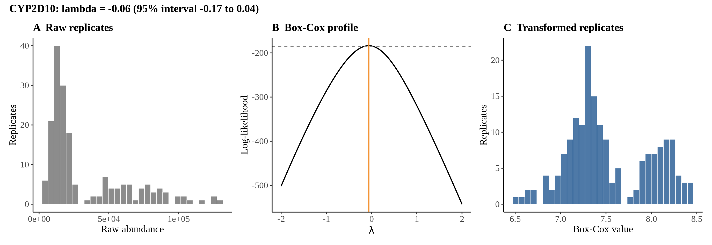
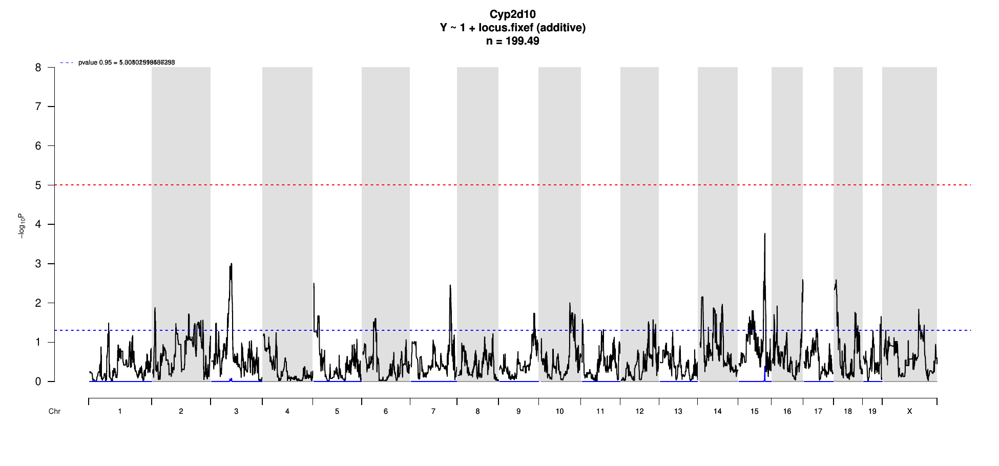

# Protein Overview

The mouse protein Cyp2d10, encoded by the gene **Cyp2d10**, is a member of the cytochrome P450 family of enzymes. It is involved in the metabolism of various compounds. The protein has several aliases, including **Cytochrome P450 2D10**. The UniProt accession number for Cyp2d10 is **Q8CIC6**.

# Data and normalization

Replicate measurements were Box-Cox transformed with a protein-specific λ = **-0.06** (95% likelihood interval -0.17 to 0.04), estimated on the individual replicates (`boxcox(y ~ strain)`, no +1 shift). The strain phenotype is the mean of the transformed replicates and the strain noise used for the wisam weights is their variance.

{fig-align="center" width="95%"}

::: {.fig-downloads}
Download: [PNG](figures/repbc_2026-10-01/proteins/Cyp2d10_normalization.png){download="Cyp2d10_normalization.png"} · [PDF](figures/repbc_2026-10-01/proteins/Cyp2d10_normalization.pdf){download="Cyp2d10_normalization.pdf"}
:::

## Heritability

Broad-sense heritability of the protein is **0.92** (95% CI 0.87–0.95; BH-adjusted P 3.48e-61). Its paired transcript is **Cyp2d10** (array probe `1418113_PM_at`, paired from the measured peptide `FGDIAPLNLPR`). Transcript H² is **0.21** (95% CI 0.05–0.35; BH-adjusted P 3.76e-03).

# pQTL genome scan

Genome scan of the Box-Cox phenotype with wisam weights (miqtl `scan.h2lmm`, 11 imputations); significance thresholds come from 1000 permutations (GEV fit to the permutation maxima of −log10 P). Strongest locus: chr15:83.56 Mb, P = 1.70e-04, adjusted P = 4.05e-01; 95% threshold = 5.01 (−log10 P).

{fig-align="center" width="95%"}

::: {.fig-downloads}
Download: [PDF](figures/repbc_2026-10-01/per_protein/Cyp2d10/Cyp2d10_genome_scan.pdf){download="Cyp2d10_genome_scan.pdf"} · [PDF](figures/repbc_2026-10-01/per_protein/Cyp2d10/Cyp2d10_scan_by_chromosome.pdf){download="Cyp2d10_scan_by_chromosome.pdf"}
:::

# Significant peak(s)

No genome-wide significant pQTL for this protein (adjusted P ≥ 0.05), so credible intervals, Merge, TIMBR and mediation were not run.
