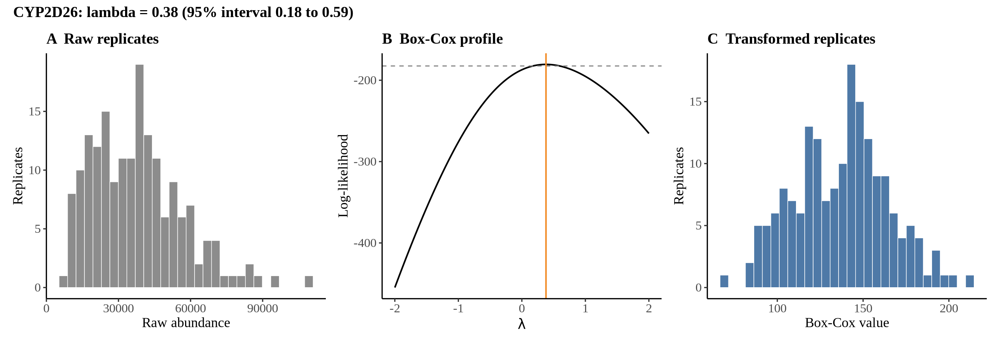
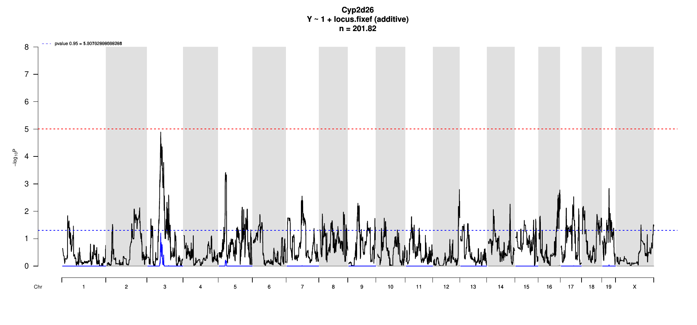

# Protein Overview

The protein Cyp2d26 is a member of the cytochrome P450 superfamily, involved in the metabolism of various substances. Its gene name is **Cyp2d26**, and it may also be referred to by its alias **Cytochrome P450 2D26**. This protein is typically found in mice and plays a role in the oxidation of organic substances. For detailed properties and functions, you can refer to its entry in the UniProt database.

# Data and normalization

Replicate measurements were Box-Cox transformed with a protein-specific λ = **0.38** (95% likelihood interval 0.18 to 0.59), estimated on the individual replicates (`boxcox(y ~ strain)`, no +1 shift). The strain phenotype is the mean of the transformed replicates and the strain noise used for the wisam weights is their variance.

{fig-align="center" width="95%"}

::: {.fig-downloads}
Download: [PNG](figures/repbc_2026-10-01/proteins/Cyp2d26_normalization.png){download="Cyp2d26_normalization.png"} · [PDF](figures/repbc_2026-10-01/proteins/Cyp2d26_normalization.pdf){download="Cyp2d26_normalization.pdf"}
:::

## Heritability

Broad-sense heritability of the protein is **0.80** (95% CI 0.70–0.86; BH-adjusted P 1.64e-35). Its paired transcript is **Cyp2d26** (array probe `1448683_PM_at`, paired from the measured peptide `GVILAPYGPEWR`). Transcript H² is **0.53** (95% CI 0.37–0.64; BH-adjusted P 7.64e-13).

# pQTL genome scan

Genome scan of the Box-Cox phenotype with wisam weights (miqtl `scan.h2lmm`, 11 imputations); significance thresholds come from 1000 permutations (GEV fit to the permutation maxima of −log10 P). Strongest locus: chr3:61.22 Mb, P = 1.28e-05, adjusted P = 6.25e-02; 95% threshold = 5.01 (−log10 P).

{fig-align="center" width="95%"}

::: {.fig-downloads}
Download: [PDF](figures/repbc_2026-10-01/per_protein/Cyp2d26/Cyp2d26_genome_scan.pdf){download="Cyp2d26_genome_scan.pdf"} · [PDF](figures/repbc_2026-10-01/per_protein/Cyp2d26/Cyp2d26_scan_by_chromosome.pdf){download="Cyp2d26_scan_by_chromosome.pdf"}
:::

# Significant peak(s)

No genome-wide significant pQTL for this protein (adjusted P ≥ 0.05), so credible intervals, Merge, TIMBR and mediation were not run.
