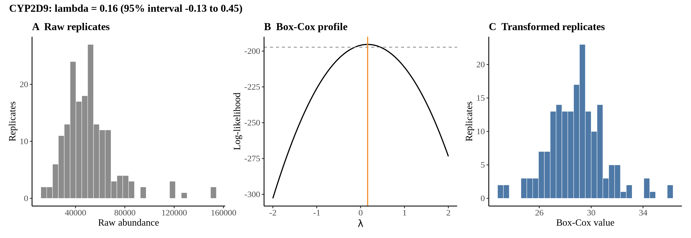
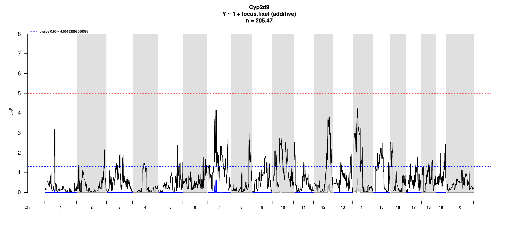

# Protein Overview

Cyp2d9 is a mouse protein encoded by the gene **Cyp2d9**. It is part of the cytochrome P450 superfamily and is involved in the metabolism of various substrates including drugs and endogenous compounds. The protein has several aliases, including **P450 2D9** and **Cytochrome P450 2D9**. For further information, you can find it on UniProt with the accession number P20815.

# Data and normalization

Replicate measurements were Box-Cox transformed with a protein-specific λ = **0.16** (95% likelihood interval -0.13 to 0.45), estimated on the individual replicates (`boxcox(y ~ strain)`, no +1 shift). The strain phenotype is the mean of the transformed replicates and the strain noise used for the wisam weights is their variance.

{fig-align="center" width="95%"}

::: {.fig-downloads}
Download: [PNG](figures/repbc_2026-10-01/proteins/Cyp2d9_normalization.png){download="Cyp2d9_normalization.png"} · [PDF](figures/repbc_2026-10-01/proteins/Cyp2d9_normalization.pdf){download="Cyp2d9_normalization.pdf"}
:::

## Heritability

Broad-sense heritability of the protein is **0.57** (95% CI 0.43–0.68; BH-adjusted P 4.96e-16). Its paired transcript is **Cyp2d9** (array probe `1419349_PM_a_at`, paired from the measured peptide `FGDIVPVNLPR`). Transcript H² is **0.41** (95% CI 0.27–0.55; BH-adjusted P 1.43e-08).

# pQTL genome scan

Genome scan of the Box-Cox phenotype with wisam weights (miqtl `scan.h2lmm`, 11 imputations); significance thresholds come from 1000 permutations (GEV fit to the permutation maxima of −log10 P). Strongest locus: chr14:28.94 Mb, P = 5.91e-05, adjusted P = 2.04e-01; 95% threshold = 4.99 (−log10 P).

{fig-align="center" width="95%"}

::: {.fig-downloads}
Download: [PDF](figures/repbc_2026-10-01/per_protein/Cyp2d9/Cyp2d9_genome_scan.pdf){download="Cyp2d9_genome_scan.pdf"} · [PDF](figures/repbc_2026-10-01/per_protein/Cyp2d9/Cyp2d9_scan_by_chromosome.pdf){download="Cyp2d9_scan_by_chromosome.pdf"}
:::

# Significant peak(s)

No genome-wide significant pQTL for this protein (adjusted P ≥ 0.05), so credible intervals, Merge, TIMBR and mediation were not run.
