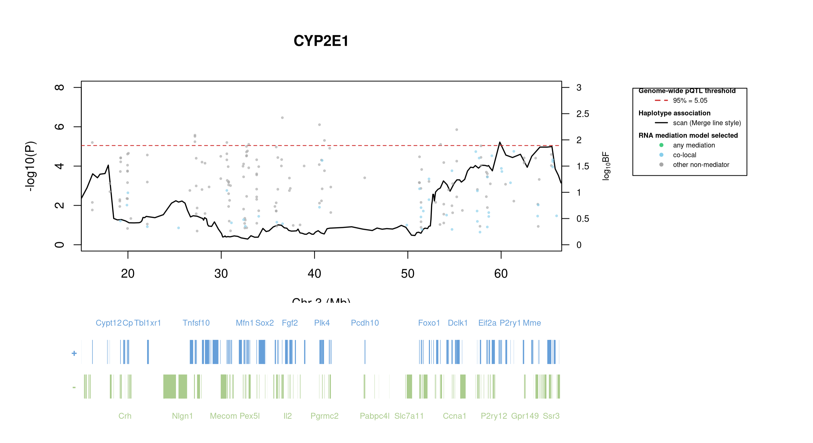

# Protein Overview

The mouse protein Cyp2e1, encoded by the gene **Cyp2e1**, is a member of the cytochrome P450 family of enzymes. It is involved in the metabolism of various substrates, including drugs and toxic compounds. Its aliases include **CYP2E1** and **Cytochrome P450 2E1**.

# Data and normalization

Replicate measurements were Box-Cox transformed with a protein-specific λ = **0.07** (95% likelihood interval -0.17 to 0.31), estimated on the individual replicates (`boxcox(y ~ strain)`, no +1 shift). The strain phenotype is the mean of the transformed replicates and the strain noise used for the wisam weights is their variance.

{fig-align="center" width="95%"}

::: {.fig-downloads}
Download: [PNG](figures/repbc_2026-10-01/proteins/Cyp2e1_normalization.png){download="Cyp2e1_normalization.png"} · [PDF](figures/repbc_2026-10-01/proteins/Cyp2e1_normalization.pdf){download="Cyp2e1_normalization.pdf"}
:::

## Heritability

Broad-sense heritability of the protein is **0.90** (95% CI 0.84–0.93; BH-adjusted P 1.01e-54). Its paired transcript is **Cyp2e1** (array probe `1415994_PM_at`, paired from the measured peptide `GIIFNNGPTWK`). Transcript H² is **0.25** (95% CI 0.07–0.40; BH-adjusted P 6.89e-04).

# pQTL genome scan

Genome scan of the Box-Cox phenotype with wisam weights (miqtl `scan.h2lmm`, 11 imputations); significance thresholds come from 1000 permutations (GEV fit to the permutation maxima of −log10 P). Strongest locus: chr3:59.86 Mb, P = 6.04e-06, adjusted P = 3.57e-02; 95% threshold = 5.05 (−log10 P).

{fig-align="center" width="95%"}

::: {.fig-downloads}
Download: [PDF](figures/repbc_2026-10-01/per_protein/Cyp2e1/Cyp2e1_genome_scan.pdf){download="Cyp2e1_genome_scan.pdf"} · [PDF](figures/repbc_2026-10-01/per_protein/Cyp2e1/Cyp2e1_scan_by_chromosome.pdf){download="Cyp2e1_scan_by_chromosome.pdf"}
:::

# Significant peak(s)

## Chromosome 3 peak (JAX00107960)

| Peak position | −log10(P) | Adjusted P | 90% credible interval | Encoding gene | Gene location | pQTL type |
|---|---:|---:|---|---|---|---|
| chr3:59.86 Mb | 5.22 | 3.57e-02 | 15.00–66.49 Mb | Cyp2e1 | chr7:140.76–140.77 Mb | **trans** |

A pQTL is **cis** when the gene encoding the protein lies within the credible interval and **trans** otherwise.

{fig-align="center" width="95%"}

::: {.fig-downloads}
Download: [PDF](figures/repbc_2026-10-01/per_protein/Cyp2e1/Cyp2e1_ci_scans_full.pdf){download="Cyp2e1_ci_scans_full.pdf"}
:::

{fig-align="center" width="95%"}

::: {.fig-downloads}
Download: [PNG](figures/repbc_2026-10-01/per_protein/Cyp2e1/Cyp2e1_ci_genes_full_chr3.png){download="Cyp2e1_ci_genes_full_chr3.png"}
:::

### Merge / diplotype fine-mapping

_Merge status: complete; the plot is not available yet._

### TIMBR allelic series

_TIMBR sweep complete; plots will appear once Merge profiles are available._

### RNA mediation

{fig-align="center" width="95%"}

::: {.fig-downloads}
Download: [PNG](figures/repbc_2026-10-01/per_protein/Cyp2e1/Cyp2e1_mediation_overlay_bf_chr3_withgenes.png){download="Cyp2e1_mediation_overlay_bf_chr3_withgenes.png"} · [PNG](figures/repbc_2026-10-01/per_protein/Cyp2e1/Cyp2e1_mediation_overlay_bf_chr3_nogenes.png){download="Cyp2e1_mediation_overlay_bf_chr3_nogenes.png"}
:::

{fig-align="center" width="95%"}

::: {.fig-downloads}
Download: [PDF](figures/repbc_2026-10-01/per_protein/Cyp2e1/Cyp2e1_targeted_mediation_chr3_posterior_bars.pdf){download="Cyp2e1_targeted_mediation_chr3_posterior_bars.pdf"}
:::
