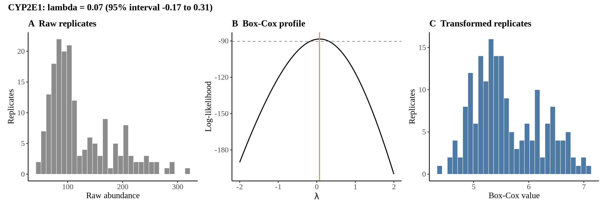
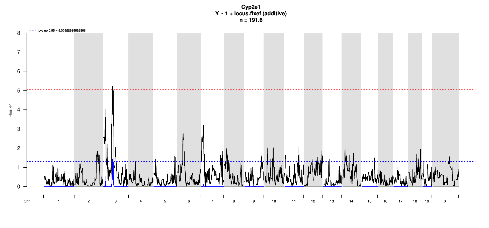
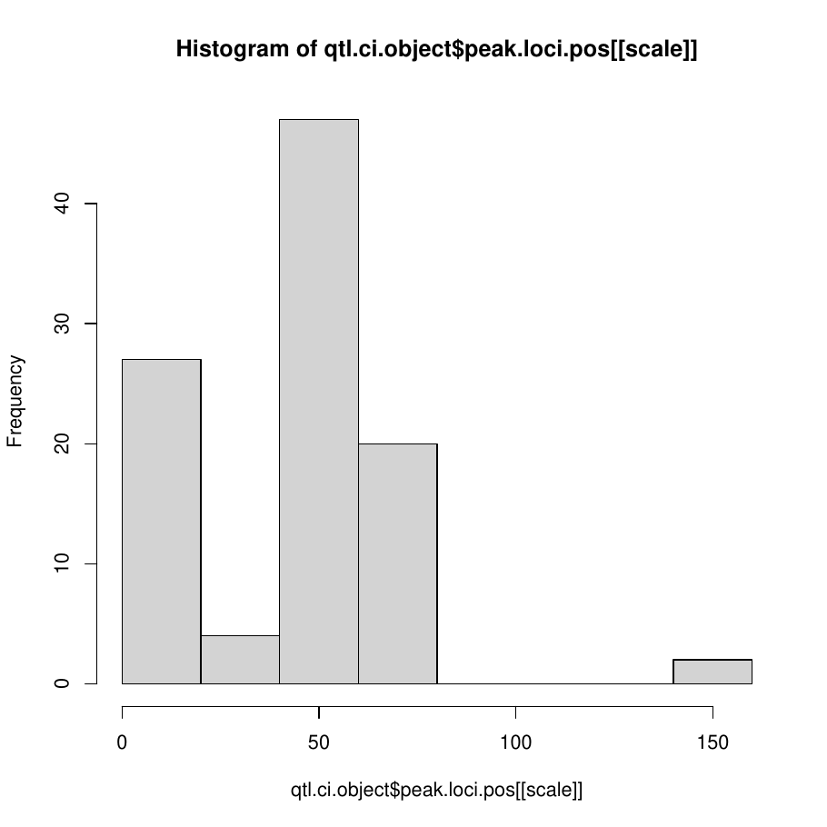
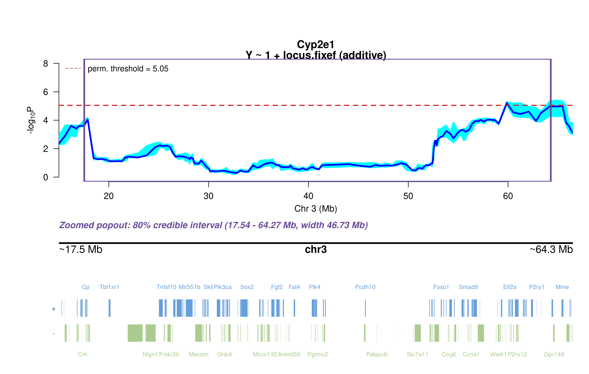
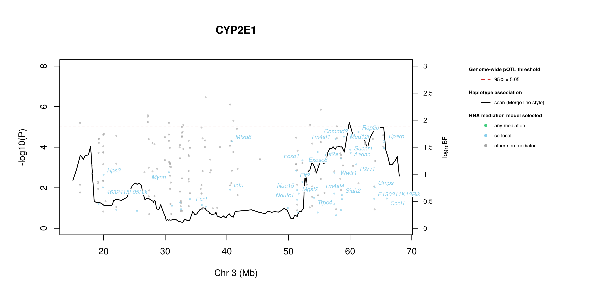
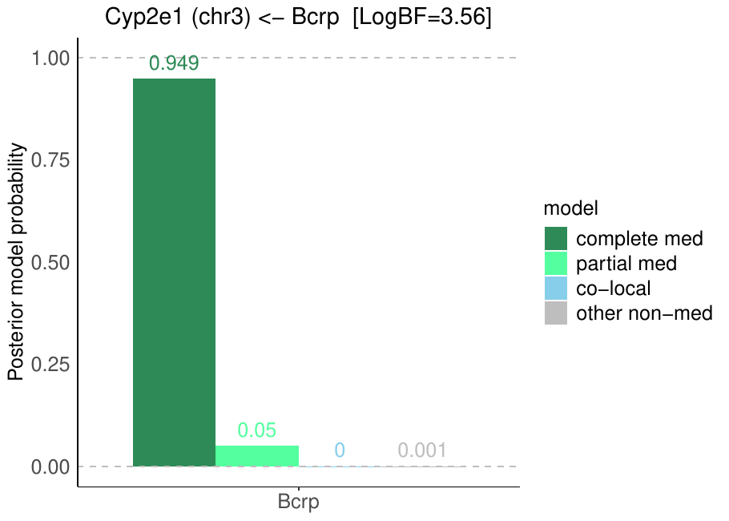

# Protein Overview

The mouse protein Cyp2e1, encoded by the gene **Cyp2e1**, is a member of the cytochrome P450 family of enzymes. It is involved in the metabolism of various substrates, including drugs and toxic compounds. Its aliases include **CYP2E1** and **Cytochrome P450 2E1**.

# Data and normalization

Replicate measurements were Box-Cox transformed with a protein-specific λ = **0.07** (95% likelihood interval -0.17 to 0.31), estimated on the individual replicates (`boxcox(y ~ strain)`, no +1 shift). The strain phenotype is the mean of the transformed replicates and the strain noise used for the wisam weights is their variance.

{fig-align="center" width="95%"}

::: {.fig-downloads}
Download: [PNG](figures/repbc_2026-10-01/proteins/Cyp2e1_normalization.png){download="Cyp2e1_normalization.png"} · [PDF](figures/repbc_2026-10-01/proteins/Cyp2e1_normalization.pdf){download="Cyp2e1_normalization.pdf"}
:::

## Heritability

Broad-sense heritability of the protein is **0.90** (95% CI 0.84–0.93; BH-adjusted P 1.01e-54). Its paired transcript is **Cyp2e1** (array probe `1415994_PM_at`, paired from the measured peptide `GIIFNNGPTWK`). Transcript H² is **0.25** (95% CI 0.07–0.40; BH-adjusted P 6.89e-04).

# pQTL genome scan

Genome scan of the Box-Cox phenotype with wisam weights (miqtl `scan.h2lmm`, 11 imputations); significance thresholds come from 1000 permutations (GEV fit to the permutation maxima of −log10 P). Strongest locus: chr3:59.86 Mb, P = 6.04e-06, adjusted P = 3.57e-02; 95% threshold = 5.05 (−log10 P).

{fig-align="center" width="95%"}

::: {.fig-downloads}
Download: [PDF](figures/repbc_2026-10-01/per_protein/Cyp2e1/Cyp2e1_genome_scan.pdf){download="Cyp2e1_genome_scan.pdf"} · [PDF](figures/repbc_2026-10-01/per_protein/Cyp2e1/Cyp2e1_scan_by_chromosome.pdf){download="Cyp2e1_scan_by_chromosome.pdf"}
:::

# Significant peak(s)

## Chromosome 3 peak (JAX00107960)

| Peak position | −log10(P) | Adjusted P | 90% credible interval | Encoding gene | Gene location | pQTL type |
|---|---:|---:|---|---|---|---|
| chr3:59.86 Mb | 5.22 | 3.57e-02 | 15.00–66.49 Mb | Cyp2e1 | chr7:140.76–140.77 Mb | **trans** |

A pQTL is **cis** when the gene encoding the protein lies within the credible interval and **trans** otherwise.

{fig-align="center" width="95%"}

::: {.fig-downloads}
Download: [PDF](figures/repbc_2026-10-01/per_protein/Cyp2e1/Cyp2e1_ci_scans_full.pdf){download="Cyp2e1_ci_scans_full.pdf"}
:::

{fig-align="center" width="95%"}

::: {.fig-downloads}
Download: [PNG](figures/repbc_2026-10-01/per_protein/Cyp2e1/Cyp2e1_ci_genes_full_chr3.png){download="Cyp2e1_ci_genes_full_chr3.png"}
:::

### Merge / diplotype fine-mapping

{fig-align="center" width="95%"}

::: {.fig-downloads}
Download: [PNG](figures/repbc_2026-10-01/per_protein/Cyp2e1/Cyp2e1_mergeplot_full_JAX00107960.png){download="Cyp2e1_mergeplot_full_JAX00107960.png"}
:::

_The top allelic series (SDP) from Merge is added to the book once the follow-up summary has been generated._

### TIMBR allelic series

{fig-align="center" width="95%"}

::: {.fig-downloads}
Download: [JPG](figures/repbc_2026-10-01/per_protein/Cyp2e1/Cyp2e1_timbr_ci_bf_dot_chr3.jpg){download="Cyp2e1_timbr_ci_bf_dot_chr3.jpg"}
:::

{fig-align="center" width="95%"}

::: {.fig-downloads}
Download: [JPG](figures/repbc_2026-10-01/per_protein/Cyp2e1/Cyp2e1_timbr_ci_dot_chr3.jpg){download="Cyp2e1_timbr_ci_dot_chr3.jpg"}
:::

The highest-posterior TIMBR allelic series at the peak splits the founders into **allele 1**: C57BL/6J, 129S1/SvImJ, NOD/ShiLtJ, NZO/HlLtJ, PWK/PhJ, WSB/EiJ; **allele 0**: A/J, CAST/EiJ. That is 2 functional alleles: founders in the same group are inferred to carry the same functional allele at this locus.

**Number of functional alleles.** At the lead locus (JAX00107960, 59.86 Mb) the posterior probability of a bi-allelic series (two functional alleles) is 0.40, tri-allelic 0.36, and four or more alleles 0.25; a single allele (no QTL effect) has probability 0.00. For comparison, the Chinese-restaurant-process prior gives 0.50 / 0.29 / 0.14 for one / two / three alleles, so the data move weight away from a single allele. The locus in the credible interval whose single best allelic series has the highest posterior probability is JAX00518784 (32.47 Mb; series 0,0,0,0,0,0,0,0, P = 0.75); there bi-allelic = 0.17, tri-allelic = 0.06, four or more = 0.02.

{fig-align="center" width="95%"}

::: {.fig-downloads}
Download: [PNG](figures/repbc_2026-10-01/per_protein/Cyp2e1/Cyp2e1_allele_number_prior_posterior_chr3.png){download="Cyp2e1_allele_number_prior_posterior_chr3.png"} · [PDF](figures/repbc_2026-10-01/per_protein/Cyp2e1/Cyp2e1_allele_number_prior_posterior_chr3.pdf){download="Cyp2e1_allele_number_prior_posterior_chr3.pdf"}
:::

{fig-align="center" width="95%"}

::: {.fig-downloads}
Download: [PNG](figures/repbc_2026-10-01/per_protein/Cyp2e1/Cyp2e1_allele_number_across_ci_chr3.png){download="Cyp2e1_allele_number_across_ci_chr3.png"} · [PDF](figures/repbc_2026-10-01/per_protein/Cyp2e1/Cyp2e1_allele_number_across_ci_chr3.pdf){download="Cyp2e1_allele_number_across_ci_chr3.pdf"}
:::

{fig-align="center" width="95%"}

::: {.fig-downloads}
Download: [PNG](figures/repbc_2026-10-01/per_protein/Cyp2e1/Cyp2e1_haplotype_lead_JAX00107960_chr3.png){download="Cyp2e1_haplotype_lead_JAX00107960_chr3.png"} · [PDF](figures/repbc_2026-10-01/per_protein/Cyp2e1/Cyp2e1_haplotype_lead_JAX00107960_chr3.pdf){download="Cyp2e1_haplotype_lead_JAX00107960_chr3.pdf"}
:::

{fig-align="center" width="95%"}

::: {.fig-downloads}
Download: [PNG](figures/repbc_2026-10-01/per_protein/Cyp2e1/Cyp2e1_haplotype_best_JAX00518784_chr3.png){download="Cyp2e1_haplotype_best_JAX00518784_chr3.png"} · [PDF](figures/repbc_2026-10-01/per_protein/Cyp2e1/Cyp2e1_haplotype_best_JAX00518784_chr3.pdf){download="Cyp2e1_haplotype_best_JAX00518784_chr3.pdf"}
:::

### RNA mediation

{fig-align="center" width="95%"}

::: {.fig-downloads}
Download: [PNG](figures/repbc_2026-10-01/per_protein/Cyp2e1/Cyp2e1_mediation_overlay_bf_chr3_nogenes.png){download="Cyp2e1_mediation_overlay_bf_chr3_nogenes.png"} · [PNG](figures/repbc_2026-10-01/per_protein/Cyp2e1/Cyp2e1_mediation_overlay_bf_chr3_withgenes.png){download="Cyp2e1_mediation_overlay_bf_chr3_withgenes.png"} · [CSV](figures/repbc_2026-10-01/per_protein/Cyp2e1/Cyp2e1_mediation_bf_points_chr3.csv){download="Cyp2e1_mediation_bf_points_chr3.csv"}
:::

108 candidate transcripts lie in the credible interval. **19** have a best-model log10 Bayes factor ≥ 0.5 with mediation or co-local as the best-supported model and are labelled in the figure (73 more reach 0.5 only for the non-mediator model and are not labelled): **co-local** (19): Rap2b (1.78), Tm4sf1 (1.78), Med12l (1.70), Commd2 (1.65), Tiparp (1.62), Mfsd8 (1.61), Aadac (1.46), Exosc8 (1.41), Sucnr1 (1.40), Foxo1 (1.26), P2ry1 (1.18), Hps3 (0.99) …. *Mediation* means the transcript is best explained as lying on the path from the QTL to the protein; *co-local* means it shares the QTL without mediating; log10 BF is the evidence for the best-supported model against the null.

::: {.callout-note collapse="true" title="Function of the 19 labelled transcripts (UniProt)"}
Function text is the UniProt (mouse) annotation retrieved on 2026-10-03; reviewed Swiss-Prot entries where available. A dash means UniProt holds no functional annotation for that symbol.

| Transcript | Best model | log10 BF | UniProt protein | Function (UniProt) |
|---|---|---:|---|---|
| *Rap2b* | co-local | 1.78 | [Ras-related protein Rap-2b](https://www.uniprot.org/uniprotkb/P61226) | Small GTP-binding protein which cycles between a GDP-bound inactive and a GTP-bound active form. Involved in EGFR and CHRM3 signaling pathways through stimulation of PLCE1. May play a role in cytoskeletal rearrangements and regulate cell spreading through activation of the effector TNIK. May regulate membrane vesiculation in red blood cells |
| *Tm4sf1* | co-local | 1.78 | [Transmembrane 4 L6 family member 1](https://www.uniprot.org/uniprotkb/Q64302) | — |
| *Med12l* | co-local | 1.70 | [Mediator of RNA polymerase II transcription subunit 12-like protein](https://www.uniprot.org/uniprotkb/Q8BQM9) | May be a component of the Mediator complex, a coactivator involved in the regulated transcription of nearly all RNA polymerase II-dependent genes. Mediator functions as a bridge to convey information from gene-specific regulatory proteins to the basal RNA polymerase II transcription machinery. |
| *Commd2* | co-local | 1.65 | [COMM domain-containing protein 2](https://www.uniprot.org/uniprotkb/Q8BXC6) | Scaffold protein in the commander complex that is essential for endosomal recycling of transmembrane cargos; the commander complex is composed of the CCC subcomplex and the retriever subcomplex. May modulate activity of cullin-RING E3 ubiquitin ligase (CRL) complexes. May down-regulate activation of NF-kappa-B |
| *Tiparp* | co-local | 1.62 | [Protein mono-ADP-ribosyltransferase TIPARP](https://www.uniprot.org/uniprotkb/Q8C1B2) | ADP-ribosyltransferase that mediates mono-ADP-ribosylation of glutamate, aspartate and cysteine residues on target proteins. Acts as a negative regulator of AHR by mediating mono-ADP-ribosylation of AHR, leading to inhibit transcription activator activity of AHR (Probable) |
| *Mfsd8* | co-local | 1.61 | [Major facilitator superfamily domain-containing protein 8](https://www.uniprot.org/uniprotkb/Q8BH31) | Outward-rectifying chloride channel involved in endolysosomal chloride homeostasis, membrane fusion and function. Conducts chloride currents up to hundreds of picoamperes. Regulates lysosomal calcium content by reducing the lysosomal membrane potential, thereby activating TRPML1 channel and further release of lysosomal calcium ions. |
| *Aadac* | co-local | 1.46 | [Deacylase AADAC](https://www.uniprot.org/uniprotkb/Q99PG0) | Catalyzes the hydrolysis of ester and amide bonds and is largely involved in prodrugs activation, xenobiotic detoxification or toxicity, and, in some contexts, lipid and indole metabolism. Prefers compounds with relatively small acyl groups, especially compounds with acetyl group. |
| *Exosc8* | co-local | 1.41 | [Exosome complex component RRP43](https://www.uniprot.org/uniprotkb/Q9D753) | Non-catalytic component of the RNA exosome complex which has 3'->5' exoribonuclease activity and participates in a multitude of cellular RNA processing and degradation events. |
| *Sucnr1* | co-local | 1.40 | [Succinate receptor 1](https://www.uniprot.org/uniprotkb/Q99MT6) | G protein-coupled receptor for succinate able to mediate signaling through Gq/GNAQ or Gi/GNAI second messengers depending on the cell type and the processes regulated. Succinate-SUCNR1 signaling serves as a link between metabolic stress, inflammation and energy homeostasis. In macrophages, plays a range of immune-regulatory roles. |
| *Foxo1* | co-local | 1.26 | [Forkhead box protein O1](https://www.uniprot.org/uniprotkb/Q9R1E0) | Transcription factor that is the main target of insulin signaling and regulates metabolic homeostasis in response to oxidative stress. Binds to the insulin response element (IRE) with consensus sequence 5'-TT[G/A]TTTTG-3' and the related Daf-16 family binding element (DBE) with consensus sequence 5'-TT[G/A]TTTAC-3'. Activity suppressed by insulin. |
| *P2ry1* | co-local | 1.18 | [P2Y purinoceptor 1](https://www.uniprot.org/uniprotkb/P49650) | Receptor for extracellular adenine nucleotides such as ADP. In platelets, binding to ADP leads to mobilization of intracellular calcium ions via activation of phospholipase C, a change in platelet shape, and ultimately platelet aggregation |
| *Hps3* | co-local | 0.99 | [BLOC-2 complex member HPS3](https://www.uniprot.org/uniprotkb/Q91VB4) | Involved in early stages of melanosome biogenesis and maturation |
| *Gmps* | co-local | 0.76 | [GMP synthase [glutamine-hydrolyzing]](https://www.uniprot.org/uniprotkb/Q3THK7) | Catalyzes the conversion of xanthine monophosphate (XMP) to GMP in the presence of glutamine and ATP through an adenyl-XMP intermediate |
| *Tm4sf4* | co-local | 0.64 | [Transmembrane 4 L6 family member 4](https://www.uniprot.org/uniprotkb/Q91XD3) | Regulates the adhesive and proliferative status of intestinal epithelial cells. Can mediate density-dependent cell proliferation |
| *Mgst2* | co-local | 0.64 | [Microsomal glutathione S-transferase 2](https://www.uniprot.org/uniprotkb/A2RST1) | Catalyzes several different glutathione-dependent reactions. Catalyzes the glutathione-dependent reduction of lipid hydroperoxides, such as 5-HPETE. Has glutathione transferase activity, toward xenobiotic electrophiles, such as 1-chloro-2, 4-dinitrobenzene (CDNB). Also catalyzes the conjugation of leukotriene A4 with reduced glutathione to form leukotriene C4 (LTC4). |
| *Siah2* | co-local | 0.61 | [E3 ubiquitin-protein ligase SIAH2](https://www.uniprot.org/uniprotkb/Q06986) | E3 ubiquitin-protein ligase that mediates ubiquitination and subsequent proteasomal degradation of target proteins. E3 ubiquitin ligases accept ubiquitin from an E2 ubiquitin-conjugating enzyme in the form of a thioester and then directly transfers the ubiquitin to targeted substrates. |
| *Trpc4* | co-local | 0.57 | [Short transient receptor potential channel 4](https://www.uniprot.org/uniprotkb/Q9QUQ5) | Forms a receptor-activated non-selective calcium permeant cation channel. Acts as a cell-cell contact-dependent endothelial calcium entry channel. Forms a homomeric ion channel or a heteromeric ion channel with TRPC1; the heteromeric ion channel has reduced calcium permeability compared to the homomeric channel. |
| *Ccnl1* | co-local | 0.55 | [Cyclin-L1](https://www.uniprot.org/uniprotkb/Q52KE7) | Regulatory component of the cyclin-L-CDK11 complex that regulates transcription and pre-mRNA splicing. Inhibited by the CDK-specific inhibitor CDKN1A/p21 |
| *E130311K13Rik* | co-local | 0.55 | — | — |
:::

{fig-align="center" width="95%"}

::: {.fig-downloads}
Download: [PDF](figures/repbc_2026-10-01/per_protein/Cyp2e1/Cyp2e1_targeted_mediation_chr3_posterior_bars.pdf){download="Cyp2e1_targeted_mediation_chr3_posterior_bars.pdf"}
:::
