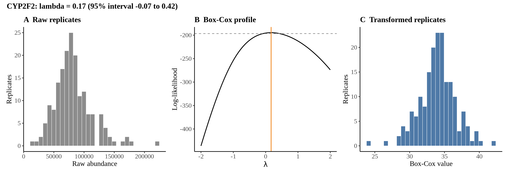
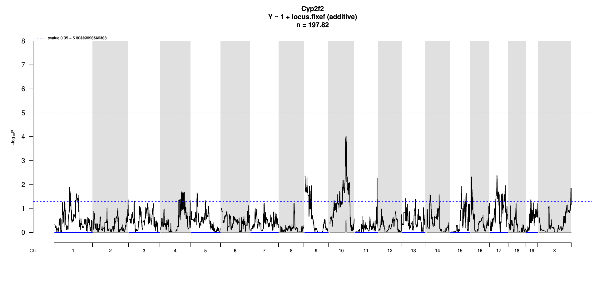

# Protein Overview

The mouse protein Cyp2f2 is encoded by the gene **Cyp2f2**. It is also known by the alias **CYP2F2**. This protein belongs to the cytochrome P450 family, which is involved in the metabolism of various substances, including drugs and endogenous compounds. Cyp2f2 specifically plays a role in the oxidative metabolism of fatty acids and other compounds.

# Data and normalization

Replicate measurements were Box-Cox transformed with a protein-specific λ = **0.17** (95% likelihood interval -0.07 to 0.42), estimated on the individual replicates (`boxcox(y ~ strain)`, no +1 shift). The strain phenotype is the mean of the transformed replicates and the strain noise used for the wisam weights is their variance.

{fig-align="center" width="95%"}

::: {.fig-downloads}
Download: [PNG](figures/repbc_2026-10-01/proteins/Cyp2f2_normalization.png){download="Cyp2f2_normalization.png"} · [PDF](figures/repbc_2026-10-01/proteins/Cyp2f2_normalization.pdf){download="Cyp2f2_normalization.pdf"}
:::

## Heritability

Broad-sense heritability of the protein is **0.55** (95% CI 0.41–0.66; BH-adjusted P 3.82e-15). Its paired transcript is **Cyp2f2** (array probe `1448792_PM_a_at`, paired from the measured peptide `SQDLLTSLTK`). Transcript H² is **0.39** (95% CI 0.17–0.55; BH-adjusted P 1.53e-06).

# pQTL genome scan

Genome scan of the Box-Cox phenotype with wisam weights (miqtl `scan.h2lmm`, 11 imputations); significance thresholds come from 1000 permutations (GEV fit to the permutation maxima of −log10 P). Strongest locus: chr10:89.93 Mb, P = 9.31e-05, adjusted P = 2.86e-01; 95% threshold = 5.03 (−log10 P).

{fig-align="center" width="95%"}

::: {.fig-downloads}
Download: [PDF](figures/repbc_2026-10-01/per_protein/Cyp2f2/Cyp2f2_genome_scan.pdf){download="Cyp2f2_genome_scan.pdf"} · [PDF](figures/repbc_2026-10-01/per_protein/Cyp2f2/Cyp2f2_scan_by_chromosome.pdf){download="Cyp2f2_scan_by_chromosome.pdf"}
:::

# Significant peak(s)

No genome-wide significant pQTL for this protein (adjusted P ≥ 0.05), so credible intervals, Merge, TIMBR and mediation were not run.
