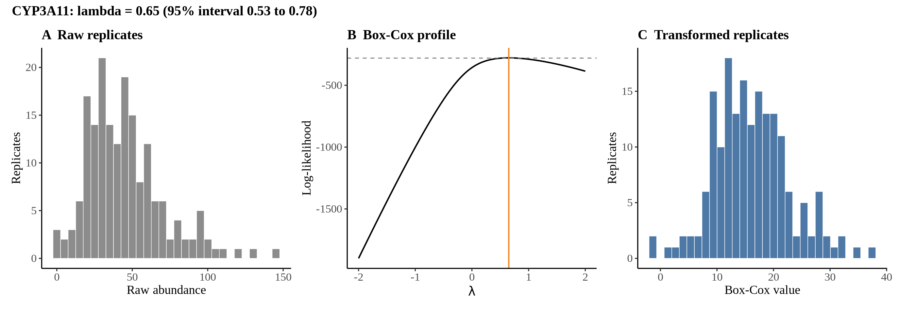
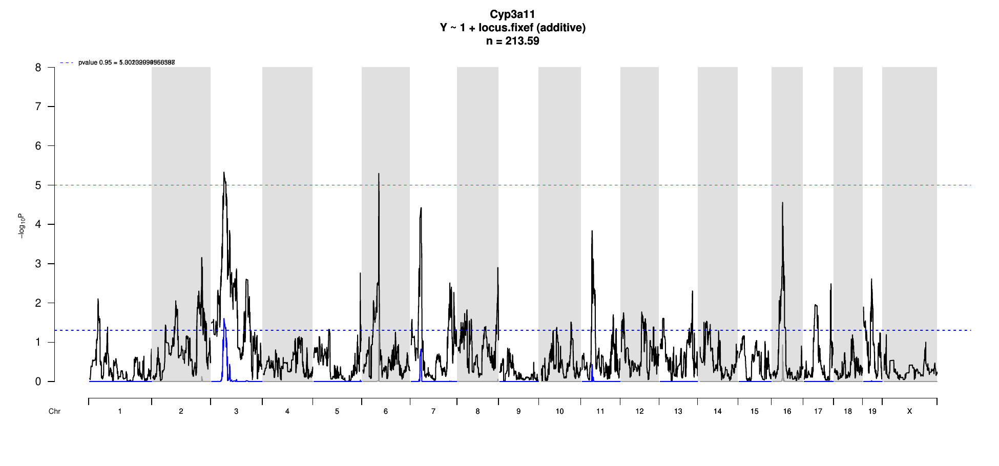
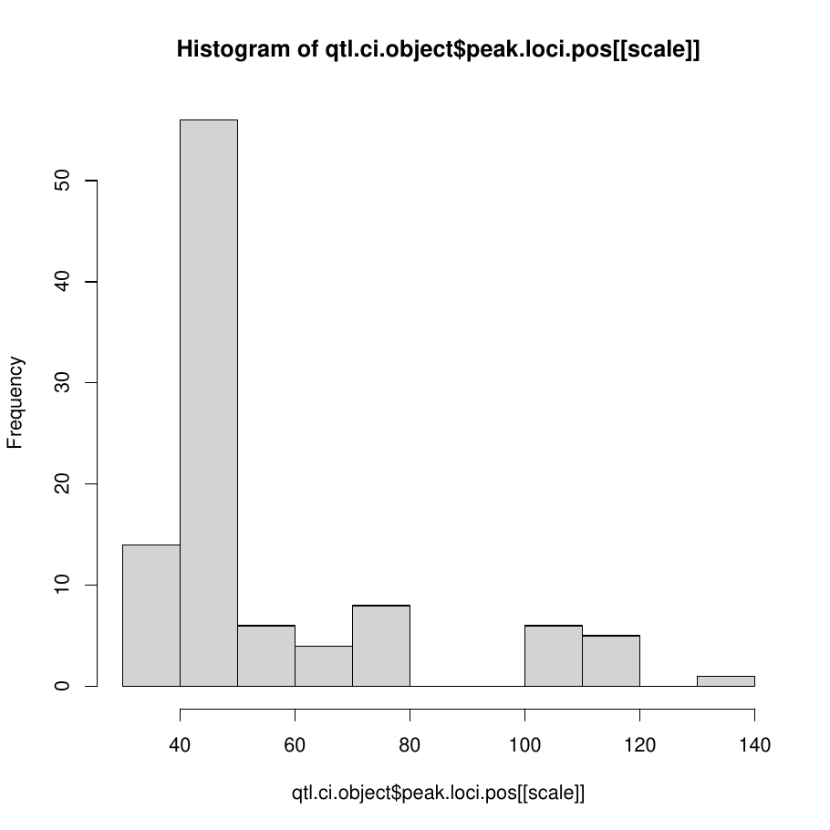
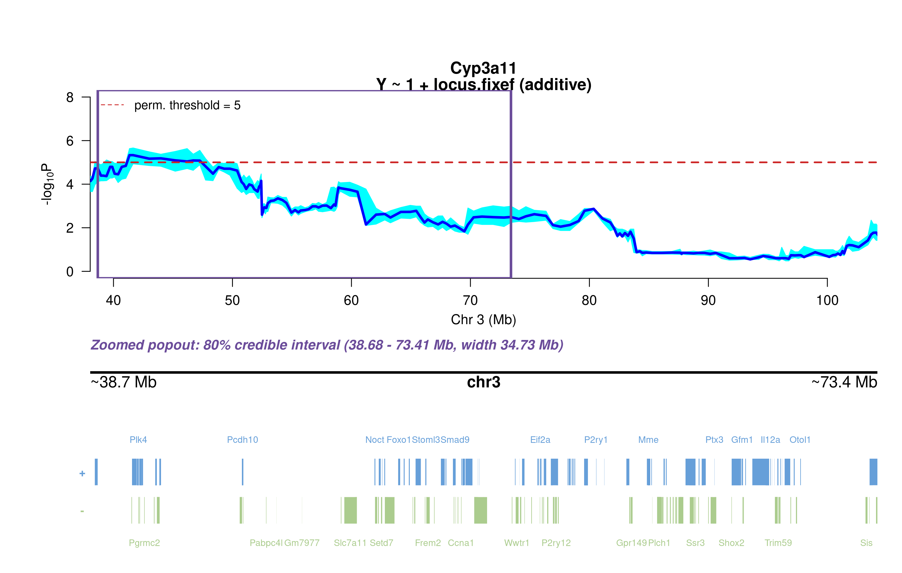
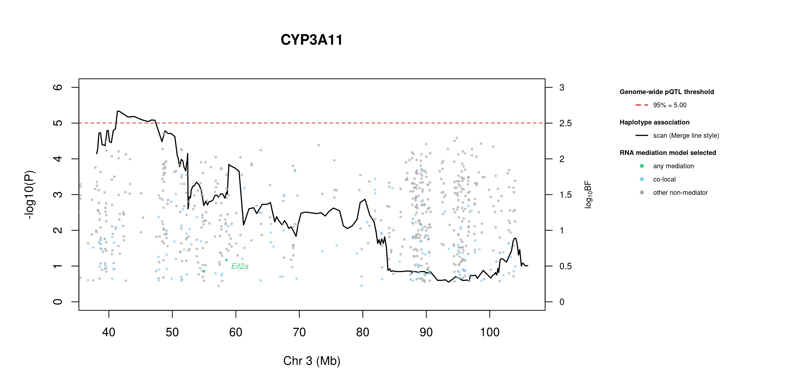
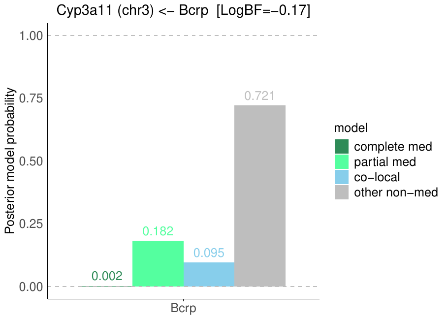
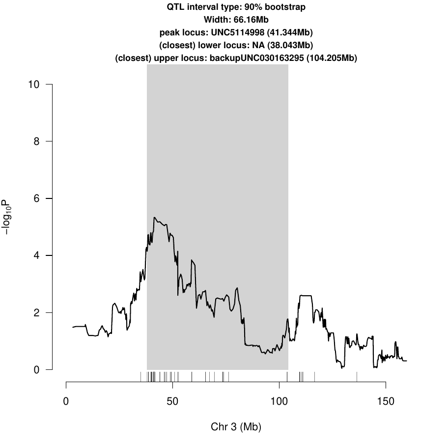
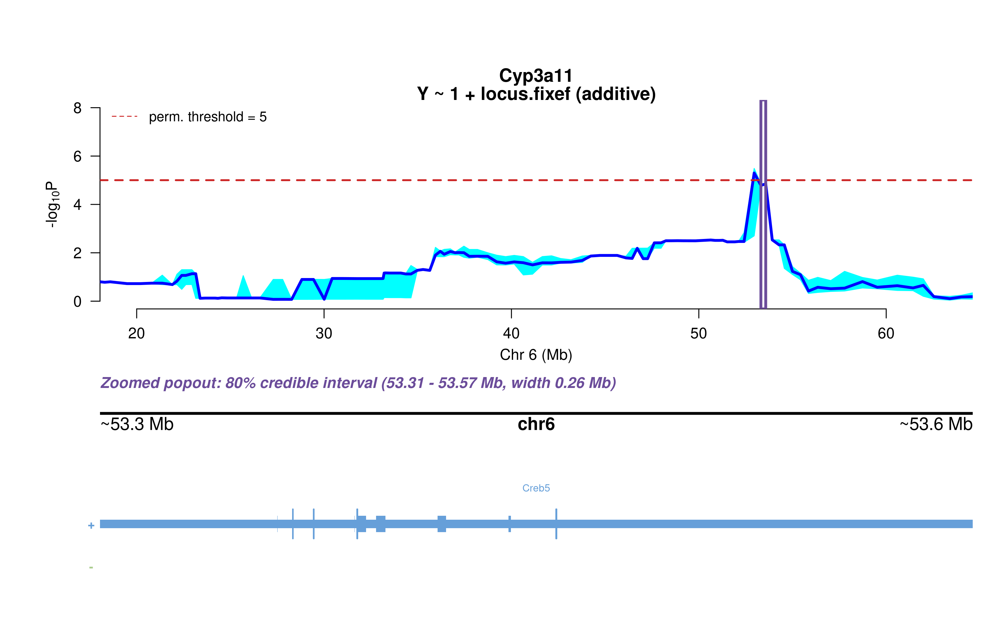
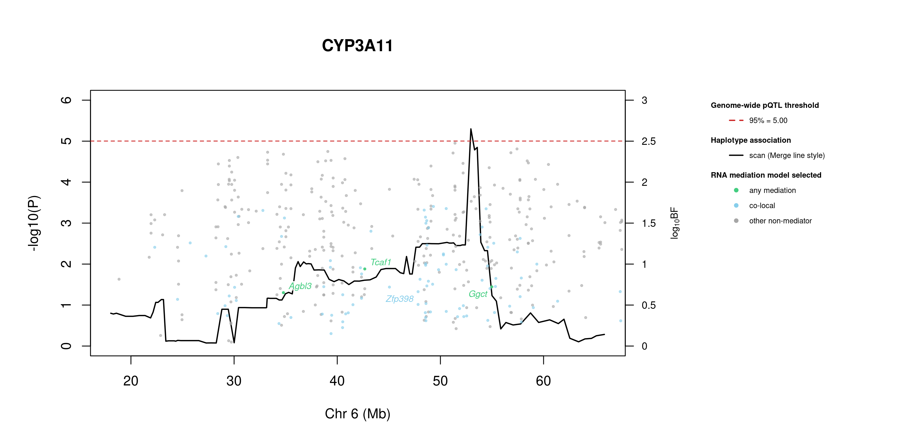
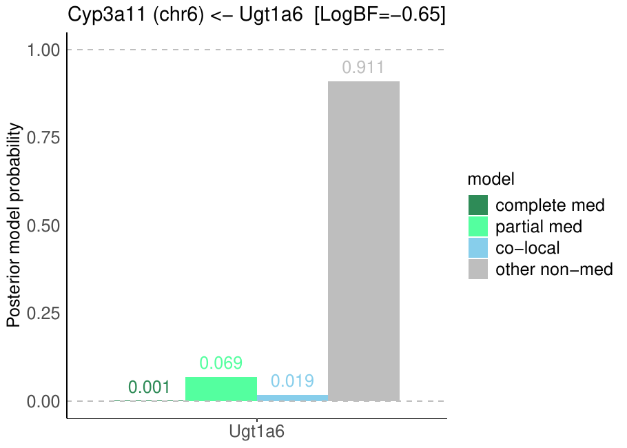

# Protein Overview

The mouse protein Cyp3a11, also known as Cytochrome P450 3A11, is encoded by the gene **Cyp3a11**. It is involved in the metabolism of various drugs and xenobiotics. The protein has several aliases, including **Cyp3a** and **Cytochrome P450 3A subfamily A**.

# Data and normalization

Replicate measurements were Box-Cox transformed with a protein-specific λ = **0.65** (95% likelihood interval 0.53 to 0.78), estimated on the individual replicates (`boxcox(y ~ strain)`, no +1 shift). The strain phenotype is the mean of the transformed replicates and the strain noise used for the wisam weights is their variance.

{fig-align="center" width="95%"}

::: {.fig-downloads}
Download: [PNG](figures/repbc_2026-10-01/proteins/Cyp3a11_normalization.png){download="Cyp3a11_normalization.png"} · [PDF](figures/repbc_2026-10-01/proteins/Cyp3a11_normalization.pdf){download="Cyp3a11_normalization.pdf"}
:::

## Heritability

Broad-sense heritability of the protein is **0.60** (95% CI 0.44–0.71; BH-adjusted P 5.35e-18). Its paired transcript is **Cyp3a11** (array probe `1416809_PM_at`, paired from the measured peptide `LYPIANR`). Transcript H² is **0.20** (95% CI 0.03–0.34; BH-adjusted P 4.89e-03).

# pQTL genome scan

Genome scan of the Box-Cox phenotype with wisam weights (miqtl `scan.h2lmm`, 11 imputations); significance thresholds come from 1000 permutations (GEV fit to the permutation maxima of −log10 P). Strongest locus: chr3:41.34 Mb, P = 4.65e-06, adjusted P = 2.48e-02; 95% threshold = 5.00 (−log10 P).

{fig-align="center" width="95%"}

::: {.fig-downloads}
Download: [PDF](figures/repbc_2026-10-01/per_protein/Cyp3a11/Cyp3a11_genome_scan.pdf){download="Cyp3a11_genome_scan.pdf"} · [PDF](figures/repbc_2026-10-01/per_protein/Cyp3a11/Cyp3a11_scan_by_chromosome.pdf){download="Cyp3a11_scan_by_chromosome.pdf"}
:::

# Significant peak(s)

## Chromosome 3 peak (UNC5114998)

| Peak position | −log10(P) | Adjusted P | 90% credible interval | Encoding gene | Gene location | pQTL type |
|---|---:|---:|---|---|---|---|
| chr3:41.34 Mb | 5.33 | 2.48e-02 | 38.04–104.21 Mb | Cyp3a11 | chr5:145.85–145.88 Mb | **trans** |

A pQTL is **cis** when the gene encoding the protein lies within the credible interval and **trans** otherwise.

{fig-align="center" width="95%"}

::: {.fig-downloads}
Download: [PDF](figures/repbc_2026-10-01/per_protein/Cyp3a11/Cyp3a11_ci_scans_full.pdf){download="Cyp3a11_ci_scans_full.pdf"}
:::

{fig-align="center" width="95%"}

::: {.fig-downloads}
Download: [PNG](figures/repbc_2026-10-01/per_protein/Cyp3a11/Cyp3a11_ci_genes_full_chr3.png){download="Cyp3a11_ci_genes_full_chr3.png"}
:::

### Merge / diplotype fine-mapping

{fig-align="center" width="95%"}

::: {.fig-downloads}
Download: [PNG](figures/repbc_2026-10-01/per_protein/Cyp3a11/Cyp3a11_mergeplot_full_UNC5114998.png){download="Cyp3a11_mergeplot_full_UNC5114998.png"}
:::

In plain terms, the strongest Merge strain distribution pattern (SDP) splits the eight founders into **allele 0**: A/J, 129S1/SvImJ, NOD/ShiLtJ, NZO/HlLtJ, CAST/EiJ, PWK/PhJ; **allele 1**: C57BL/6J, WSB/EiJ. That is 2 functional alleles: founders in the same group are inferred to carry the same functional allele at this locus.

### TIMBR allelic series

{fig-align="center" width="95%"}

::: {.fig-downloads}
Download: [JPG](figures/repbc_2026-10-01/per_protein/Cyp3a11/Cyp3a11_timbr_ci_bf_dot_chr3.jpg){download="Cyp3a11_timbr_ci_bf_dot_chr3.jpg"}
:::

{fig-align="center" width="95%"}

::: {.fig-downloads}
Download: [PNG](figures/repbc_2026-10-01/per_protein/Cyp3a11/Cyp3a11_timbr_ci_bf_dot_chr3.png){download="Cyp3a11_timbr_ci_bf_dot_chr3.png"}
:::

{fig-align="center" width="95%"}

::: {.fig-downloads}
Download: [JPG](figures/repbc_2026-10-01/per_protein/Cyp3a11/Cyp3a11_timbr_ci_dot_chr3.jpg){download="Cyp3a11_timbr_ci_dot_chr3.jpg"}
:::

{fig-align="center" width="95%"}

::: {.fig-downloads}
Download: [PNG](figures/repbc_2026-10-01/per_protein/Cyp3a11/Cyp3a11_timbr_ci_dot_chr3.png){download="Cyp3a11_timbr_ci_dot_chr3.png"}
:::

The highest-posterior TIMBR allelic series at the peak splits the founders into **allele 0**: A/J, C57BL/6J, 129S1/SvImJ, WSB/EiJ; **allele 1**: NOD/ShiLtJ, NZO/HlLtJ, CAST/EiJ, PWK/PhJ. That is 2 functional alleles: founders in the same group are inferred to carry the same functional allele at this locus.

**Number of functional alleles.** At the lead locus (UNC5114998, 41.34 Mb) the posterior probability of a bi-allelic series (two functional alleles) is 0.30, tri-allelic 0.39, and four or more alleles 0.31; a single allele (no QTL effect) has probability 0.00. For comparison, the Chinese-restaurant-process prior gives 0.50 / 0.29 / 0.14 for one / two / three alleles, so the data move weight away from a single allele. The locus in the credible interval whose single best allelic series has the highest posterior probability is UNC030147562 (94.22 Mb; series 0,0,0,0,0,0,0,0, P = 0.70); there bi-allelic = 0.20, tri-allelic = 0.07, four or more = 0.03.

{fig-align="center" width="95%"}

::: {.fig-downloads}
Download: [PNG](figures/repbc_2026-10-01/per_protein/Cyp3a11/Cyp3a11_allele_number_prior_posterior_chr3.png){download="Cyp3a11_allele_number_prior_posterior_chr3.png"} · [PDF](figures/repbc_2026-10-01/per_protein/Cyp3a11/Cyp3a11_allele_number_prior_posterior_chr3.pdf){download="Cyp3a11_allele_number_prior_posterior_chr3.pdf"}
:::

{fig-align="center" width="95%"}

::: {.fig-downloads}
Download: [PNG](figures/repbc_2026-10-01/per_protein/Cyp3a11/Cyp3a11_allele_number_across_ci_chr3.png){download="Cyp3a11_allele_number_across_ci_chr3.png"} · [PDF](figures/repbc_2026-10-01/per_protein/Cyp3a11/Cyp3a11_allele_number_across_ci_chr3.pdf){download="Cyp3a11_allele_number_across_ci_chr3.pdf"}
:::

{fig-align="center" width="95%"}

::: {.fig-downloads}
Download: [PNG](figures/repbc_2026-10-01/per_protein/Cyp3a11/Cyp3a11_haplotype_lead_UNC5114998_chr3.png){download="Cyp3a11_haplotype_lead_UNC5114998_chr3.png"} · [PDF](figures/repbc_2026-10-01/per_protein/Cyp3a11/Cyp3a11_haplotype_lead_UNC5114998_chr3.pdf){download="Cyp3a11_haplotype_lead_UNC5114998_chr3.pdf"}
:::

{fig-align="center" width="95%"}

::: {.fig-downloads}
Download: [PNG](figures/repbc_2026-10-01/per_protein/Cyp3a11/Cyp3a11_haplotype_best_UNC030147562_chr3.png){download="Cyp3a11_haplotype_best_UNC030147562_chr3.png"} · [PDF](figures/repbc_2026-10-01/per_protein/Cyp3a11/Cyp3a11_haplotype_best_UNC030147562_chr3.pdf){download="Cyp3a11_haplotype_best_UNC030147562_chr3.pdf"}
:::

### RNA mediation

{fig-align="center" width="95%"}

::: {.fig-downloads}
Download: [PNG](figures/repbc_2026-10-01/per_protein/Cyp3a11/Cyp3a11_mediation_overlay_bf_chr3_nogenes.png){download="Cyp3a11_mediation_overlay_bf_chr3_nogenes.png"} · [PNG](figures/repbc_2026-10-01/per_protein/Cyp3a11/Cyp3a11_mediation_overlay_bf_chr3_withgenes.png){download="Cyp3a11_mediation_overlay_bf_chr3_withgenes.png"} · [CSV](figures/repbc_2026-10-01/per_protein/Cyp3a11/Cyp3a11_mediation_bf_points_chr3.csv){download="Cyp3a11_mediation_bf_points_chr3.csv"}
:::

467 candidate transcripts lie in the credible interval. **0** have a best-model log10 Bayes factor ≥ 0.5 and mediation has the highest posterior probability among the model classes; these are labelled in the figure (377 more reach 0.5 only for the non-mediator model and are not labelled): none.. *Mediation* means the transcript is best explained as lying on the path from the QTL to the protein; *co-local* means it shares the QTL without mediating; log10 BF is the evidence for the best-supported model against the null.

{fig-align="center" width="95%"}

::: {.fig-downloads}
Download: [PDF](figures/repbc_2026-10-01/per_protein/Cyp3a11/Cyp3a11_protein_mediation_chr3_posterior_bars.pdf){download="Cyp3a11_protein_mediation_chr3_posterior_bars.pdf"}
:::

## Chromosome 6 peak (UNC11092470)

| Peak position | −log10(P) | Adjusted P | 90% credible interval | Encoding gene | Gene location | pQTL type |
|---|---:|---:|---|---|---|---|
| chr6:52.95 Mb | 5.30 | 2.67e-02 | 18.04–64.62 Mb | Cyp3a11 | chr5:145.85–145.88 Mb | **trans** |

A pQTL is **cis** when the gene encoding the protein lies within the credible interval and **trans** otherwise.

{fig-align="center" width="95%"}

::: {.fig-downloads}
Download: [PDF](figures/repbc_2026-10-01/per_protein/Cyp3a11/Cyp3a11_ci_scans_full.pdf){download="Cyp3a11_ci_scans_full.pdf"}
:::

{fig-align="center" width="95%"}

::: {.fig-downloads}
Download: [PNG](figures/repbc_2026-10-01/per_protein/Cyp3a11/Cyp3a11_ci_genes_full_chr6.png){download="Cyp3a11_ci_genes_full_chr6.png"}
:::

### Merge / diplotype fine-mapping

{fig-align="center" width="95%"}

::: {.fig-downloads}
Download: [PNG](figures/repbc_2026-10-01/per_protein/Cyp3a11/Cyp3a11_mergeplot_full_UNC11092470.png){download="Cyp3a11_mergeplot_full_UNC11092470.png"}
:::

In plain terms, the strongest Merge strain distribution pattern (SDP) splits the eight founders into **allele 1**: C57BL/6J, 129S1/SvImJ, NOD/ShiLtJ, NZO/HlLtJ; **allele 2**: CAST/EiJ, PWK/PhJ, WSB/EiJ; **allele 0**: A/J. That is 3 functional alleles: founders in the same group are inferred to carry the same functional allele at this locus.

### TIMBR allelic series

{fig-align="center" width="95%"}

::: {.fig-downloads}
Download: [JPG](figures/repbc_2026-10-01/per_protein/Cyp3a11/Cyp3a11_timbr_ci_bf_dot_chr6.jpg){download="Cyp3a11_timbr_ci_bf_dot_chr6.jpg"}
:::

{fig-align="center" width="95%"}

::: {.fig-downloads}
Download: [PNG](figures/repbc_2026-10-01/per_protein/Cyp3a11/Cyp3a11_timbr_ci_bf_dot_chr6.png){download="Cyp3a11_timbr_ci_bf_dot_chr6.png"}
:::

{fig-align="center" width="95%"}

::: {.fig-downloads}
Download: [JPG](figures/repbc_2026-10-01/per_protein/Cyp3a11/Cyp3a11_timbr_ci_dot_chr6.jpg){download="Cyp3a11_timbr_ci_dot_chr6.jpg"}
:::

{fig-align="center" width="95%"}

::: {.fig-downloads}
Download: [PNG](figures/repbc_2026-10-01/per_protein/Cyp3a11/Cyp3a11_timbr_ci_dot_chr6.png){download="Cyp3a11_timbr_ci_dot_chr6.png"}
:::

The highest-posterior TIMBR allelic series at the peak splits the founders into **allele 1**: C57BL/6J, 129S1/SvImJ, NOD/ShiLtJ, NZO/HlLtJ, CAST/EiJ, PWK/PhJ, WSB/EiJ; **allele 0**: A/J. That is 2 functional alleles: founders in the same group are inferred to carry the same functional allele at this locus.

**Number of functional alleles.** At the lead locus (UNC11092470, 52.95 Mb) the posterior probability of a bi-allelic series (two functional alleles) is 0.38, tri-allelic 0.39, and four or more alleles 0.23; a single allele (no QTL effect) has probability 0.00. For comparison, the Chinese-restaurant-process prior gives 0.50 / 0.29 / 0.14 for one / two / three alleles, so the data move weight away from a single allele. The locus in the credible interval whose single best allelic series has the highest posterior probability is JAX00605159 (24.54 Mb; series 0,0,0,0,0,0,0,0, P = 0.80); there bi-allelic = 0.14, tri-allelic = 0.04, four or more = 0.02.

{fig-align="center" width="95%"}

::: {.fig-downloads}
Download: [PNG](figures/repbc_2026-10-01/per_protein/Cyp3a11/Cyp3a11_allele_number_prior_posterior_chr6.png){download="Cyp3a11_allele_number_prior_posterior_chr6.png"} · [PDF](figures/repbc_2026-10-01/per_protein/Cyp3a11/Cyp3a11_allele_number_prior_posterior_chr6.pdf){download="Cyp3a11_allele_number_prior_posterior_chr6.pdf"}
:::

{fig-align="center" width="95%"}

::: {.fig-downloads}
Download: [PNG](figures/repbc_2026-10-01/per_protein/Cyp3a11/Cyp3a11_allele_number_across_ci_chr6.png){download="Cyp3a11_allele_number_across_ci_chr6.png"} · [PDF](figures/repbc_2026-10-01/per_protein/Cyp3a11/Cyp3a11_allele_number_across_ci_chr6.pdf){download="Cyp3a11_allele_number_across_ci_chr6.pdf"}
:::

{fig-align="center" width="95%"}

::: {.fig-downloads}
Download: [PNG](figures/repbc_2026-10-01/per_protein/Cyp3a11/Cyp3a11_haplotype_lead_UNC11092470_chr6.png){download="Cyp3a11_haplotype_lead_UNC11092470_chr6.png"} · [PDF](figures/repbc_2026-10-01/per_protein/Cyp3a11/Cyp3a11_haplotype_lead_UNC11092470_chr6.pdf){download="Cyp3a11_haplotype_lead_UNC11092470_chr6.pdf"}
:::

{fig-align="center" width="95%"}

::: {.fig-downloads}
Download: [PNG](figures/repbc_2026-10-01/per_protein/Cyp3a11/Cyp3a11_haplotype_best_JAX00605159_chr6.png){download="Cyp3a11_haplotype_best_JAX00605159_chr6.png"} · [PDF](figures/repbc_2026-10-01/per_protein/Cyp3a11/Cyp3a11_haplotype_best_JAX00605159_chr6.pdf){download="Cyp3a11_haplotype_best_JAX00605159_chr6.pdf"}
:::

### RNA mediation

{fig-align="center" width="95%"}

::: {.fig-downloads}
Download: [PNG](figures/repbc_2026-10-01/per_protein/Cyp3a11/Cyp3a11_mediation_overlay_bf_chr6_nogenes.png){download="Cyp3a11_mediation_overlay_bf_chr6_nogenes.png"} · [PNG](figures/repbc_2026-10-01/per_protein/Cyp3a11/Cyp3a11_mediation_overlay_bf_chr6_withgenes.png){download="Cyp3a11_mediation_overlay_bf_chr6_withgenes.png"} · [CSV](figures/repbc_2026-10-01/per_protein/Cyp3a11/Cyp3a11_mediation_bf_points_chr6.csv){download="Cyp3a11_mediation_bf_points_chr6.csv"}
:::

467 candidate transcripts lie in the credible interval. **1** have a best-model log10 Bayes factor ≥ 0.5 and mediation has the highest posterior probability among the model classes; these are labelled in the figure (394 more reach 0.5 only for the non-mediator model and are not labelled): **mediation** (1): Tcaf1 (0.94). *Mediation* means the transcript is best explained as lying on the path from the QTL to the protein; *co-local* means it shares the QTL without mediating; log10 BF is the evidence for the best-supported model against the null.

::: {.callout-note collapse="true" title="Function of the 1 labelled transcripts (UniProt)"}
Function text is the UniProt (mouse) annotation retrieved on 2026-10-04; reviewed Swiss-Prot entries where available. A dash means UniProt holds no functional annotation for that symbol.

| Transcript | Best model | log10 BF | UniProt protein | Function (UniProt) |
|---|---|---:|---|---|
| *Tcaf1* | mediation | 0.94 | [TRPM8 channel-associated factor 1](https://www.uniprot.org/uniprotkb/Q8BNE1) | Positively regulates the plasma membrane cation channel TRPM8 activity. Involved in the recruitment of TRPM8 to the cell surface. Promotes prostate cancer cell migration inhibition in a TRPM8-dependent manner |
:::

{fig-align="center" width="95%"}

::: {.fig-downloads}
Download: [PDF](figures/repbc_2026-10-01/per_protein/Cyp3a11/Cyp3a11_protein_mediation_chr6_posterior_bars.pdf){download="Cyp3a11_protein_mediation_chr6_posterior_bars.pdf"}
:::
