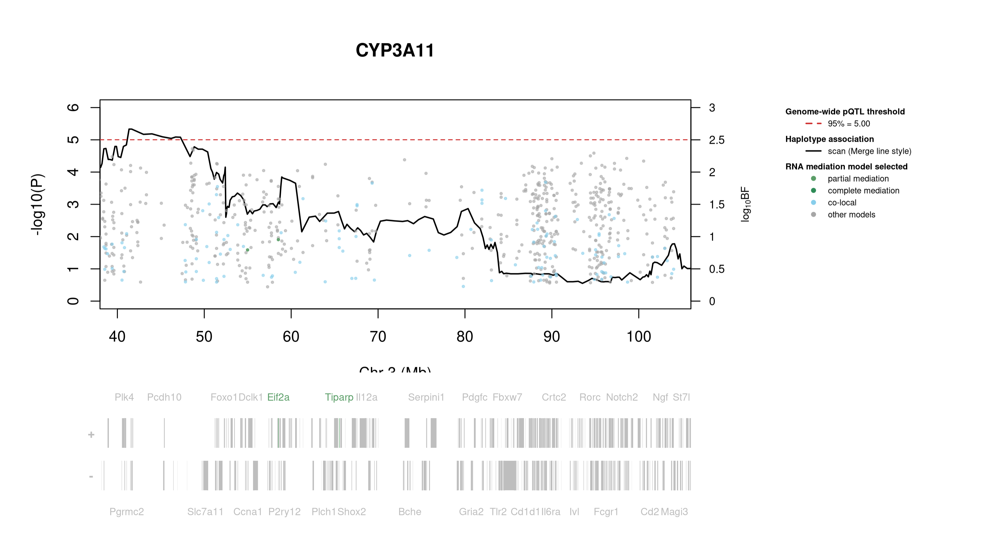
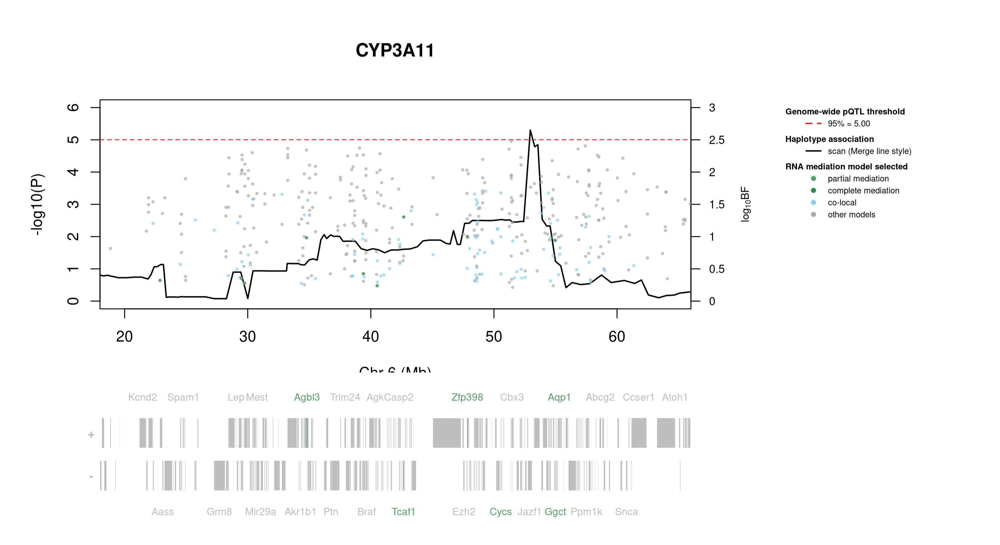

# Protein Overview

The mouse protein Cyp3a11, also known as Cytochrome P450 3A11, is encoded by the gene **Cyp3a11**. It is involved in the metabolism of various drugs and xenobiotics. The protein has several aliases, including **Cyp3a** and **Cytochrome P450 3A subfamily A**.

# Data and normalization

Replicate measurements were Box-Cox transformed with a protein-specific λ = **0.65** (95% likelihood interval 0.53 to 0.78), estimated on the individual replicates (`boxcox(y ~ strain)`, no +1 shift). The strain phenotype is the mean of the transformed replicates and the strain noise used for the wisam weights is their variance.

{fig-align="center" width="95%"}

::: {.fig-downloads}
Download: [PNG](figures/repbc_2026-10-01/proteins/Cyp3a11_normalization.png){download="Cyp3a11_normalization.png"} · [PDF](figures/repbc_2026-10-01/proteins/Cyp3a11_normalization.pdf){download="Cyp3a11_normalization.pdf"}
:::

## Heritability

Broad-sense heritability of the protein is **0.60** (95% CI 0.44–0.71; BH-adjusted P 5.35e-18). Its paired transcript is **Cyp3a11** (array probe `1416809_PM_at`, paired from the measured peptide `LYPIANR`). Transcript H² is **0.20** (95% CI 0.03–0.34; BH-adjusted P 4.89e-03).

# pQTL genome scan

Genome scan of the Box-Cox phenotype with wisam weights (miqtl `scan.h2lmm`, 11 imputations); significance thresholds come from 1000 permutations (GEV fit to the permutation maxima of −log10 P). Strongest locus: chr3:41.34 Mb, P = 4.65e-06, adjusted P = 2.48e-02; 95% threshold = 5.00 (−log10 P).

{fig-align="center" width="95%"}

::: {.fig-downloads}
Download: [PDF](figures/repbc_2026-10-01/per_protein/Cyp3a11/Cyp3a11_genome_scan.pdf){download="Cyp3a11_genome_scan.pdf"} · [PDF](figures/repbc_2026-10-01/per_protein/Cyp3a11/Cyp3a11_scan_by_chromosome.pdf){download="Cyp3a11_scan_by_chromosome.pdf"}
:::

# Significant peak(s)

## Chromosome 3 peak (UNC5114998)

| Peak position | −log10(P) | Adjusted P | 90% credible interval | Encoding gene | Gene location | pQTL type |
|---|---:|---:|---|---|---|---|
| chr3:41.34 Mb | 5.33 | 2.48e-02 | 38.04–104.21 Mb | Cyp3a11 | chr5:145.85–145.88 Mb | **trans** |

A pQTL is **cis** when the gene encoding the protein lies within the credible interval and **trans** otherwise.

{fig-align="center" width="95%"}

::: {.fig-downloads}
Download: [PDF](figures/repbc_2026-10-01/per_protein/Cyp3a11/Cyp3a11_ci_scans_full.pdf){download="Cyp3a11_ci_scans_full.pdf"}
:::

{fig-align="center" width="95%"}

::: {.fig-downloads}
Download: [PNG](figures/repbc_2026-10-01/per_protein/Cyp3a11/Cyp3a11_ci_genes_full_chr3.png){download="Cyp3a11_ci_genes_full_chr3.png"}
:::

### Merge / diplotype fine-mapping

_Merge status: running or not started; the plot is not available yet._

### TIMBR allelic series

_TIMBR sweep complete; plots will appear once Merge profiles are available._

### RNA mediation

{fig-align="center" width="95%"}

::: {.fig-downloads}
Download: [PNG](figures/repbc_2026-10-01/per_protein/Cyp3a11/Cyp3a11_mediation_overlay_bf_chr3_withgenes.png){download="Cyp3a11_mediation_overlay_bf_chr3_withgenes.png"} · [PNG](figures/repbc_2026-10-01/per_protein/Cyp3a11/Cyp3a11_mediation_overlay_bf_chr3_nogenes.png){download="Cyp3a11_mediation_overlay_bf_chr3_nogenes.png"}
:::

{fig-align="center" width="95%"}

::: {.fig-downloads}
Download: [PDF](figures/repbc_2026-10-01/per_protein/Cyp3a11/Cyp3a11_targeted_mediation_chr3_posterior_bars.pdf){download="Cyp3a11_targeted_mediation_chr3_posterior_bars.pdf"}
:::

## Chromosome 6 peak (UNC11092470)

| Peak position | −log10(P) | Adjusted P | 90% credible interval | Encoding gene | Gene location | pQTL type |
|---|---:|---:|---|---|---|---|
| chr6:52.95 Mb | 5.30 | 2.67e-02 | 18.04–64.62 Mb | Cyp3a11 | chr5:145.85–145.88 Mb | **trans** |

A pQTL is **cis** when the gene encoding the protein lies within the credible interval and **trans** otherwise.

{fig-align="center" width="95%"}

::: {.fig-downloads}
Download: [PDF](figures/repbc_2026-10-01/per_protein/Cyp3a11/Cyp3a11_ci_scans_full.pdf){download="Cyp3a11_ci_scans_full.pdf"}
:::

{fig-align="center" width="95%"}

::: {.fig-downloads}
Download: [PNG](figures/repbc_2026-10-01/per_protein/Cyp3a11/Cyp3a11_ci_genes_full_chr6.png){download="Cyp3a11_ci_genes_full_chr6.png"}
:::

### Merge / diplotype fine-mapping

_Merge status: running or not started; the plot is not available yet._

### TIMBR allelic series

_TIMBR sweep complete; plots will appear once Merge profiles are available._

### RNA mediation

{fig-align="center" width="95%"}

::: {.fig-downloads}
Download: [PNG](figures/repbc_2026-10-01/per_protein/Cyp3a11/Cyp3a11_mediation_overlay_bf_chr6_withgenes.png){download="Cyp3a11_mediation_overlay_bf_chr6_withgenes.png"} · [PNG](figures/repbc_2026-10-01/per_protein/Cyp3a11/Cyp3a11_mediation_overlay_bf_chr6_nogenes.png){download="Cyp3a11_mediation_overlay_bf_chr6_nogenes.png"}
:::

{fig-align="center" width="95%"}

::: {.fig-downloads}
Download: [PDF](figures/repbc_2026-10-01/per_protein/Cyp3a11/Cyp3a11_targeted_mediation_chr6_posterior_bars.pdf){download="Cyp3a11_targeted_mediation_chr6_posterior_bars.pdf"}
:::
