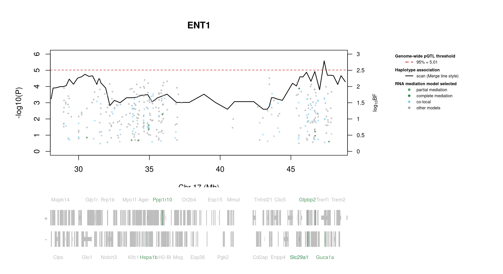

# Protein Overview

The mouse protein Ent1 (ENT1) is encoded by the gene **Ent1**, which stands for "equilibrative nucleoside transporter 1." It is also known by several aliases, including **Ent1** and **Slc29a1**. ENT1 is involved in the transport of nucleosides across cell membranes, playing a crucial role in nucleoside homeostasis and cellular signaling.

# Data and normalization

Replicate measurements were Box-Cox transformed with a protein-specific λ = **0.20** (95% likelihood interval -0.09 to 0.51), estimated on the individual replicates (`boxcox(y ~ strain)`, no +1 shift). The strain phenotype is the mean of the transformed replicates and the strain noise used for the wisam weights is their variance.

{fig-align="center" width="95%"}

::: {.fig-downloads}
Download: [PNG](figures/repbc_2026-10-01/proteins/Ent1_normalization.png){download="Ent1_normalization.png"} · [PDF](figures/repbc_2026-10-01/proteins/Ent1_normalization.pdf){download="Ent1_normalization.pdf"}
:::

## Heritability

Broad-sense heritability of the protein is **0.74** (95% CI 0.63–0.82; BH-adjusted P 3.65e-29). Its paired transcript is **Slc29a1** (array probe `1451782_PM_a_at`, paired from the measured peptide `ALADPTVALPAR`). Transcript H² is **0.47** (95% CI 0.29–0.61; BH-adjusted P 1.64e-10).

# pQTL genome scan

Genome scan of the Box-Cox phenotype with wisam weights (miqtl `scan.h2lmm`, 11 imputations); significance thresholds come from 1000 permutations (GEV fit to the permutation maxima of −log10 P). Strongest locus: chr17:47.35 Mb, P = 2.62e-06, adjusted P = 1.54e-02; 95% threshold = 5.01 (−log10 P).

{fig-align="center" width="95%"}

::: {.fig-downloads}
Download: [PDF](figures/repbc_2026-10-01/per_protein/Ent1/Ent1_genome_scan.pdf){download="Ent1_genome_scan.pdf"} · [PDF](figures/repbc_2026-10-01/per_protein/Ent1/Ent1_scan_by_chromosome.pdf){download="Ent1_scan_by_chromosome.pdf"}
:::

# Significant peak(s)

## Chromosome 17 peak (UNC27944457)

| Peak position | −log10(P) | Adjusted P | 90% credible interval | Encoding gene | Gene location | pQTL type |
|---|---:|---:|---|---|---|---|
| chr17:47.35 Mb | 5.58 | 1.54e-02 | 28.91–47.90 Mb | Slc29a1 | chr17:45.59–45.60 Mb | **cis** |

A pQTL is **cis** when the gene encoding the protein lies within the credible interval and **trans** otherwise.

{fig-align="center" width="95%"}

::: {.fig-downloads}
Download: [PDF](figures/repbc_2026-10-01/per_protein/Ent1/Ent1_ci_scans_full.pdf){download="Ent1_ci_scans_full.pdf"}
:::

{fig-align="center" width="95%"}

::: {.fig-downloads}
Download: [PNG](figures/repbc_2026-10-01/per_protein/Ent1/Ent1_ci_genes_full_chr17.png){download="Ent1_ci_genes_full_chr17.png"}
:::

### Merge / diplotype fine-mapping

{fig-align="center" width="95%"}

::: {.fig-downloads}
Download: [PNG](figures/repbc_2026-10-01/per_protein/Ent1/Ent1_mergeplot_full_UNC27944457.png){download="Ent1_mergeplot_full_UNC27944457.png"}
:::

### TIMBR allelic series

_TIMBR sweep complete; plots will appear once Merge profiles are available._

### RNA mediation

{fig-align="center" width="95%"}

::: {.fig-downloads}
Download: [PNG](figures/repbc_2026-10-01/per_protein/Ent1/Ent1_mediation_overlay_bf_chr17_withgenes.png){download="Ent1_mediation_overlay_bf_chr17_withgenes.png"} · [PNG](figures/repbc_2026-10-01/per_protein/Ent1/Ent1_mediation_overlay_bf_chr17_nogenes.png){download="Ent1_mediation_overlay_bf_chr17_nogenes.png"}
:::

{fig-align="center" width="95%"}

::: {.fig-downloads}
Download: [PDF](figures/repbc_2026-10-01/per_protein/Ent1/Ent1_targeted_mediation_chr17_posterior_bars.pdf){download="Ent1_targeted_mediation_chr17_posterior_bars.pdf"}
:::
