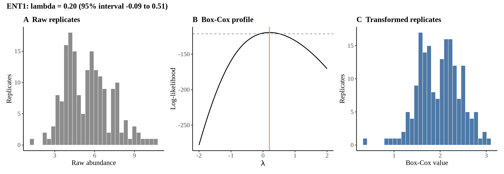
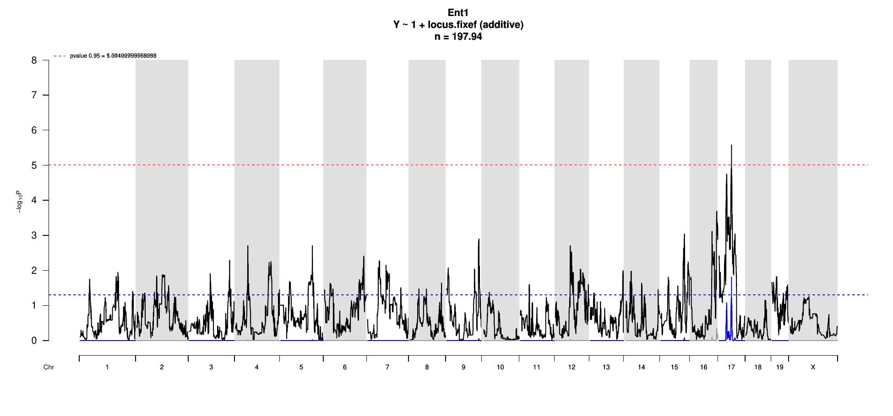
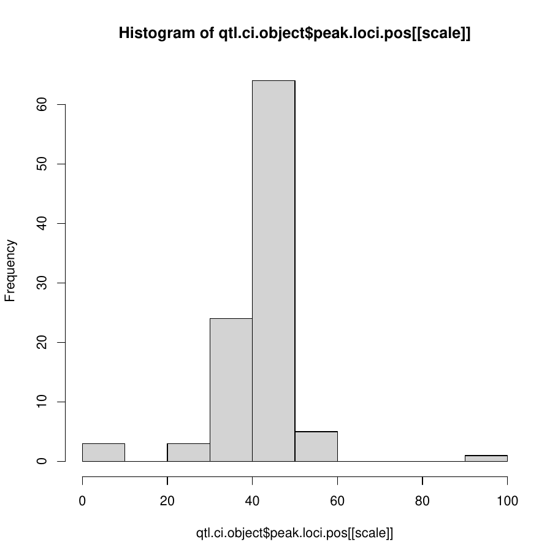
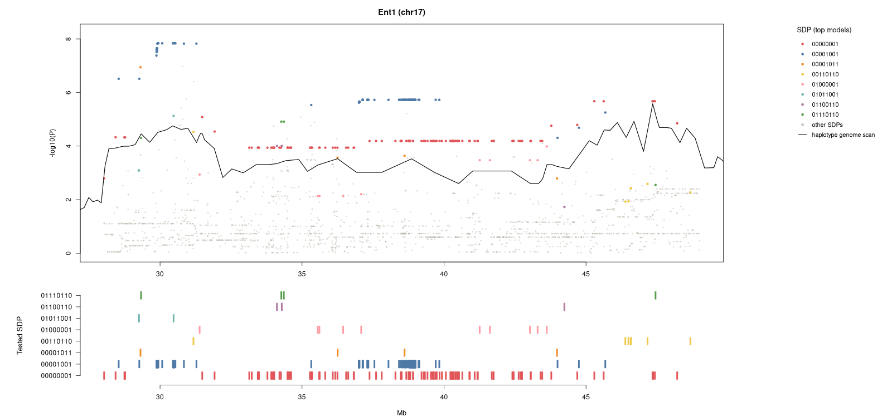
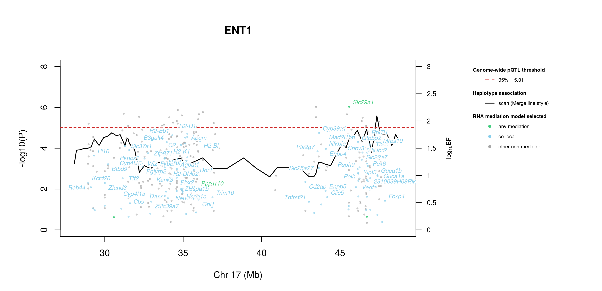
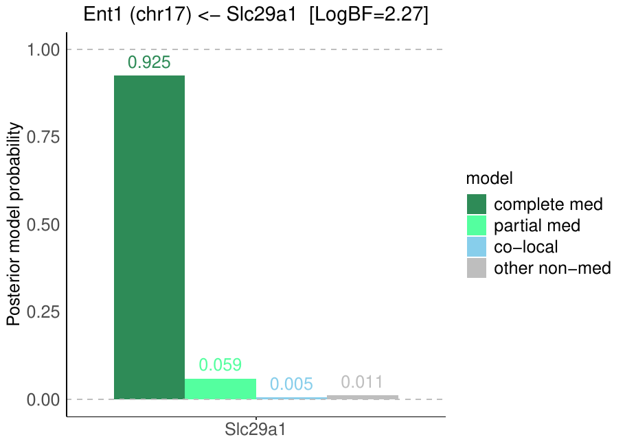

# Protein Overview

The mouse protein Ent1 (ENT1) is encoded by the gene **Ent1**, which stands for "equilibrative nucleoside transporter 1." It is also known by several aliases, including **Ent1** and **Slc29a1**. ENT1 is involved in the transport of nucleosides across cell membranes, playing a crucial role in nucleoside homeostasis and cellular signaling.

# Data and normalization

Replicate measurements were Box-Cox transformed with a protein-specific λ = **0.20** (95% likelihood interval -0.09 to 0.51), estimated on the individual replicates (`boxcox(y ~ strain)`, no +1 shift). The strain phenotype is the mean of the transformed replicates and the strain noise used for the wisam weights is their variance.

{fig-align="center" width="95%"}

::: {.fig-downloads}
Download: [PNG](figures/repbc_2026-10-01/proteins/Ent1_normalization.png){download="Ent1_normalization.png"} · [PDF](figures/repbc_2026-10-01/proteins/Ent1_normalization.pdf){download="Ent1_normalization.pdf"}
:::

## Heritability

Broad-sense heritability of the protein is **0.74** (95% CI 0.63–0.82; BH-adjusted P 3.65e-29). Its paired transcript is **Slc29a1** (array probe `1451782_PM_a_at`, paired from the measured peptide `ALADPTVALPAR`). Transcript H² is **0.47** (95% CI 0.29–0.61; BH-adjusted P 1.64e-10).

# pQTL genome scan

Genome scan of the Box-Cox phenotype with wisam weights (miqtl `scan.h2lmm`, 11 imputations); significance thresholds come from 1000 permutations (GEV fit to the permutation maxima of −log10 P). Strongest locus: chr17:47.35 Mb, P = 2.62e-06, adjusted P = 1.54e-02; 95% threshold = 5.01 (−log10 P).

{fig-align="center" width="95%"}

::: {.fig-downloads}
Download: [PDF](figures/repbc_2026-10-01/per_protein/Ent1/Ent1_genome_scan.pdf){download="Ent1_genome_scan.pdf"} · [PDF](figures/repbc_2026-10-01/per_protein/Ent1/Ent1_scan_by_chromosome.pdf){download="Ent1_scan_by_chromosome.pdf"}
:::

# Significant peak(s)

## Chromosome 17 peak (UNC27944457)

| Peak position | −log10(P) | Adjusted P | 90% credible interval | Encoding gene | Gene location | pQTL type |
|---|---:|---:|---|---|---|---|
| chr17:47.35 Mb | 5.58 | 1.54e-02 | 28.91–47.90 Mb | Slc29a1 | chr17:45.59–45.60 Mb | **cis** |

A pQTL is **cis** when the gene encoding the protein lies within the credible interval and **trans** otherwise.

{fig-align="center" width="95%"}

::: {.fig-downloads}
Download: [PDF](figures/repbc_2026-10-01/per_protein/Ent1/Ent1_ci_scans_full.pdf){download="Ent1_ci_scans_full.pdf"}
:::

{fig-align="center" width="95%"}

::: {.fig-downloads}
Download: [PNG](figures/repbc_2026-10-01/per_protein/Ent1/Ent1_ci_genes_full_chr17.png){download="Ent1_ci_genes_full_chr17.png"}
:::

### Merge / diplotype fine-mapping

{fig-align="center" width="95%"}

::: {.fig-downloads}
Download: [PNG](figures/repbc_2026-10-01/per_protein/Ent1/Ent1_mergeplot_full_UNC27944457.png){download="Ent1_mergeplot_full_UNC27944457.png"}
:::

_The top allelic series (SDP) from Merge is added to the book once the follow-up summary has been generated._

### TIMBR allelic series

{fig-align="center" width="95%"}

::: {.fig-downloads}
Download: [JPG](figures/repbc_2026-10-01/per_protein/Ent1/Ent1_timbr_ci_bf_dot_chr17.jpg){download="Ent1_timbr_ci_bf_dot_chr17.jpg"}
:::

{fig-align="center" width="95%"}

::: {.fig-downloads}
Download: [JPG](figures/repbc_2026-10-01/per_protein/Ent1/Ent1_timbr_ci_dot_chr17.jpg){download="Ent1_timbr_ci_dot_chr17.jpg"}
:::

The highest-posterior TIMBR allelic series at the peak splits the founders into **allele 0**: A/J, C57BL/6J, 129S1/SvImJ, NOD/ShiLtJ, NZO/HlLtJ, CAST/EiJ, PWK/PhJ; **allele 1**: WSB/EiJ. That is 2 functional alleles: founders in the same group are inferred to carry the same functional allele at this locus.

**Number of functional alleles.** At the lead locus (UNC27944457, 47.35 Mb) the posterior probability of a bi-allelic series (two functional alleles) is 0.41, tri-allelic 0.36, and four or more alleles 0.22; a single allele (no QTL effect) has probability 0.00. For comparison, the Chinese-restaurant-process prior gives 0.50 / 0.29 / 0.14 for one / two / three alleles, so the data move weight away from a single allele. The locus in the credible interval whose single best allelic series has the highest posterior probability is UNC27771124 (31.48 Mb; series 0,0,0,0,1,0,0,1, P = 0.65); there bi-allelic = 0.69, tri-allelic = 0.24, four or more = 0.07.

{fig-align="center" width="95%"}

::: {.fig-downloads}
Download: [PNG](figures/repbc_2026-10-01/per_protein/Ent1/Ent1_allele_number_prior_posterior_chr17.png){download="Ent1_allele_number_prior_posterior_chr17.png"} · [PDF](figures/repbc_2026-10-01/per_protein/Ent1/Ent1_allele_number_prior_posterior_chr17.pdf){download="Ent1_allele_number_prior_posterior_chr17.pdf"}
:::

{fig-align="center" width="95%"}

::: {.fig-downloads}
Download: [PNG](figures/repbc_2026-10-01/per_protein/Ent1/Ent1_allele_number_across_ci_chr17.png){download="Ent1_allele_number_across_ci_chr17.png"} · [PDF](figures/repbc_2026-10-01/per_protein/Ent1/Ent1_allele_number_across_ci_chr17.pdf){download="Ent1_allele_number_across_ci_chr17.pdf"}
:::

{fig-align="center" width="95%"}

::: {.fig-downloads}
Download: [PNG](figures/repbc_2026-10-01/per_protein/Ent1/Ent1_haplotype_lead_UNC27944457_chr17.png){download="Ent1_haplotype_lead_UNC27944457_chr17.png"} · [PDF](figures/repbc_2026-10-01/per_protein/Ent1/Ent1_haplotype_lead_UNC27944457_chr17.pdf){download="Ent1_haplotype_lead_UNC27944457_chr17.pdf"}
:::

{fig-align="center" width="95%"}

::: {.fig-downloads}
Download: [PNG](figures/repbc_2026-10-01/per_protein/Ent1/Ent1_haplotype_best_UNC27771124_chr17.png){download="Ent1_haplotype_best_UNC27771124_chr17.png"} · [PDF](figures/repbc_2026-10-01/per_protein/Ent1/Ent1_haplotype_best_UNC27771124_chr17.pdf){download="Ent1_haplotype_best_UNC27771124_chr17.pdf"}
:::

### RNA mediation

{fig-align="center" width="95%"}

::: {.fig-downloads}
Download: [PNG](figures/repbc_2026-10-01/per_protein/Ent1/Ent1_mediation_overlay_bf_chr17_nogenes.png){download="Ent1_mediation_overlay_bf_chr17_nogenes.png"} · [PNG](figures/repbc_2026-10-01/per_protein/Ent1/Ent1_mediation_overlay_bf_chr17_withgenes.png){download="Ent1_mediation_overlay_bf_chr17_withgenes.png"} · [CSV](figures/repbc_2026-10-01/per_protein/Ent1/Ent1_mediation_bf_points_chr17.csv){download="Ent1_mediation_bf_points_chr17.csv"}
:::

215 candidate transcripts lie in the credible interval. **53** have a best-model log10 Bayes factor ≥ 0.5 with mediation or co-local as the best-supported model and are labelled in the figure (146 more reach 0.5 only for the non-mediator model and are not labelled): **mediation** (2): Slc29a1 (2.26), Ppp1r10 (0.77); **co-local** (51): Cyp39a1 (1.78), H2-D1 (1.77), H2-Eb1 (1.74), Rpl7l1 (1.71), Apom (1.70), Mrps10 (1.64), H2-Bl (1.63), Mad2l1bp (1.62), B3galt4 (1.61), Gtpbp2 (1.61), Tbcc (1.57), C2 (1.56) …. *Mediation* means the transcript is best explained as lying on the path from the QTL to the protein; *co-local* means it shares the QTL without mediating; log10 BF is the evidence for the best-supported model against the null.

::: {.callout-note collapse="true" title="Function of the 53 labelled transcripts (UniProt)"}
Function text is the UniProt (mouse) annotation retrieved on 2026-10-03; reviewed Swiss-Prot entries where available. A dash means UniProt holds no functional annotation for that symbol.

| Transcript | Best model | log10 BF | UniProt protein | Function (UniProt) |
|---|---|---:|---|---|
| *Slc29a1* | mediation | 2.26 | [Equilibrative nucleoside transporter 1](https://www.uniprot.org/uniprotkb/Q9JIM1) | Uniporter involved in the facilitative transport of nucleosides and nucleobases, and contributes to maintaining their cellular homeostasis. Functions as a Na(+)-independent transporter. Involved in the transport of nucleosides such as adenosine, guanosine, inosine, uridine, thymidine and cytidine. |
| *Ppp1r10* | mediation | 0.77 | [Serine/threonine-protein phosphatase 1 regulatory subunit 10](https://www.uniprot.org/uniprotkb/Q80W00) | Substrate-recognition component of the PNUTS-PP1 protein phosphatase complex, a protein phosphatase 1 (PP1) complex that promotes RNA polymerase II transcription pause-release, allowing transcription elongation. |
| *Cyp39a1* | co-local | 1.78 | [24-hydroxycholesterol 7-alpha-hydroxylase](https://www.uniprot.org/uniprotkb/Q9JKJ9) | A cytochrome P450 monooxygenase involved in neural cholesterol clearance through bile acid synthesis. Catalyzes 7-alpha hydroxylation of (24S)-hydroxycholesterol, a neural oxysterol that is metabolized to bile acids in the liver. |
| *H2-D1* | co-local | 1.77 | [H-2 class I histocompatibility antigen, D-B alpha chain](https://www.uniprot.org/uniprotkb/P01899) | Involved in the presentation of foreign antigens to the immune system |
| *H2-Eb1* | co-local | 1.74 | [H-2 class II histocompatibility antigen, E-B beta chain](https://www.uniprot.org/uniprotkb/P04230) | — |
| *Rpl7l1* | co-local | 1.71 | [Large ribosomal subunit protein uL30-like 1](https://www.uniprot.org/uniprotkb/Q9D8M4) | — |
| *Apom* | co-local | 1.70 | [Apolipoprotein M](https://www.uniprot.org/uniprotkb/Q9Z1R3) | Probably involved in lipid transport. Can bind sphingosine-1-phosphate, myristic acid, palmitic acid and stearic acid, retinol, all-trans-retinoic acid and 9-cis-retinoic acid |
| *Mrps10* | co-local | 1.64 | [Small ribosomal subunit protein uS10m](https://www.uniprot.org/uniprotkb/Q80ZK0) | — |
| *H2-Bl* | co-local | 1.63 | [MHC class I antigen splice variant Bl.1](https://www.uniprot.org/uniprotkb/Q4VCN9) | Involved in the presentation of foreign antigens to the immune system |
| *Mad2l1bp* | co-local | 1.62 | [MAD2L1-binding protein](https://www.uniprot.org/uniprotkb/Q9DCX1) | May function to silence the spindle checkpoint and allow mitosis to proceed through anaphase by binding MAD2L1 after it has become dissociated from the MAD2L1-CDC20 complex |
| *B3galt4* | co-local | 1.61 | [Beta-1,3-galactosyltransferase 4](https://www.uniprot.org/uniprotkb/Q9Z0F0) | Involved in GM1/GD1B/GA1 ganglioside biosynthesis |
| *Gtpbp2* | co-local | 1.61 | [GTP-binding protein 2](https://www.uniprot.org/uniprotkb/Q3UJK4) | Involved in the rescue of ribosome stalling due to the presence of non-functional tRNA. Has very low GTP-binding activity |
| *Tbcc* | co-local | 1.57 | [Tubulin-specific chaperone C](https://www.uniprot.org/uniprotkb/Q8VCN9) | Tubulin-folding protein; involved in the final step of the tubulin folding pathway |
| *C2* | co-local | 1.56 | [Complement C2](https://www.uniprot.org/uniprotkb/P21180) | Precursor of the catalytic component of the C3 and C5 convertase complexes, which are part of the complement pathway, a cascade of proteins that leads to phagocytosis and breakdown of pathogens and signaling that strengthens the adaptive immune system. Component C2 is part of the classical, lectin and GZMK complement systems |
| *Ubr2* | co-local | 1.55 | [E3 ubiquitin-protein ligase UBR2](https://www.uniprot.org/uniprotkb/Q6WKZ8) | E3 ubiquitin-protein ligase which is a component of the N-end rule pathway. Recognizes and binds to proteins bearing specific N-terminal residues (N-degrons) that are destabilizing according to the N-end rule, leading to their ubiquitination and subsequent degradation. |
| *Slc37a1* | co-local | 1.54 | [Glucose-6-phosphate exchanger SLC37A1](https://www.uniprot.org/uniprotkb/Q8R070) | Inorganic phosphate and glucose-6-phosphate antiporter. May transport cytoplasmic glucose-6-phosphate into the lumen of the endoplasmic reticulum and translocate inorganic phosphate into the opposite direction. Independent of a lumenal glucose-6-phosphatase. May not play a role in homeostatic regulation of blood glucose levels |
| *Nfkbie* | co-local | 1.50 | [NF-kappa-B inhibitor epsilon](https://www.uniprot.org/uniprotkb/O54910) | Sequesters NF-kappa-B transcription factor complexes in the cytoplasm, thereby inhibiting their activity. Sequestered complexes include NFKB1/p50-RELA/p65 and NFKB1/p50-REL/c-Rel complexes. Limits B-cell activation in response to pathogens, and also plays an important role in B-cell development |
| *Enpp4* | co-local | 1.49 | [Bis(5'-adenosyl)-triphosphatase enpp4](https://www.uniprot.org/uniprotkb/Q8BTJ4) | Hydrolyzes extracellular Ap3A into AMP and ADP, and Ap4A into AMP and ATP. Ap3A and Ap4A are diadenosine polyphosphates thought to induce proliferation of vascular smooth muscle cells. Acts as a procoagulant, mediating platelet aggregation at the site of nascent thrombus via release of ADP from Ap3A and activation of ADP receptors |
| *Pknox1* | co-local | 1.47 | [Homeobox protein PKNOX1](https://www.uniprot.org/uniprotkb/O70477) | Activates transcription in the presence of PBX1A and HOXA1 |
| *H2-K1* | co-local | 1.44 | [H-2 class I histocompatibility antigen, K-B alpha chain](https://www.uniprot.org/uniprotkb/P01901) | Involved in the presentation of foreign antigens to the immune system |
| *Pla2g7* | co-local | 1.44 | [Platelet-activating factor acetylhydrolase](https://www.uniprot.org/uniprotkb/Q60963) | Lipoprotein-associated calcium-independent phospholipase A2 involved in phospholipid catabolism during inflammatory and oxidative stress response. At the lipid-aqueous interface, hydrolyzes the ester bond of fatty acyl group attached at sn-2 position of phospholipids (phospholipase A2 activity). |
| *Slc22a7* | co-local | 1.42 | [Solute carrier family 22 member 7](https://www.uniprot.org/uniprotkb/Q91WU2) | Functions as a Na(+)-independent bidirectional multispecific transporter. Contributes to the renal and hepatic elimination of endogenous organic compounds from the systemic circulation into the urine and bile, respectively. |
| *Cnpy3* | co-local | 1.42 | [Protein canopy homolog 3](https://www.uniprot.org/uniprotkb/Q9DAU1) | Toll-like receptor (TLR)-specific co-chaperone for HSP90B1. Required for proper TLR folding, except that of TLR3, and hence controls TLR exit from the endoplasmic reticulum. Consequently, required for both innate and adaptive immune responses |
| *Zfp871* | co-local | 1.41 | [C2H2-type domain-containing protein](https://www.uniprot.org/uniprotkb/Q80XN4) | — |
| *Pi16* | co-local | 1.37 | [Peptidase inhibitor 16](https://www.uniprot.org/uniprotkb/Q9ET66) | May inhibit cardiomyocyte growth |
| *Ndufa7* | co-local | 1.32 | [NADH dehydrogenase [ubiquinone] 1 alpha subcomplex subunit 7](https://www.uniprot.org/uniprotkb/Q9Z1P6) | Accessory subunit of the mitochondrial membrane respiratory chain NADH dehydrogenase (Complex I), that is believed not to be involved in catalysis. Complex I functions in the transfer of electrons from NADH to the respiratory chain. The immediate electron acceptor for the enzyme is believed to be ubiquinone |
| *Fkbpl* | co-local | 1.30 | [FK506-binding protein-like](https://www.uniprot.org/uniprotkb/O35450) | May be involved in response to X-ray. Regulates p21 protein stability by binding to Hsp90 and p21 |
| *Pex6* | co-local | 1.22 | [Peroxisomal ATPase PEX6](https://www.uniprot.org/uniprotkb/Q99LC9) | Component of the PEX1-PEX6 AAA ATPase complex, a protein dislocase complex that mediates the ATP-dependent extraction of the PEX5 receptor from peroxisomal membranes, an essential step for PEX5 recycling. Specifically recognizes PEX5 monoubiquitinated at 'Cys-11', and pulls it out of the peroxisome lumen through the PEX2-PEX10-PEX12 retrotranslocation channel. |
| *Btbd9* | co-local | 1.21 | [BTB/POZ domain-containing protein 9](https://www.uniprot.org/uniprotkb/Q8C726) | — |
| *Pglyrp2* | co-local | 1.16 | [N-acetylmuramoyl-L-alanine amidase](https://www.uniprot.org/uniprotkb/Q8VCS0) | May play a scavenger role by digesting biologically active peptidoglycan (PGN) into biologically inactive fragments. Has no direct bacteriolytic activity |
| *Yipf3* | co-local | 1.15 | [Protein YIPF3](https://www.uniprot.org/uniprotkb/Q3UDR8) | Involved in the maintenance of the Golgi structure. May play a role in hematopoiesis |
| *Agpat1* | co-local | 1.12 | [1-acyl-sn-glycerol-3-phosphate acyltransferase alpha](https://www.uniprot.org/uniprotkb/O35083) | Converts 1-acyl-sn-glycerol-3-phosphate (lysophosphatidic acid or LPA) into 1,2-diacyl-sn-glycerol-3-phosphate (phosphatidic acid or PA) by incorporating an acyl moiety at the sn-2 position of the glycerol backbone |
| *Rsph9* | co-local | 1.12 | [Radial spoke head protein 9 homolog](https://www.uniprot.org/uniprotkb/Q9D9V4) | Functions as part of axonemal radial spoke complexes that play an important part in the motility of sperm and cilia. Essential for both the radial spoke head assembly and the central pair microtubule stability in ependymal motile cilia. Required for motility of olfactory and neural cilia and for the structural integrity of ciliary axonemes in both 9+0 and 9+2 motile cilia |
| *Guca1b* | co-local | 1.01 | [Guanylyl cyclase-activating protein 2](https://www.uniprot.org/uniprotkb/Q8VBV8) | Stimulates two retinal guanylyl cyclase (GCs) GUCY2E and GUCY2F when free calcium ions concentration is low, and inhibits GUCY2E and GUCY2F when free calcium ions concentration is elevated. This Ca(2+)-sensitive regulation of GCs is a key event in recovery of the dark state of rod photoreceptors following light exposure. |
| *Guca1a* | co-local | 0.99 | [Guanylyl cyclase-activating protein 1](https://www.uniprot.org/uniprotkb/P43081) | Stimulates retinal guanylyl cyclase when free calcium ions concentration is low and inhibits guanylyl cyclase when free calcium ions concentration is elevated. This Ca(2+)-sensitive regulation of retinal guanylyl cyclase is a key event in recovery of the dark state of rod photoreceptors following light exposure. |
| *H2-DMb2* | co-local | 0.95 | [H2-M beta 2](https://www.uniprot.org/uniprotkb/Q31099) | — |
| *Tff2* | co-local | 0.95 | [Trefoil factor 2](https://www.uniprot.org/uniprotkb/Q03404) | Inhibits gastrointestinal motility and gastric acid secretion. Could function as a structural component of gastric mucus, possibly by stabilizing glycoproteins in the mucus gel through interactions with carbohydrate side chains |
| *Polh* | co-local | 0.90 | [DNA polymerase eta](https://www.uniprot.org/uniprotkb/Q9JJN0) | DNA polymerase specifically involved in the DNA repair by translesion synthesis (TLS). Due to low processivity on both damaged and normal DNA, cooperates with the heterotetrameric (REV3L, REV7, POLD2 and POLD3) POLZ complex for complete bypass of DNA lesions. Inserts one or 2 nucleotide(s) opposite the lesion, the primer is further extended by the tetrameric POLZ complex. |
| *2310039H08Rik* | co-local | 0.89 | — | — |
| *Cd2ap* | co-local | 0.88 | [CD2-associated protein](https://www.uniprot.org/uniprotkb/Q9JLQ0) | Seems to act as an adapter protein between membrane proteins and the actin cytoskeleton. In collaboration with CBLC, modulates the rate of RET turnover and may act as regulatory checkpoint that limits the potency of GDNF on neuronal survival. Controls CBLC function, converting it from an inhibitor to a promoter of RET degradation. |
| *Kctd20* | co-local | 0.87 | [BTB/POZ domain-containing protein KCTD20](https://www.uniprot.org/uniprotkb/Q8CDD8) | Promotes the phosphorylation of AKT family members |
| *Zbtb12* | co-local | 0.84 | [Zinc finger and BTB domain containing 12](https://www.uniprot.org/uniprotkb/Q9Z150) | May be involved in transcriptional regulation |
| *Rab44* | co-local | 0.78 | [Ras-related protein Rab-44](https://www.uniprot.org/uniprotkb/Q8CB87) | The small GTPases Rab are key regulators of intracellular membrane trafficking, from the formation of transport vesicles to their fusion with membranes. Rabs cycle between an inactive GDP-bound form and an active GTP-bound form that is able to recruit to membranes different sets of downstream effectors directly responsible for vesicle formation, movement, tethering and fusion. |
| *Hspa1b* | co-local | 0.76 | [Heat shock 70 kDa protein 1B](https://www.uniprot.org/uniprotkb/P17879) | Molecular chaperone implicated in a wide variety of cellular processes, including protection of the proteome from stress, folding and transport of newly synthesized polypeptides, activation of proteolysis of misfolded proteins and the formation and dissociation of protein complexes. |
| *Neu1* | co-local | 0.73 | [Sialidase-1](https://www.uniprot.org/uniprotkb/O35657) | Lysosomal exo-alpha-sialidase that catalyzes the removal of sialic acid (N-acetylneuraminic acid) moieties from glycoproteins and glycolipids. To be active, it is strictly dependent on its presence in the multienzyme complex. Appears to have a preference for alpha 2-3 and alpha 2-6 sialyl linkage |
| *Enpp5* | co-local | 0.72 | [Ectonucleotide pyrophosphatase/phosphodiesterase family member 5](https://www.uniprot.org/uniprotkb/Q9EQG7) | Can hydrolyze NAD but cannot hydrolyze nucleotide di- and triphosphates. Lacks lysopholipase D activity. May play a role in neuronal cell communication |
| *Daxx* | co-local | 0.70 | [Death domain-associated protein 6](https://www.uniprot.org/uniprotkb/O35613) | Transcription corepressor known to repress transcriptional potential of several sumoylated transcription factors. Down-regulates basal and activated transcription. Its transcription repressor activity is modulated by recruiting it to subnuclear compartments like the nucleolus or PML/POD/ND10 nuclear bodies through interactions with MCSR1 and PML, respectively. |
| *Hspa1a* | co-local | 0.70 | [Heat shock 70 kDa protein 1A](https://www.uniprot.org/uniprotkb/Q61696) | Molecular chaperone implicated in a wide variety of cellular processes, including protection of the proteome from stress, folding and transport of newly synthesized polypeptides, activation of proteolysis of misfolded proteins and the formation and dissociation of protein complexes. |
| *Cyp4f13* | co-local | 0.67 | [Cytochrome P450, family 4, subfamily f, polypeptide 13](https://www.uniprot.org/uniprotkb/B8JK07) | — |
| *Cbs* | co-local | 0.61 | [Cystathionine beta-synthase](https://www.uniprot.org/uniprotkb/Q91WT9) | Hydro-lyase catalyzing the first step of the transsulfuration pathway, where the hydroxyl group of L-serine is displaced by L-homocysteine in a beta-replacement reaction to form L-cystathionine, the precursor of L-cysteine. This catabolic route allows the elimination of L-methionine and the toxic metabolite L-homocysteine. |
| *Trim10* | co-local | 0.60 | [E3 ubiquitin-protein ligase TRIM10](https://www.uniprot.org/uniprotkb/Q9WUH5) | E3 ligase that plays an essential role in the differentiation and survival of terminal erythroid cells. May directly bind to PTEN and promote its ubiquitination, resulting in its proteasomal degradation and activation of hypertrophic signaling. |
| *Slc39a7* | co-local | 0.58 | [Zinc transporter SLC39A7](https://www.uniprot.org/uniprotkb/Q31125) | Transports Zn(2+) from the endoplasmic reticulum (ER)/Golgi apparatus to the cytosol, playing an essential role in the regulation of cytosolic zinc levels. Acts as a gatekeeper of zinc release from intracellular stores, requiring post-translational activation by phosphorylation, resulting in activation of multiple downstream pathways leading to cell growth and proliferation. |
| *Zfp472* | co-local | 0.52 | [Zinc finger protein 472](https://www.uniprot.org/uniprotkb/B0V2W5) | May be involved in transcriptional regulation |
:::

{fig-align="center" width="95%"}

::: {.fig-downloads}
Download: [PDF](figures/repbc_2026-10-01/per_protein/Ent1/Ent1_targeted_mediation_chr17_posterior_bars.pdf){download="Ent1_targeted_mediation_chr17_posterior_bars.pdf"}
:::
