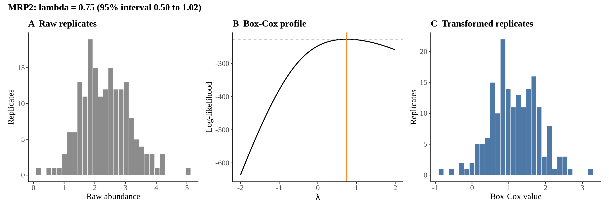
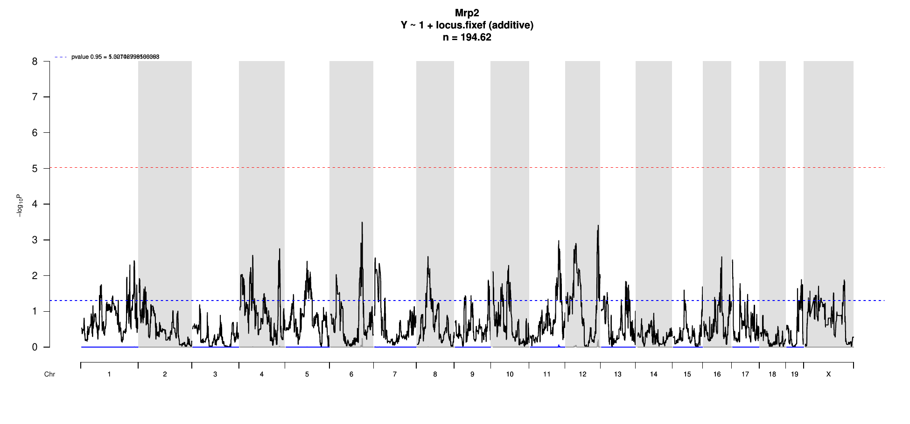

# Protein Overview

The mouse protein Mrp2, also known as **Abcc2**, is a member of the ATP-binding cassette (ABC) transporter family. It is involved in the transport of various substrates across cellular membranes. In addition to its primary name, Mrp2 has aliases such as **multidrug resistance-associated protein 2** and **Canalicular multispecific organic anion transporter 2**. The gene encoding this protein is located on chromosome 6 in mice.

# Data and normalization

Replicate measurements were Box-Cox transformed with a protein-specific λ = **0.75** (95% likelihood interval 0.50 to 1.02), estimated on the individual replicates (`boxcox(y ~ strain)`, no +1 shift). The strain phenotype is the mean of the transformed replicates and the strain noise used for the wisam weights is their variance.

{fig-align="center" width="95%"}

::: {.fig-downloads}
Download: [PNG](figures/repbc_2026-10-01/proteins/Mrp2_normalization.png){download="Mrp2_normalization.png"} · [PDF](figures/repbc_2026-10-01/proteins/Mrp2_normalization.pdf){download="Mrp2_normalization.pdf"}
:::

## Heritability

Broad-sense heritability of the protein is **0.31** (95% CI 0.10–0.46; BH-adjusted P 1.04e-05). Its paired transcript is **Abcc2** (array probe `1450109_PM_s_at`, paired from the measured peptide `EAGIESVNHTEL`). Transcript H² is **0.41** (95% CI 0.23–0.56; BH-adjusted P 1.75e-08).

# pQTL genome scan

Genome scan of the Box-Cox phenotype with wisam weights (miqtl `scan.h2lmm`, 11 imputations); significance thresholds come from 1000 permutations (GEV fit to the permutation maxima of −log10 P). Strongest locus: chr6:110.84 Mb, P = 3.17e-04, adjusted P = 5.72e-01; 95% threshold = 5.03 (−log10 P).

{fig-align="center" width="95%"}

::: {.fig-downloads}
Download: [PDF](figures/repbc_2026-10-01/per_protein/Mrp2/Mrp2_genome_scan.pdf){download="Mrp2_genome_scan.pdf"} · [PDF](figures/repbc_2026-10-01/per_protein/Mrp2/Mrp2_scan_by_chromosome.pdf){download="Mrp2_scan_by_chromosome.pdf"}
:::

# Significant peak(s)

No genome-wide significant pQTL for this protein (adjusted P ≥ 0.05), so credible intervals, Merge, TIMBR and mediation were not run.
