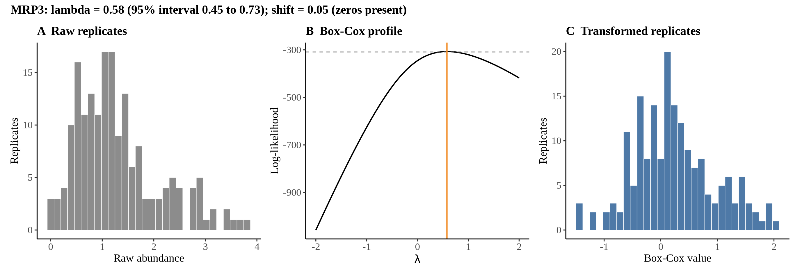
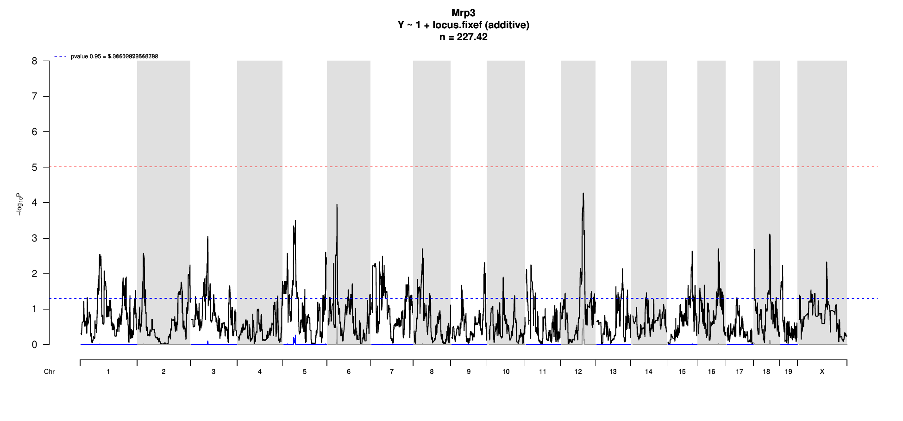

# Protein Overview

Mrp3, also known as Multidrug Resistance-associated Protein 3, is a protein encoded by the **Abcc3** gene in mice. It is involved in the transport of various endogenous and exogenous compounds across cell membranes. Alias names for Mrp3 include **ABCC3**.

# Data and normalization

Replicate measurements were Box-Cox transformed with a protein-specific λ = **0.58** (95% likelihood interval 0.45 to 0.73), estimated on the individual replicates (`boxcox(y ~ strain)`, no +1 shift); because 3 replicate(s) were zero, a small shift of 0.05 was added before transforming. The strain phenotype is the mean of the transformed replicates and the strain noise used for the wisam weights is their variance.

{fig-align="center" width="95%"}

::: {.fig-downloads}
Download: [PNG](figures/repbc_2026-10-01/proteins/Mrp3_normalization.png){download="Mrp3_normalization.png"} · [PDF](figures/repbc_2026-10-01/proteins/Mrp3_normalization.pdf){download="Mrp3_normalization.pdf"}
:::

## Heritability

Broad-sense heritability of the protein is **0.51** (95% CI 0.38–0.64; BH-adjusted P 2.83e-13). Its paired transcript is **Abcc3** (array probe `1428988_PM_at`, paired from the measured peptide `GALVAVVGPVGCGK`). Transcript H² is **0.48** (95% CI 0.32–0.63; BH-adjusted P 3.87e-11).

# pQTL genome scan

Genome scan of the Box-Cox phenotype with wisam weights (miqtl `scan.h2lmm`, 11 imputations); significance thresholds come from 1000 permutations (GEV fit to the permutation maxima of −log10 P). Strongest locus: chr12:77.11 Mb, P = 5.37e-05, adjusted P = 1.92e-01; 95% threshold = 5.02 (−log10 P).

{fig-align="center" width="95%"}

::: {.fig-downloads}
Download: [PDF](figures/repbc_2026-10-01/per_protein/Mrp3/Mrp3_genome_scan.pdf){download="Mrp3_genome_scan.pdf"} · [PDF](figures/repbc_2026-10-01/per_protein/Mrp3/Mrp3_scan_by_chromosome.pdf){download="Mrp3_scan_by_chromosome.pdf"}
:::

# Significant peak(s)

No genome-wide significant pQTL for this protein (adjusted P ≥ 0.05), so credible intervals, Merge, TIMBR and mediation were not run.
