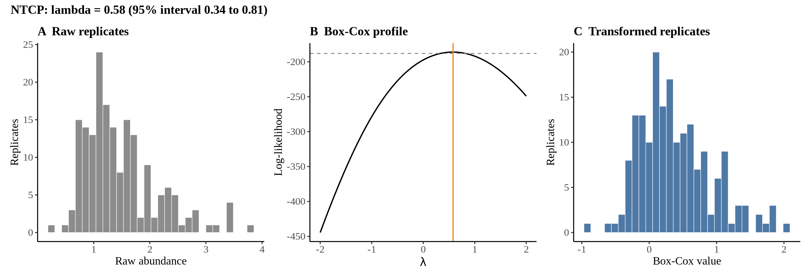
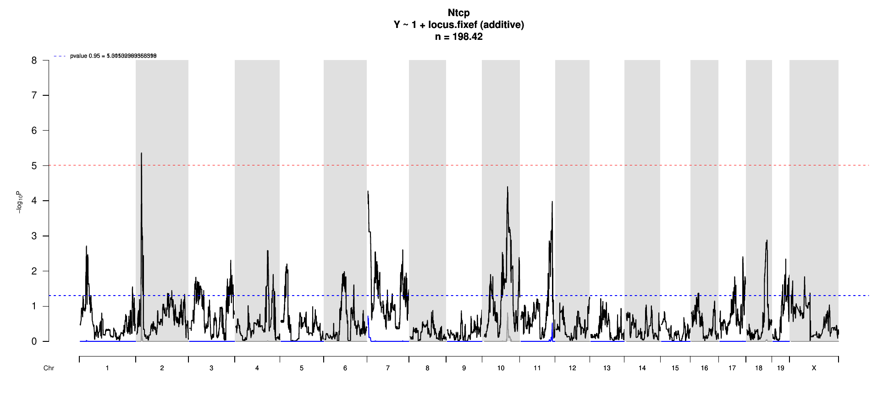
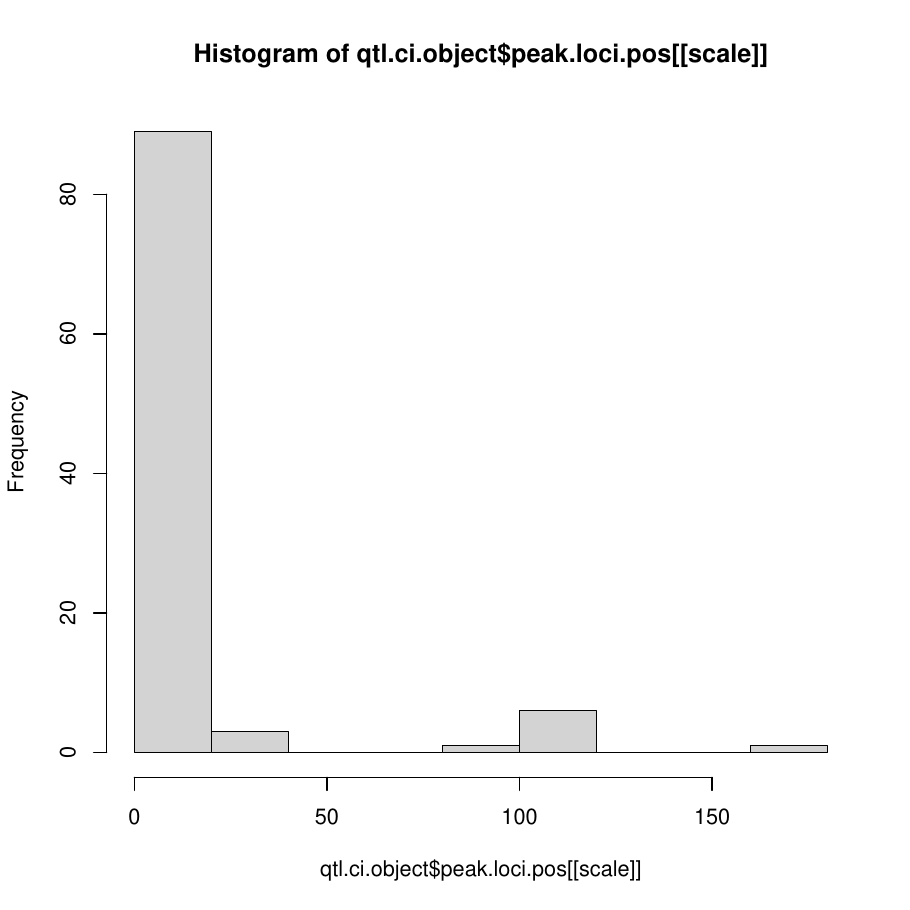
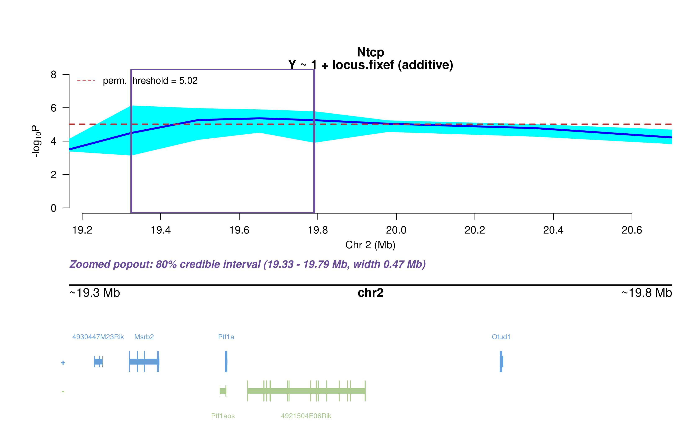
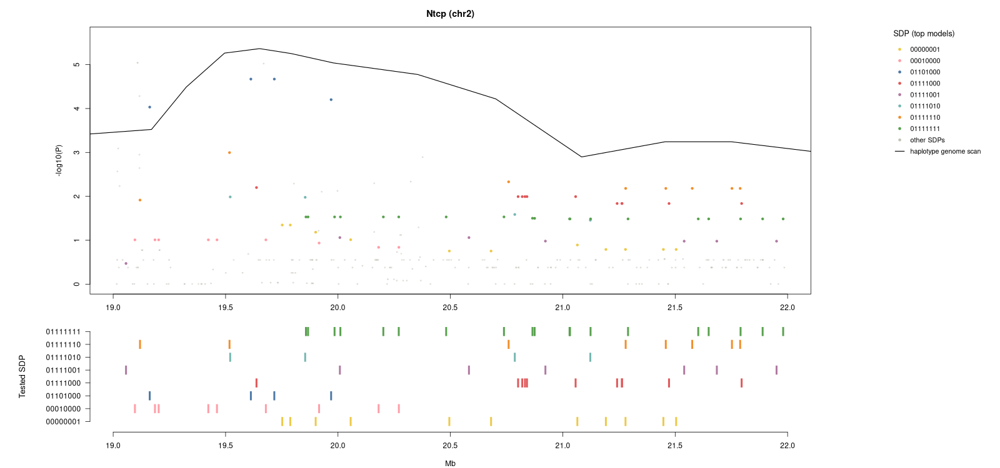
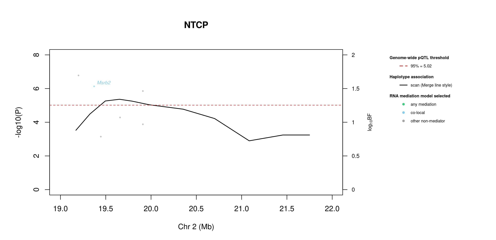
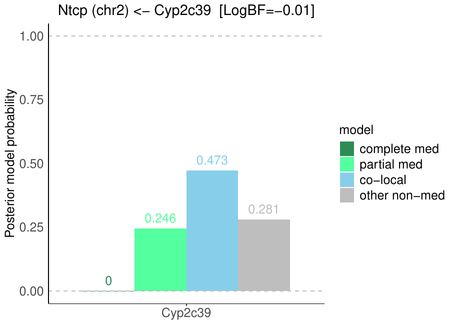

# Protein Overview

The mouse protein Ntcp, encoded by the gene *Ntcp* (also known as *Slc10a1*), is a solute carrier that functions as a sodium-dependent bile acid transport protein. It plays a critical role in bile acid homeostasis. The protein is involved in the uptake of bile acids from the intestine into the liver.

# Data and normalization

Replicate measurements were Box-Cox transformed with a protein-specific λ = **0.58** (95% likelihood interval 0.34 to 0.81), estimated on the individual replicates (`boxcox(y ~ strain)`, no +1 shift). The strain phenotype is the mean of the transformed replicates and the strain noise used for the wisam weights is their variance.

{fig-align="center" width="95%"}

::: {.fig-downloads}
Download: [PNG](figures/repbc_2026-10-01/proteins/Ntcp_normalization.png){download="Ntcp_normalization.png"} · [PDF](figures/repbc_2026-10-01/proteins/Ntcp_normalization.pdf){download="Ntcp_normalization.pdf"}
:::

## Heritability

Broad-sense heritability of the protein is **0.72** (95% CI 0.58–0.79; BH-adjusted P 1.06e-26). Its paired transcript is **Slc10a1** (array probe `1424898_PM_at`, paired from the measured peptide `GIYDGDLK`). Transcript H² is **0.22** (95% CI 0.07–0.37; BH-adjusted P 3.62e-03).

# pQTL genome scan

Genome scan of the Box-Cox phenotype with wisam weights (miqtl `scan.h2lmm`, 11 imputations); significance thresholds come from 1000 permutations (GEV fit to the permutation maxima of −log10 P). Strongest locus: chr2:19.65 Mb, P = 4.32e-06, adjusted P = 2.45e-02; 95% threshold = 5.02 (−log10 P).

{fig-align="center" width="95%"}

::: {.fig-downloads}
Download: [PDF](figures/repbc_2026-10-01/per_protein/Ntcp/Ntcp_genome_scan.pdf){download="Ntcp_genome_scan.pdf"} · [PDF](figures/repbc_2026-10-01/per_protein/Ntcp/Ntcp_scan_by_chromosome.pdf){download="Ntcp_scan_by_chromosome.pdf"}
:::

# Significant peak(s)

## Chromosome 2 peak (UNC2678323)

| Peak position | −log10(P) | Adjusted P | 90% credible interval | Encoding gene | Gene location | pQTL type |
|---|---:|---:|---|---|---|---|
| chr2:19.65 Mb | 5.36 | 2.45e-02 | 19.17–20.70 Mb | Slc10a1 | chr12:80.95–80.97 Mb | **trans** |

A pQTL is **cis** when the gene encoding the protein lies within the credible interval and **trans** otherwise.

{fig-align="center" width="95%"}

::: {.fig-downloads}
Download: [PDF](figures/repbc_2026-10-01/per_protein/Ntcp/Ntcp_ci_scans_full.pdf){download="Ntcp_ci_scans_full.pdf"}
:::

{fig-align="center" width="95%"}

::: {.fig-downloads}
Download: [PNG](figures/repbc_2026-10-01/per_protein/Ntcp/Ntcp_ci_genes_full_chr2.png){download="Ntcp_ci_genes_full_chr2.png"}
:::

### Merge / diplotype fine-mapping

{fig-align="center" width="95%"}

::: {.fig-downloads}
Download: [PNG](figures/repbc_2026-10-01/per_protein/Ntcp/Ntcp_mergeplot_full_UNC2678323.png){download="Ntcp_mergeplot_full_UNC2678323.png"}
:::

_The top allelic series (SDP) from Merge is added to the book once the follow-up summary has been generated._

### TIMBR allelic series

{fig-align="center" width="95%"}

::: {.fig-downloads}
Download: [JPG](figures/repbc_2026-10-01/per_protein/Ntcp/Ntcp_timbr_ci_bf_dot_chr2.jpg){download="Ntcp_timbr_ci_bf_dot_chr2.jpg"}
:::

{fig-align="center" width="95%"}

::: {.fig-downloads}
Download: [JPG](figures/repbc_2026-10-01/per_protein/Ntcp/Ntcp_timbr_ci_dot_chr2.jpg){download="Ntcp_timbr_ci_dot_chr2.jpg"}
:::

The highest-posterior TIMBR allelic series at the peak splits the founders into **allele 0**: A/J, C57BL/6J, NOD/ShiLtJ, NZO/HlLtJ, CAST/EiJ, PWK/PhJ, WSB/EiJ; **allele 1**: 129S1/SvImJ. That is 2 functional alleles: founders in the same group are inferred to carry the same functional allele at this locus.

**Number of functional alleles.** At the lead locus (UNC2678323, 19.65 Mb) the posterior probability of a bi-allelic series (two functional alleles) is 0.28, tri-allelic 0.40, and four or more alleles 0.33; a single allele (no QTL effect) has probability 0.00. For comparison, the Chinese-restaurant-process prior gives 0.50 / 0.29 / 0.14 for one / two / three alleles, so the data move weight away from a single allele. The locus in the credible interval whose single best allelic series has the highest posterior probability is JAX00091946 (20.70 Mb; series 0,0,1,0,0,0,0,0, P = 0.30); there bi-allelic = 0.49, tri-allelic = 0.32, four or more = 0.18.

{fig-align="center" width="95%"}

::: {.fig-downloads}
Download: [PNG](figures/repbc_2026-10-01/per_protein/Ntcp/Ntcp_allele_number_prior_posterior_chr2.png){download="Ntcp_allele_number_prior_posterior_chr2.png"} · [PDF](figures/repbc_2026-10-01/per_protein/Ntcp/Ntcp_allele_number_prior_posterior_chr2.pdf){download="Ntcp_allele_number_prior_posterior_chr2.pdf"}
:::

{fig-align="center" width="95%"}

::: {.fig-downloads}
Download: [PNG](figures/repbc_2026-10-01/per_protein/Ntcp/Ntcp_allele_number_across_ci_chr2.png){download="Ntcp_allele_number_across_ci_chr2.png"} · [PDF](figures/repbc_2026-10-01/per_protein/Ntcp/Ntcp_allele_number_across_ci_chr2.pdf){download="Ntcp_allele_number_across_ci_chr2.pdf"}
:::

{fig-align="center" width="95%"}

::: {.fig-downloads}
Download: [PNG](figures/repbc_2026-10-01/per_protein/Ntcp/Ntcp_haplotype_lead_UNC2678323_chr2.png){download="Ntcp_haplotype_lead_UNC2678323_chr2.png"} · [PDF](figures/repbc_2026-10-01/per_protein/Ntcp/Ntcp_haplotype_lead_UNC2678323_chr2.pdf){download="Ntcp_haplotype_lead_UNC2678323_chr2.pdf"}
:::

{fig-align="center" width="95%"}

::: {.fig-downloads}
Download: [PNG](figures/repbc_2026-10-01/per_protein/Ntcp/Ntcp_haplotype_best_JAX00091946_chr2.png){download="Ntcp_haplotype_best_JAX00091946_chr2.png"} · [PDF](figures/repbc_2026-10-01/per_protein/Ntcp/Ntcp_haplotype_best_JAX00091946_chr2.pdf){download="Ntcp_haplotype_best_JAX00091946_chr2.pdf"}
:::

### RNA mediation

{fig-align="center" width="95%"}

::: {.fig-downloads}
Download: [PNG](figures/repbc_2026-10-01/per_protein/Ntcp/Ntcp_mediation_overlay_bf_chr2_nogenes.png){download="Ntcp_mediation_overlay_bf_chr2_nogenes.png"} · [PNG](figures/repbc_2026-10-01/per_protein/Ntcp/Ntcp_mediation_overlay_bf_chr2_withgenes.png){download="Ntcp_mediation_overlay_bf_chr2_withgenes.png"} · [CSV](figures/repbc_2026-10-01/per_protein/Ntcp/Ntcp_mediation_bf_points_chr2.csv){download="Ntcp_mediation_bf_points_chr2.csv"}
:::

5 candidate transcripts lie in the credible interval. **1** have a best-model log10 Bayes factor ≥ 0.5 with mediation or co-local as the best-supported model and are labelled in the figure (4 more reach 0.5 only for the non-mediator model and are not labelled): **co-local** (1): Msrb2 (1.53). *Mediation* means the transcript is best explained as lying on the path from the QTL to the protein; *co-local* means it shares the QTL without mediating; log10 BF is the evidence for the best-supported model against the null.

::: {.callout-note collapse="true" title="Function of the 1 labelled transcripts (UniProt)"}
Function text is the UniProt (mouse) annotation retrieved on 2026-10-03; reviewed Swiss-Prot entries where available. A dash means UniProt holds no functional annotation for that symbol.

| Transcript | Best model | log10 BF | UniProt protein | Function (UniProt) |
|---|---|---:|---|---|
| *Msrb2* | co-local | 1.53 | [Methionine-R-sulfoxide reductase B2, mitochondrial](https://www.uniprot.org/uniprotkb/Q78J03) | Methionine-sulfoxide reductase that specifically reduces methionine (R)-sulfoxide back to methionine. While in many cases, methionine oxidation is the result of random oxidation following oxidative stress, methionine oxidation is also a post-translational modification that takes place on specific residue. |
:::

{fig-align="center" width="95%"}

::: {.fig-downloads}
Download: [PDF](figures/repbc_2026-10-01/per_protein/Ntcp/Ntcp_targeted_mediation_chr2_posterior_bars.pdf){download="Ntcp_targeted_mediation_chr2_posterior_bars.pdf"}
:::
