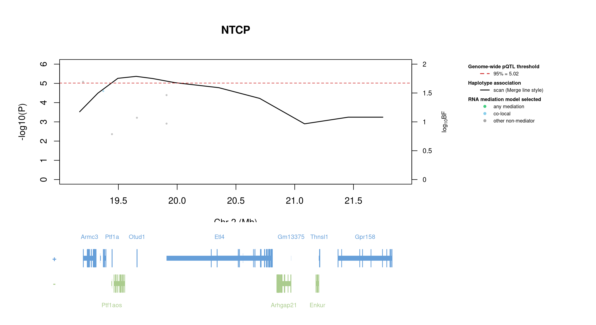

# Protein Overview

The mouse protein Ntcp, encoded by the gene *Ntcp* (also known as *Slc10a1*), is a solute carrier that functions as a sodium-dependent bile acid transport protein. It plays a critical role in bile acid homeostasis. The protein is involved in the uptake of bile acids from the intestine into the liver.

# Data and normalization

Replicate measurements were Box-Cox transformed with a protein-specific λ = **0.58** (95% likelihood interval 0.34 to 0.81), estimated on the individual replicates (`boxcox(y ~ strain)`, no +1 shift). The strain phenotype is the mean of the transformed replicates and the strain noise used for the wisam weights is their variance.

{fig-align="center" width="95%"}

::: {.fig-downloads}
Download: [PNG](figures/repbc_2026-10-01/proteins/Ntcp_normalization.png){download="Ntcp_normalization.png"} · [PDF](figures/repbc_2026-10-01/proteins/Ntcp_normalization.pdf){download="Ntcp_normalization.pdf"}
:::

## Heritability

Broad-sense heritability of the protein is **0.72** (95% CI 0.58–0.79; BH-adjusted P 1.06e-26). Its paired transcript is **Slc10a1** (array probe `1424898_PM_at`, paired from the measured peptide `GIYDGDLK`). Transcript H² is **0.22** (95% CI 0.07–0.37; BH-adjusted P 3.62e-03).

# pQTL genome scan

Genome scan of the Box-Cox phenotype with wisam weights (miqtl `scan.h2lmm`, 11 imputations); significance thresholds come from 1000 permutations (GEV fit to the permutation maxima of −log10 P). Strongest locus: chr2:19.65 Mb, P = 4.32e-06, adjusted P = 2.45e-02; 95% threshold = 5.02 (−log10 P).

{fig-align="center" width="95%"}

::: {.fig-downloads}
Download: [PDF](figures/repbc_2026-10-01/per_protein/Ntcp/Ntcp_genome_scan.pdf){download="Ntcp_genome_scan.pdf"} · [PDF](figures/repbc_2026-10-01/per_protein/Ntcp/Ntcp_scan_by_chromosome.pdf){download="Ntcp_scan_by_chromosome.pdf"}
:::

# Significant peak(s)

## Chromosome 2 peak (UNC2678323)

| Peak position | −log10(P) | Adjusted P | 90% credible interval | Encoding gene | Gene location | pQTL type |
|---|---:|---:|---|---|---|---|
| chr2:19.65 Mb | 5.36 | 2.45e-02 | 19.17–20.70 Mb | Slc10a1 | chr12:80.95–80.97 Mb | **trans** |

A pQTL is **cis** when the gene encoding the protein lies within the credible interval and **trans** otherwise.

{fig-align="center" width="95%"}

::: {.fig-downloads}
Download: [PDF](figures/repbc_2026-10-01/per_protein/Ntcp/Ntcp_ci_scans_full.pdf){download="Ntcp_ci_scans_full.pdf"}
:::

{fig-align="center" width="95%"}

::: {.fig-downloads}
Download: [PNG](figures/repbc_2026-10-01/per_protein/Ntcp/Ntcp_ci_genes_full_chr2.png){download="Ntcp_ci_genes_full_chr2.png"}
:::

### Merge / diplotype fine-mapping

{fig-align="center" width="95%"}

::: {.fig-downloads}
Download: [PNG](figures/repbc_2026-10-01/per_protein/Ntcp/Ntcp_mergeplot_full_UNC2678323.png){download="Ntcp_mergeplot_full_UNC2678323.png"}
:::

### TIMBR allelic series

_TIMBR sweep complete; plots will appear once Merge profiles are available._

### RNA mediation

{fig-align="center" width="95%"}

::: {.fig-downloads}
Download: [PNG](figures/repbc_2026-10-01/per_protein/Ntcp/Ntcp_mediation_overlay_bf_chr2_withgenes.png){download="Ntcp_mediation_overlay_bf_chr2_withgenes.png"} · [PNG](figures/repbc_2026-10-01/per_protein/Ntcp/Ntcp_mediation_overlay_bf_chr2_nogenes.png){download="Ntcp_mediation_overlay_bf_chr2_nogenes.png"}
:::

{fig-align="center" width="95%"}

::: {.fig-downloads}
Download: [PDF](figures/repbc_2026-10-01/per_protein/Ntcp/Ntcp_targeted_mediation_chr2_posterior_bars.pdf){download="Ntcp_targeted_mediation_chr2_posterior_bars.pdf"}
:::
