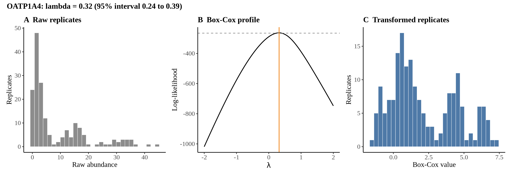
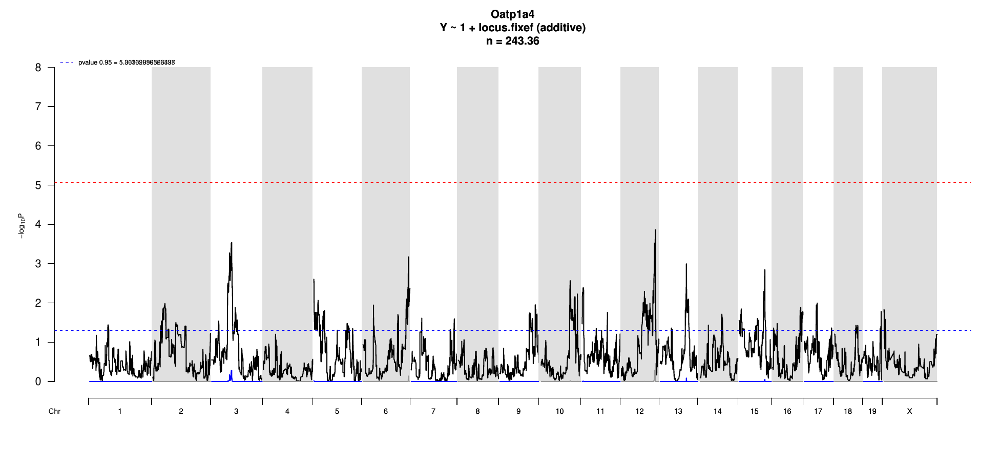

# Protein Overview

Oatp1a4, also known as **Slco1a4**, is a protein in mice (Mus musculus) that functions as an organic anion transport protein, specifically involved in the transport of various compounds across cell membranes. Its gene is referred to as **Slco1a4**, and it has the following alias: **Oatp4a1**.

# Data and normalization

Replicate measurements were Box-Cox transformed with a protein-specific λ = **0.32** (95% likelihood interval 0.24 to 0.39), estimated on the individual replicates (`boxcox(y ~ strain)`, no +1 shift). The strain phenotype is the mean of the transformed replicates and the strain noise used for the wisam weights is their variance.

{fig-align="center" width="95%"}

::: {.fig-downloads}
Download: [PNG](figures/repbc_2026-10-01/proteins/Oatp1a4_normalization.png){download="Oatp1a4_normalization.png"} · [PDF](figures/repbc_2026-10-01/proteins/Oatp1a4_normalization.pdf){download="Oatp1a4_normalization.pdf"}
:::

## Heritability

Broad-sense heritability of the protein is **0.94** (95% CI 0.91–0.96; BH-adjusted P 6.66e-70). Its paired transcript is **Slco1a4** (array probe `1420405_PM_at`, paired from the measured peptide `YLEQQYGK`). Transcript H² is **0.50** (95% CI 0.34–0.64; BH-adjusted P 1.48e-11).

# pQTL genome scan

Genome scan of the Box-Cox phenotype with wisam weights (miqtl `scan.h2lmm`, 11 imputations); significance thresholds come from 1000 permutations (GEV fit to the permutation maxima of −log10 P). Strongest locus: chr12:108.26 Mb, P = 1.36e-04, adjusted P = 3.52e-01; 95% threshold = 5.06 (−log10 P).

{fig-align="center" width="95%"}

::: {.fig-downloads}
Download: [PDF](figures/repbc_2026-10-01/per_protein/Oatp1a4/Oatp1a4_genome_scan.pdf){download="Oatp1a4_genome_scan.pdf"} · [PDF](figures/repbc_2026-10-01/per_protein/Oatp1a4/Oatp1a4_scan_by_chromosome.pdf){download="Oatp1a4_scan_by_chromosome.pdf"}
:::

# Significant peak(s)

No genome-wide significant pQTL for this protein (adjusted P ≥ 0.05), so credible intervals, Merge, TIMBR and mediation were not run.
