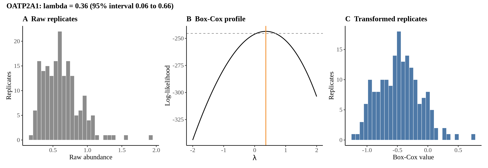
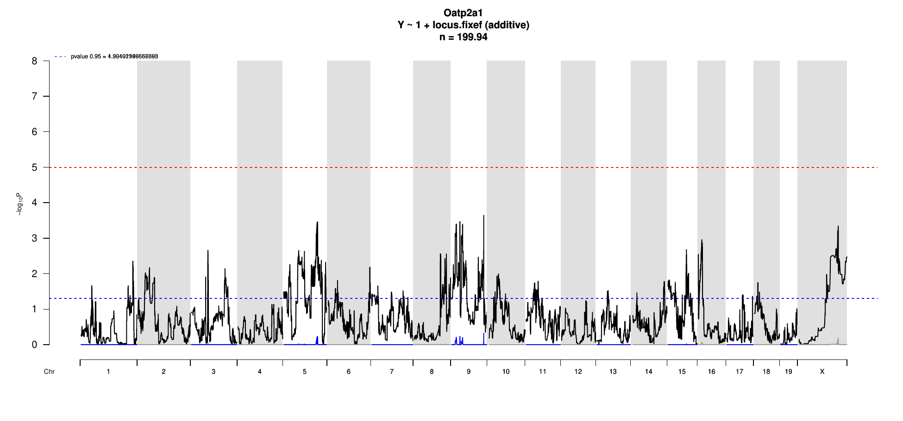

# Protein Overview

The mouse protein Oatp2a1, also known as Slco2a1, is an organic anion transporting polypeptide involved in the transport of various organic molecules across cell membranes. It has several aliases, including Oatp-2A1 and Oatp2a. The gene encoding this protein is important for physiological processes such as drug metabolism and the transport of bile acids.

# Data and normalization

Replicate measurements were Box-Cox transformed with a protein-specific λ = **0.36** (95% likelihood interval 0.06 to 0.66), estimated on the individual replicates (`boxcox(y ~ strain)`, no +1 shift). The strain phenotype is the mean of the transformed replicates and the strain noise used for the wisam weights is their variance.

{fig-align="center" width="95%"}

::: {.fig-downloads}
Download: [PNG](figures/repbc_2026-10-01/proteins/Oatp2a1_normalization.png){download="Oatp2a1_normalization.png"} · [PDF](figures/repbc_2026-10-01/proteins/Oatp2a1_normalization.pdf){download="Oatp2a1_normalization.pdf"}
:::

## Heritability

Broad-sense heritability of the protein is **0.38** (95% CI 0.22–0.52; BH-adjusted P 6.56e-08). Its paired transcript is **Slco2a1** (array probe `1420914_PM_at`, paired from the measured peptide `HLPGLLPSK`). Transcript H² is **0.57** (95% CI 0.42–0.70; BH-adjusted P 7.56e-15).

# pQTL genome scan

Genome scan of the Box-Cox phenotype with wisam weights (miqtl `scan.h2lmm`, 11 imputations); significance thresholds come from 1000 permutations (GEV fit to the permutation maxima of −log10 P). Strongest locus: chr9:113.11 Mb, P = 2.26e-04, adjusted P = 4.81e-01; 95% threshold = 4.99 (−log10 P).

{fig-align="center" width="95%"}

::: {.fig-downloads}
Download: [PDF](figures/repbc_2026-10-01/per_protein/Oatp2a1/Oatp2a1_genome_scan.pdf){download="Oatp2a1_genome_scan.pdf"} · [PDF](figures/repbc_2026-10-01/per_protein/Oatp2a1/Oatp2a1_scan_by_chromosome.pdf){download="Oatp2a1_scan_by_chromosome.pdf"}
:::

# Significant peak(s)

No genome-wide significant pQTL for this protein (adjusted P ≥ 0.05), so credible intervals, Merge, TIMBR and mediation were not run.
