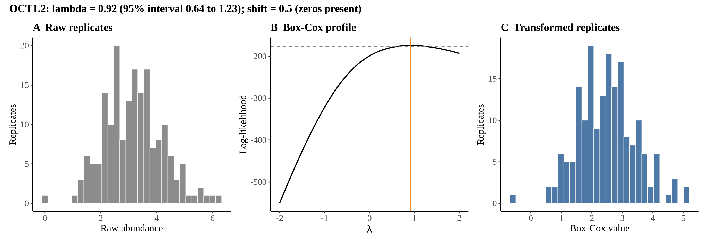
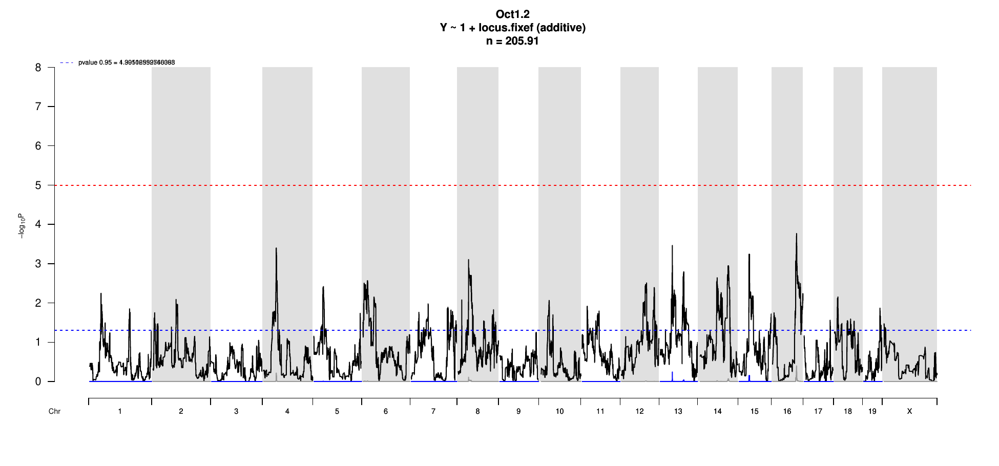

# Protein Overview

The mouse protein Oct1.2 is encoded by the gene **Pou2f1**. It is a member of the POU (POU domain) family of transcription factors and is also known by its aliases **Oct-1**, **Oct-1A**, and **OCT1**. This protein plays a vital role in regulating gene expression and is involved in various biological processes, including development and cellular differentiation.

# Data and normalization

Replicate measurements were Box-Cox transformed with a protein-specific λ = **0.92** (95% likelihood interval 0.64 to 1.23), estimated on the individual replicates (`boxcox(y ~ strain)`, no +1 shift); because 1 replicate(s) were zero, a small shift of 0.5 was added before transforming. The strain phenotype is the mean of the transformed replicates and the strain noise used for the wisam weights is their variance.

{fig-align="center" width="95%"}

::: {.fig-downloads}
Download: [PNG](figures/repbc_2026-10-01/proteins/Oct1.2_normalization.png){download="Oct1.2_normalization.png"} · [PDF](figures/repbc_2026-10-01/proteins/Oct1.2_normalization.pdf){download="Oct1.2_normalization.pdf"}
:::

## Heritability

Broad-sense heritability of the protein is **0.42** (95% CI 0.29–0.56; BH-adjusted P 3.40e-09). Its paired transcript is **Slc22a1** (array probe `1418118_PM_at`, paired from the measured peptide `SPGVAELSQR`). Transcript H² is **0.60** (95% CI 0.45–0.71; BH-adjusted P 1.29e-13).

# pQTL genome scan

Genome scan of the Box-Cox phenotype with wisam weights (miqtl `scan.h2lmm`, 11 imputations); significance thresholds come from 1000 permutations (GEV fit to the permutation maxima of −log10 P). Strongest locus: chr16:77.90 Mb, P = 1.70e-04, adjusted P = 4.01e-01; 95% threshold = 5.00 (−log10 P).

{fig-align="center" width="95%"}

::: {.fig-downloads}
Download: [PDF](figures/repbc_2026-10-01/per_protein/Oct1.2/Oct1.2_genome_scan.pdf){download="Oct1.2_genome_scan.pdf"} · [PDF](figures/repbc_2026-10-01/per_protein/Oct1.2/Oct1.2_scan_by_chromosome.pdf){download="Oct1.2_scan_by_chromosome.pdf"}
:::

# Significant peak(s)

No genome-wide significant pQTL for this protein (adjusted P ≥ 0.05), so credible intervals, Merge, TIMBR and mediation were not run.
