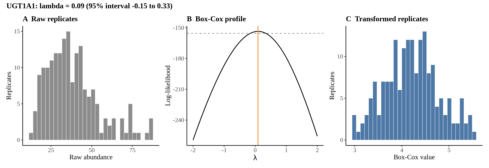
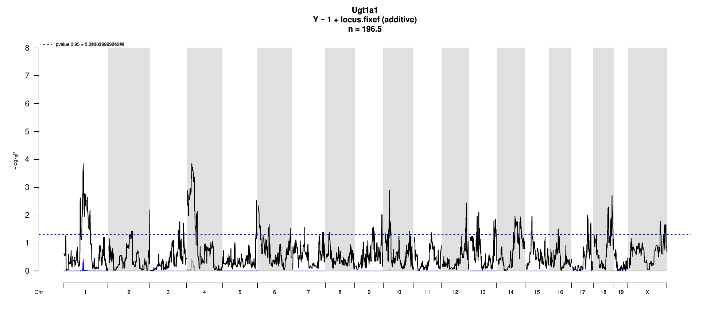

# Protein Overview

The mouse protein Ugt1a1 is encoded by the gene **Ugt1a1**, which is part of the UDP-glucuronosyltransferase family. It is involved in the metabolic detoxification of various compounds, including drugs and endogenous substances. The protein has several aliases, including **UGT1A1**, **UGT1**, and **UGT1A**.

# Data and normalization

Replicate measurements were Box-Cox transformed with a protein-specific λ = **0.09** (95% likelihood interval -0.15 to 0.33), estimated on the individual replicates (`boxcox(y ~ strain)`, no +1 shift). The strain phenotype is the mean of the transformed replicates and the strain noise used for the wisam weights is their variance.

{fig-align="center" width="95%"}

::: {.fig-downloads}
Download: [PNG](figures/repbc_2026-10-01/proteins/Ugt1a1_normalization.png){download="Ugt1a1_normalization.png"} · [PDF](figures/repbc_2026-10-01/proteins/Ugt1a1_normalization.pdf){download="Ugt1a1_normalization.pdf"}
:::

## Heritability

Broad-sense heritability of the protein is **0.77** (95% CI 0.67–0.84; BH-adjusted P 8.97e-32). Its paired transcript is **Ugt1a1 +7** (array probe `1426260_PM_a_at`, paired from the measured peptide `VVYSPYGSLATEILQK`). Transcript H² is **0.39** (95% CI 0.19–0.55; BH-adjusted P 9.36e-08). This is a shared multi-gene probe, so the transcript signal is not gene-specific.

# pQTL genome scan

Genome scan of the Box-Cox phenotype with wisam weights (miqtl `scan.h2lmm`, 11 imputations); significance thresholds come from 1000 permutations (GEV fit to the permutation maxima of −log10 P). Strongest locus: chr1:87.59 Mb, P = 1.41e-04, adjusted P = 3.72e-01; 95% threshold = 5.01 (−log10 P).

{fig-align="center" width="95%"}

::: {.fig-downloads}
Download: [PDF](figures/repbc_2026-10-01/per_protein/Ugt1a1/Ugt1a1_genome_scan.pdf){download="Ugt1a1_genome_scan.pdf"} · [PDF](figures/repbc_2026-10-01/per_protein/Ugt1a1/Ugt1a1_scan_by_chromosome.pdf){download="Ugt1a1_scan_by_chromosome.pdf"}
:::

# Significant peak(s)

No genome-wide significant pQTL for this protein (adjusted P ≥ 0.05), so credible intervals, Merge, TIMBR and mediation were not run.
