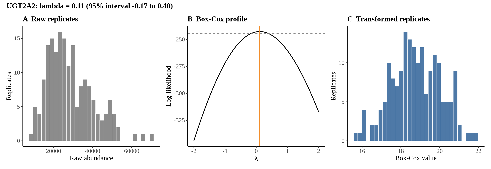
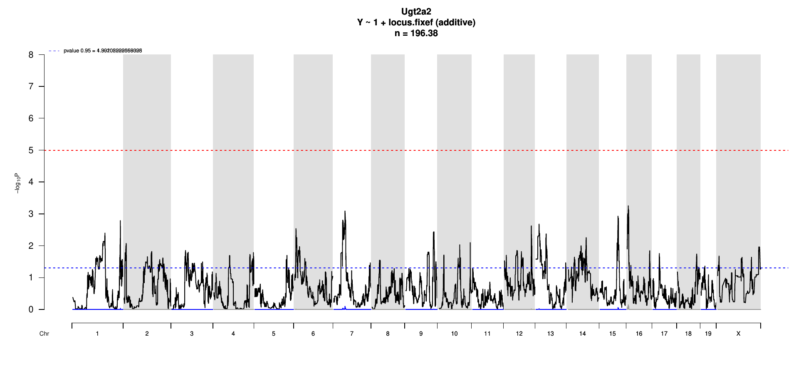

# Protein Overview

The mouse protein Ugt2a2, also known as UDP-glucuronosyltransferase 2 family, member A2, is encoded by the gene Ugt2a2. Its aliases include Ugt2a2 and Ugt2a. This enzyme is involved in the process of glucuronidation, which is essential for detoxifying various compounds in the organism.

# Data and normalization

Replicate measurements were Box-Cox transformed with a protein-specific λ = **0.11** (95% likelihood interval -0.17 to 0.40), estimated on the individual replicates (`boxcox(y ~ strain)`, no +1 shift). The strain phenotype is the mean of the transformed replicates and the strain noise used for the wisam weights is their variance.

{fig-align="center" width="95%"}

::: {.fig-downloads}
Download: [PNG](figures/repbc_2026-10-01/proteins/Ugt2a2_normalization.png){download="Ugt2a2_normalization.png"} · [PDF](figures/repbc_2026-10-01/proteins/Ugt2a2_normalization.pdf){download="Ugt2a2_normalization.pdf"}
:::

## Heritability

Broad-sense heritability of the protein is **0.34** (95% CI 0.20–0.47; BH-adjusted P 1.63e-06). Its paired transcript is **Ugt2a1 +1** (array probe `1421484_PM_at`, paired from the measured peptide `FSPASTVER`). Transcript H² is **0.05** (95% CI 0.00–0.18; BH-adjusted P 2.79e-01). This is a shared multi-gene probe, so the transcript signal is not gene-specific.

# pQTL genome scan

Genome scan of the Box-Cox phenotype with wisam weights (miqtl `scan.h2lmm`, 11 imputations); significance thresholds come from 1000 permutations (GEV fit to the permutation maxima of −log10 P). Strongest locus: chr16:8.05 Mb, P = 5.56e-04, adjusted P = 7.08e-01; 95% threshold = 4.99 (−log10 P).

{fig-align="center" width="95%"}

::: {.fig-downloads}
Download: [PDF](figures/repbc_2026-10-01/per_protein/Ugt2a2/Ugt2a2_genome_scan.pdf){download="Ugt2a2_genome_scan.pdf"} · [PDF](figures/repbc_2026-10-01/per_protein/Ugt2a2/Ugt2a2_scan_by_chromosome.pdf){download="Ugt2a2_scan_by_chromosome.pdf"}
:::

# Significant peak(s)

No genome-wide significant pQTL for this protein (adjusted P ≥ 0.05), so credible intervals, Merge, TIMBR and mediation were not run.
