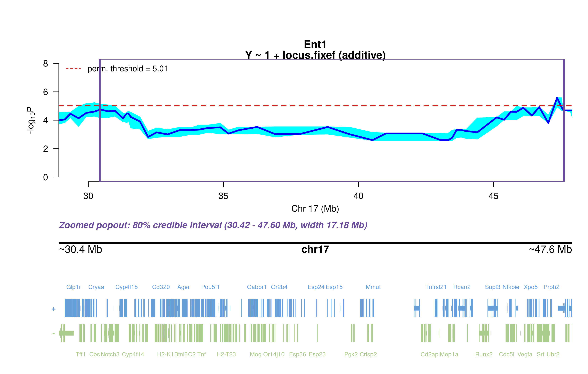
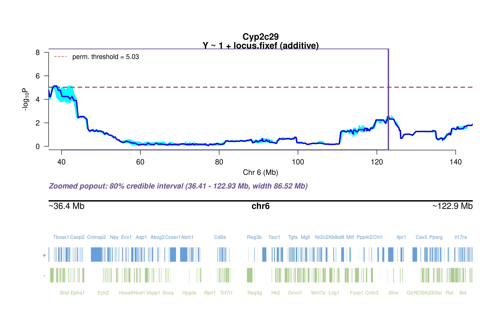

# Credible intervals {.unnumbered}

Every genome-wide significant pQTL locus with its 90% bootstrap credible interval (100 Bayesian bootstrap replicates of the chromosome scan; the 80% interval is boxed in the gene-track plots). A locus is **cis** when the gene encoding the protein lies inside the interval. Follow-up figures (Merge, TIMBR, mediation) are in each protein's chapter.

| Protein | Chr | Peak (Mb) | Adjusted P | 90% CI (Mb) | Width (Mb) | Encoding gene | pQTL type |
|---|---|---:|---:|---|---:|---|---|
| ENT1 | 17 | 47.35 | 1.54e-02 | 28.91–47.90 | 19.0 | Slc29a1 | **cis** |
| NTCP | 2 | 19.65 | 2.45e-02 | 19.17–20.70 | 1.5 | Slc10a1 | **trans** |
| CYP2C50 | 19 | 37.99 | 2.22e-16 | 37.45–48.47 | 11.0 | Cyp2c50 | **cis** |
| CYP2C50 | 3 | 60.51 | 5.32e-03 | 47.17–87.62 | 40.5 | Cyp2c50 | **trans** |
| CYP2E1 | 3 | 59.86 | 3.57e-02 | 15.00–66.49 | 51.5 | Cyp2e1 | **trans** |
| CYP2C29 | 6 | 38.19 | 4.02e-02 | 36.73–144.32 | 107.6 | Cyp2c29 | **trans** |
| BSEP | 16 | 38.15 | 1.48e-03 | 35.14–43.74 | 8.6 | Abcb11 | **trans** |
| CYP2C39 | 19 | 39.93 | 2.22e-16 | 38.20–40.36 | 2.2 | Cyp2c39 | **cis** |
| CYP3A11 | 3 | 41.34 | 2.48e-02 | 38.04–104.21 | 66.2 | Cyp3a11 | **trans** |
| CYP3A11 | 6 | 52.95 | 2.67e-02 | 18.04–64.62 | 46.6 | Cyp3a11 | **trans** |
| CYP2D26 | 3 | 61.22 | — | 60.51–96.17 | 35.7 | — | **—** |
| CYP2C9 | 12 | 113.58 | — | 86.52–118.08 | 31.6 | — | **—** |
| BSEP | 17 | 55.41 | — | 43.63–56.89 | 13.3 | — | **—** |
| CYP2C39 (subset) | 19 | 39.93 | 5.79e-07 | 37.99–41.30 | 3.3 | Cyp2c39 | **cis** |

## ENT1, chromosome 17

{fig-align="center" width="95%"}

::: {.fig-downloads}
Download: [PNG](figures/repbc_2026-10-01/per_protein/Ent1/Ent1_ci_genes_full_chr17.png){download="Ent1_ci_genes_full_chr17.png"}
:::

Interval 28.91–47.90 Mb around the peak at 47.35 Mb. Follow-up: see the [ENT1 chapter](Ent1.qmd).

## NTCP, chromosome 2

{fig-align="center" width="95%"}

::: {.fig-downloads}
Download: [PNG](figures/repbc_2026-10-01/per_protein/Ntcp/Ntcp_ci_genes_full_chr2.png){download="Ntcp_ci_genes_full_chr2.png"}
:::

Interval 19.17–20.70 Mb around the peak at 19.65 Mb. Follow-up: see the [NTCP chapter](Ntcp.qmd).

## CYP2C50, chromosome 19

{fig-align="center" width="95%"}

::: {.fig-downloads}
Download: [PNG](figures/repbc_2026-10-01/per_protein/Cyp2c50/Cyp2c50_ci_genes_full_chr19.png){download="Cyp2c50_ci_genes_full_chr19.png"}
:::

Interval 37.45–48.47 Mb around the peak at 37.99 Mb. Follow-up: see the [CYP2C50 chapter](Cyp2c50.qmd).

## CYP2C50, chromosome 3

{fig-align="center" width="95%"}

::: {.fig-downloads}
Download: [PNG](figures/repbc_2026-10-01/per_protein/Cyp2c50/Cyp2c50_ci_genes_full_chr3.png){download="Cyp2c50_ci_genes_full_chr3.png"}
:::

Interval 47.17–87.62 Mb around the peak at 60.51 Mb. Follow-up: see the [CYP2C50 chapter](Cyp2c50.qmd).

## CYP2E1, chromosome 3

{fig-align="center" width="95%"}

::: {.fig-downloads}
Download: [PNG](figures/repbc_2026-10-01/per_protein/Cyp2e1/Cyp2e1_ci_genes_full_chr3.png){download="Cyp2e1_ci_genes_full_chr3.png"}
:::

Interval 15.00–66.49 Mb around the peak at 59.86 Mb. Follow-up: see the [CYP2E1 chapter](Cyp2e1.qmd).

## CYP2C29, chromosome 6

{fig-align="center" width="95%"}

::: {.fig-downloads}
Download: [PNG](figures/repbc_2026-10-01/per_protein/Cyp2c29/Cyp2c29_ci_genes_full_chr6.png){download="Cyp2c29_ci_genes_full_chr6.png"}
:::

Interval 36.73–144.32 Mb around the peak at 38.19 Mb. Follow-up: see the [CYP2C29 chapter](Cyp2c29.qmd).

## BSEP, chromosome 16

{fig-align="center" width="95%"}

::: {.fig-downloads}
Download: [PNG](figures/repbc_2026-10-01/per_protein/Bsep/Bsep_ci_genes_full_chr16.png){download="Bsep_ci_genes_full_chr16.png"}
:::

Interval 35.14–43.74 Mb around the peak at 38.15 Mb. Follow-up: see the [BSEP chapter](Bsep.qmd).

## CYP2C39, chromosome 19

{fig-align="center" width="95%"}

::: {.fig-downloads}
Download: [PNG](figures/repbc_2026-10-01/per_protein/Cyp2c39/Cyp2c39_ci_genes_full_chr19.png){download="Cyp2c39_ci_genes_full_chr19.png"}
:::

Interval 38.20–40.36 Mb around the peak at 39.93 Mb. Follow-up: see the [CYP2C39 chapter](Cyp2c39.qmd).

## CYP3A11, chromosome 3

{fig-align="center" width="95%"}

::: {.fig-downloads}
Download: [PNG](figures/repbc_2026-10-01/per_protein/Cyp3a11/Cyp3a11_ci_genes_full_chr3.png){download="Cyp3a11_ci_genes_full_chr3.png"}
:::

Interval 38.04–104.21 Mb around the peak at 41.34 Mb. Follow-up: see the [CYP3A11 chapter](Cyp3a11.qmd).

## CYP3A11, chromosome 6

{fig-align="center" width="95%"}

::: {.fig-downloads}
Download: [PNG](figures/repbc_2026-10-01/per_protein/Cyp3a11/Cyp3a11_ci_genes_full_chr6.png){download="Cyp3a11_ci_genes_full_chr6.png"}
:::

Interval 18.04–64.62 Mb around the peak at 52.95 Mb. Follow-up: see the [CYP3A11 chapter](Cyp3a11.qmd).

## CYP2D26, chromosome 3

Interval 60.51–96.17 Mb around the peak at 61.22 Mb. Follow-up: see the [CYP2D26 chapter](Cyp2d26.qmd).

## CYP2C9, chromosome 12

Interval 86.52–118.08 Mb around the peak at 113.58 Mb. Follow-up: see the [CYP2C9 chapter](Cyp2c9.qmd).

## BSEP, chromosome 17

Interval 43.63–56.89 Mb around the peak at 55.41 Mb. Follow-up: see the [BSEP chapter](Bsep.qmd).

## CYP2C39, chromosome 19 (zero-inflated subset scan)

{fig-align="center" width="95%"}

::: {.fig-downloads}
Download: [PNG](figures/repbc_2026-10-01/per_protein/Cyp2c39/Cyp2c39_ci_genes_sub_chr19.png){download="Cyp2c39_ci_genes_sub_chr19.png"}
:::

Interval 37.99–41.30 Mb around the peak at 39.93 Mb. Follow-up: see the [CYP2C39 chapter](Cyp2c39.qmd).
