# V2 results overview {.unnumbered}

This is the reporting overview for the **rerun_2026-09-24_v2** rerun. It presents the current cross-protein results and links the figure set. The reporting table and figures exclude **CES2** because of the previously identified protein QC issue. CES2's legacy source chapter is omitted from the rendered book; this page is the cross-panel summary.

## Cross-protein summary

The table combines pQTL lead-locus statistics and protein broad-sense H² with coding-transcript broad-sense H² where an original-array probe could be matched. Protein H² uses the Box–Cox transformed protein measurements supplied to the QTL analyses. Transcript H² uses RINT-transformed individual RNA array measurements, with CC line as a random effect and scan date adjusted as a fixed effect. Transcript rows without a gene-specific match are shown as unavailable.

Download the [QC-filtered CSV summary](figures/rerun_2026-09-24_v2/v2_integrated_summary_no_CES2.csv) or the [transcript H² estimates and intervals](figures/rerun_2026-09-24_v2/coding_transcript_h2_broad_sense.csv). OCT1.2 is retained with its protein H² estimate from the figure 2 results, but the v2 integrated table contains no OCT1.2 pQTL row.

| Protein | pQTL lead (chr:Mb) | pQTL P | Adjusted P | Scan plots | Protein H² (95% CI) | Protein H² Bonferroni P | Coding transcript | Transcript H² (95% CI) | Transcript H² BH P |
|---|---:|---:|---:|---|---:|---:|---|---:|---:|
| ATPASE | 6:129.07 | 7.42e-05 | 2.43e-01 | [PDF](figures/rerun_2026-09-24_v2/pqtl_per_protein/ATPase.pdf) | 0.23 (0.07, 0.39) | 1.87e-02 | Atp1a1 | 0.51 (0.36, 0.64) | 1.54e-12 |
| ABCB4 | 15:82.74 | 1.65e-04 | 4.08e-01 | [PDF](figures/rerun_2026-09-24_v2/pqtl_per_protein/Abcb4.pdf) | 0.39 (0.21, 0.56) | 8.56e-07 | Abcb4 | 0.28 (0.10, 0.42) | 1.39e-04 |
| BCRP | 10:110.74 | 2.36e-03 | 9.47e-01 | [PDF](figures/rerun_2026-09-24_v2/pqtl_per_protein/Bcrp.pdf) | 0.81 (0.70, 0.87) | 2.76e-37 | Abcg2 | 0.47 (0.32, 0.60) | 6.72e-09 |
| BSEP | 16:38.15 | 4.18e-07 | 1.90e-03 | [PDF](figures/rerun_2026-09-24_v2/pqtl_per_protein/Bsep.pdf) | 0.57 (0.40, 0.69) | 5.60e-15 | Abcb11 | 0.22 (0.06, 0.36) | 4.12e-03 |
| CES1 | 7:115.90 | 1.45e-04 | 3.70e-01 | [PDF](figures/rerun_2026-09-24_v2/pqtl_per_protein/Ces1.pdf) | 0.62 (0.50, 0.72) | 3.33e-18 | — | — | — |
| CYP1A2 | 10:25.10 | 3.15e-05 | 1.32e-01 | [PDF](figures/rerun_2026-09-24_v2/pqtl_per_protein/Cyp1a2.pdf) | 0.60 (0.46, 0.73) | 9.31e-17 | Cyp1a2 | 0.16 (0.02, 0.30) | 1.90e-02 |
| CYP2C29 | 13:41.29 | 4.73e-05 | 1.68e-01 | [PDF](figures/rerun_2026-09-24_v2/pqtl_per_protein/Cyp2c29.pdf) | 0.93 (0.88, 0.95) | 1.58e-64 | Cyp2c29 | 0.33 (0.16, 0.47) | 1.66e-05 |
| CYP2C39 | 19:38.97 | 2.08e-15 | 2.22e-16 | [PDF](figures/rerun_2026-09-24_v2/pqtl_per_protein/Cyp2c39.pdf) | 0.90 (0.84, 0.93) | 3.18e-54 | Cyp2c39 | 0.69 (0.55, 0.79) | 1.14e-23 |
| CYP2C9 | 12:113.58 | 1.05e-05 | 5.89e-02 | [PDF](figures/rerun_2026-09-24_v2/pqtl_per_protein/Cyp2c9.pdf) | 0.58 (0.42, 0.69) | 2.93e-15 | — | — | — |
| CYP2C50 | 19:37.99 | 4.88e-11 | 2.22e-16 | [PDF](figures/rerun_2026-09-24_v2/pqtl_per_protein/Cyp2c50.pdf) | 0.84 (0.74, 0.89) | 1.09e-40 | Cyp2c54 | 0.31 (0.13, 0.45) | 2.39e-05 |
| CYP2D9 | 10:56.03 | 1.32e-05 | 6.39e-02 | — | 0.56 (0.41, 0.66) | 3.77e-14 | Cyp2d9 | 0.41 (0.27, 0.55) | 1.48e-08 |
| CYP2D10 | 3:59.86 | 7.05e-04 | 7.06e-01 | — | 0.91 (0.87, 0.95) | 1.34e-57 | Cyp2d10 | 0.21 (0.05, 0.35) | 3.69e-03 |
| CYP2D26 | 3:61.22 | 5.62e-06 | 3.37e-02 | [PDF](figures/rerun_2026-09-24_v2/pqtl_per_protein/Cyp2d26.pdf) | 0.80 (0.67, 0.86) | 1.76e-34 | Cyp2d26 | 0.53 (0.37, 0.64) | 9.11e-13 |
| CYP2E1 | 3:59.86 | 7.38e-05 | 2.39e-01 | — | 0.86 (0.78, 0.90) | 1.69e-45 | Cyp2e1 | 0.25 (0.07, 0.40) | 6.91e-04 |
| CYP2F2 | 10:86.92 | 8.65e-05 | 2.71e-01 | [PDF](figures/rerun_2026-09-24_v2/pqtl_per_protein/Cyp2f2.pdf) | 0.54 (0.36, 0.66) | 5.08e-13 | Cyp2f2 | 0.39 (0.17, 0.55) | 1.77e-06 |
| CYP3A11 | 3:41.34 | 5.74e-06 | 2.86e-02 | [PDF](figures/rerun_2026-09-24_v2/pqtl_per_protein/Cyp3a11.pdf) | 0.49 (0.30, 0.62) | 1.08e-10 | Cyp3a11 | 0.20 (0.03, 0.34) | 4.71e-03 |
| ENT1 | 17:47.35 | 1.72e-06 | 1.00e-02 | [PDF](figures/rerun_2026-09-24_v2/pqtl_per_protein/Ent1.pdf) | 0.73 (0.63, 0.81) | 1.86e-27 | Slco1a4 | 0.50 (0.34, 0.64) | 1.47e-11 |
| MRP2 | 6:110.84 | 2.35e-04 | 4.91e-01 | — | 0.31 (0.10, 0.46) | 3.29e-04 | Abcc2 | 0.41 (0.23, 0.56) | 1.93e-08 |
| MRP3 | 12:74.10 | 1.00e-05 | 5.18e-02 | [PDF](figures/rerun_2026-09-24_v2/pqtl_per_protein/Mrp3.pdf) | 0.46 (0.28, 0.59) | 3.88e-09 | Abcc3 | 0.48 (0.32, 0.63) | 3.73e-11 |
| NTCP | 7:6.37 | 5.63e-05 | 1.98e-01 | [PDF](figures/rerun_2026-09-24_v2/pqtl_per_protein/Ntcp.pdf) | 0.22 (0.08, 0.37) | 3.48e-02 | Slc10a1 | 0.22 (0.07, 0.37) | 3.59e-03 |
| OATP1A4 | 12:108.26 | 7.87e-05 | 2.43e-01 | [PDF](figures/rerun_2026-09-24_v2/pqtl_per_protein/Oatp1a4.pdf) | 0.86 (0.78, 0.91) | 1.23e-44 | Slco1a4 | 0.50 (0.34, 0.64) | 1.47e-11 |
| OATP2A1 | 16:15.22 | 1.37e-06 | 7.33e-03 | [PDF](figures/rerun_2026-09-24_v2/pqtl_per_protein/Oatp2a1.pdf) | 0.21 (0.03, 0.35) | 6.19e-02 | Slco2a1 | 0.53 (0.37, 0.66) | 9.11e-13 |
| OCT1.2 | — | — | — | — | 0.38 (0.22, 0.53) | 1.57e-06 | — | — | — |
| UGT1A1 | 4:22.18 | 3.50e-04 | 5.68e-01 | [PDF](figures/rerun_2026-09-24_v2/pqtl_per_protein/Ugt1a1.pdf) | 0.76 (0.65, 0.84) | 1.76e-30 | — | — | — |
| UGT1A6 | 1:84.18 | 7.23e-04 | 7.49e-01 | [PDF](figures/rerun_2026-09-24_v2/pqtl_per_protein/Ugt1a6.pdf) | 0.67 (0.54, 0.77) | 1.06e-21 | — | — | — |
| UGT2A2 | 16:8.05 | 4.88e-04 | 6.61e-01 | [PDF](figures/rerun_2026-09-24_v2/pqtl_per_protein/Ugt2a2.pdf) | 0.34 (0.19, 0.46) | 4.53e-05 | — | — | — |

## Heritability and strain structure

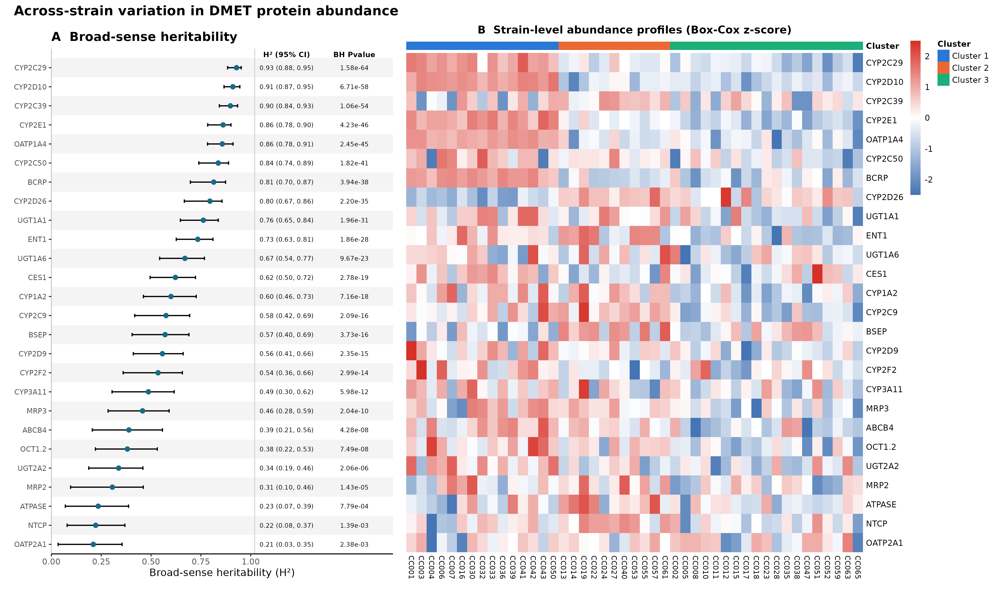

Protein H² is estimated from replicated protein measurements. The figure displays the protein-level estimates and their uncertainty alongside the strain-level expression heatmap. The separately estimated transcript H² values are summarized in the table above; they are not the estimates in this forest panel.

### Coding-transcript heritability

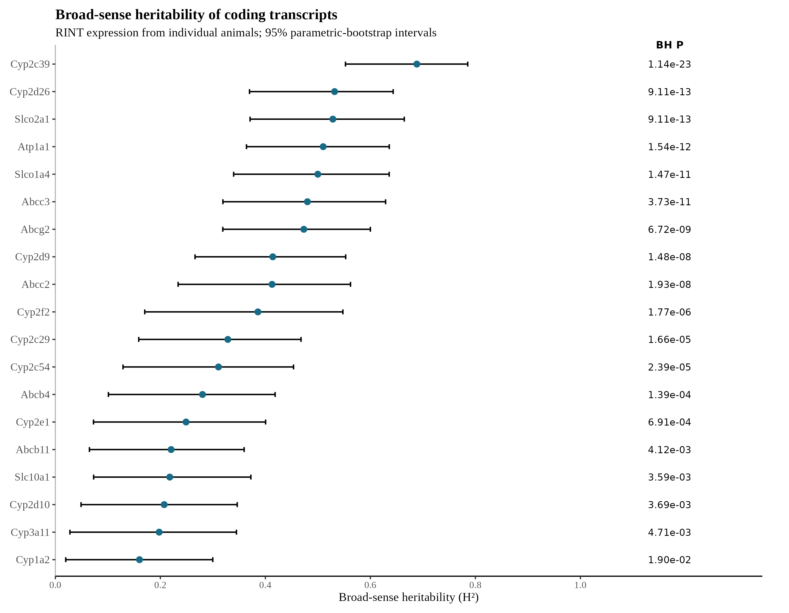

Transcript H² was estimated from RINT-transformed individual RNA measurements for 19 unique original-array probes, corresponding to 20 protein rows. The model includes a random CC-line effect and adjusts for scan date; intervals are 95% parametric-bootstrap intervals. The table gives the per-transcript BH-adjusted p-values.

### Protein phenotype correlation

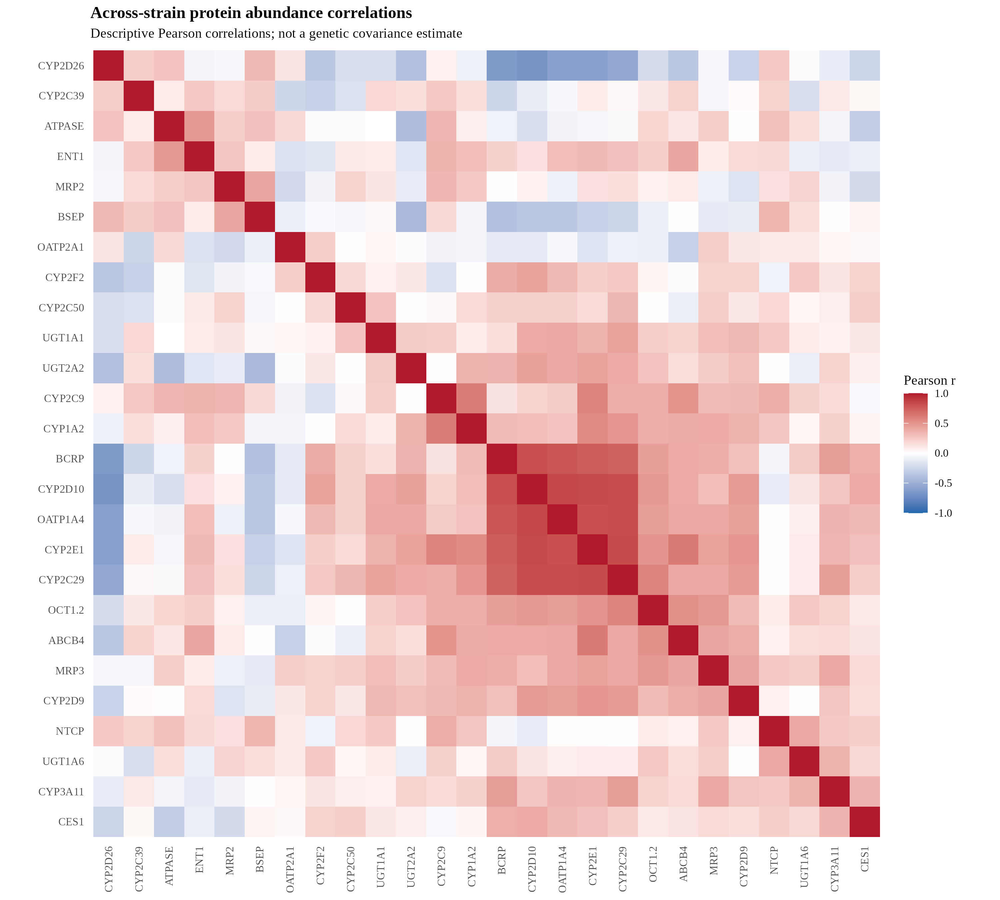

This descriptive Pearson matrix summarizes observed across-strain protein abundance and is distinct from the random-effect covariance estimates below.

### Genetic covariance and genetic correlation

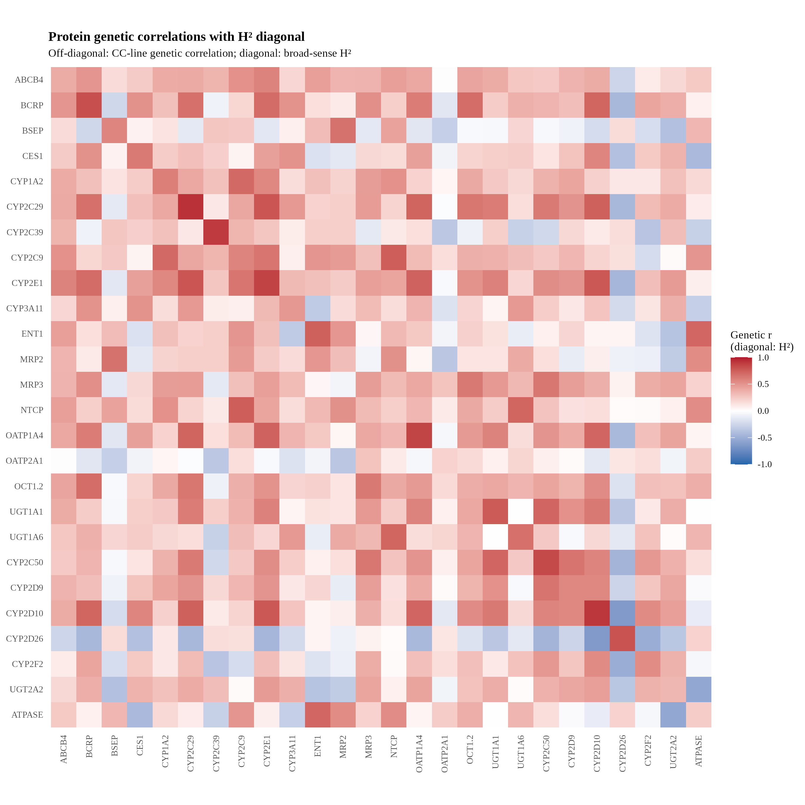

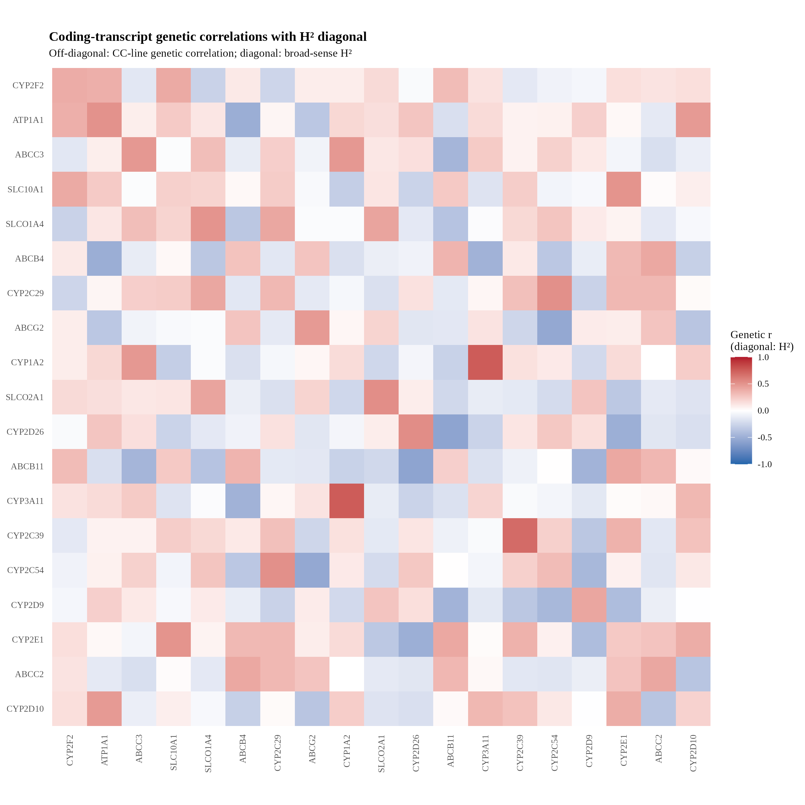

Download the [protein genetic covariance matrix](figures/rerun_2026-09-24_v2/protein_genetic_correlation_H2_diagonal_genetic_covariance.csv), [protein genetic correlation matrix with H² diagonal](figures/rerun_2026-09-24_v2/protein_genetic_correlation_H2_diagonal_genetic_correlation_H2_diagonal.csv), [coding-transcript covariance matrix](figures/rerun_2026-09-24_v2/transcript_genetic_correlation_H2_diagonal_genetic_covariance.csv), or [coding-transcript correlation matrix with H² diagonal](figures/rerun_2026-09-24_v2/transcript_genetic_correlation_H2_diagonal_genetic_correlation_H2_diagonal.csv). The displayed diagonal contains the existing broad-sense H² estimates; off-diagonal cells are estimated CC-line genetic correlations. Covariances use Box–Cox protein values and RINT transcript values. Protein residual cross-trait covariance is assumed zero because replicate assays are not paired across traits; transcript off-diagonal covariance is corrected for within-line residual covariance. Correlations were projected to a valid correlation matrix after sampling correction. Estimates are point estimates without confidence intervals.

## Genome-wide QTL overview

### pQTL

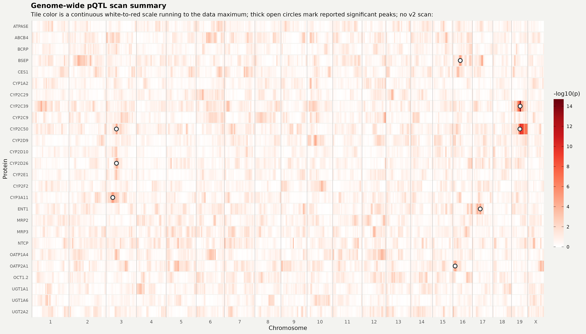

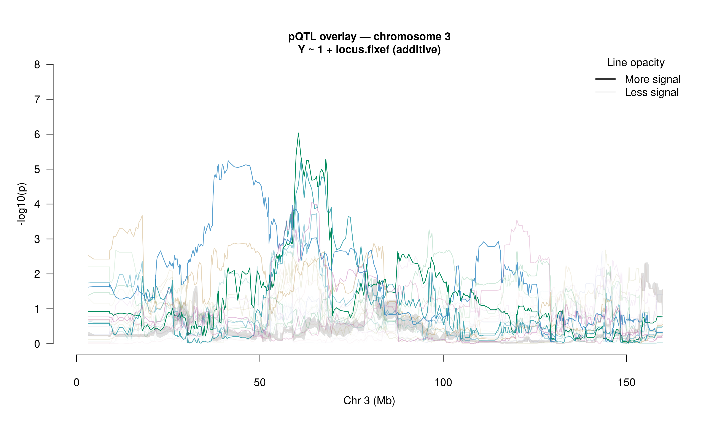

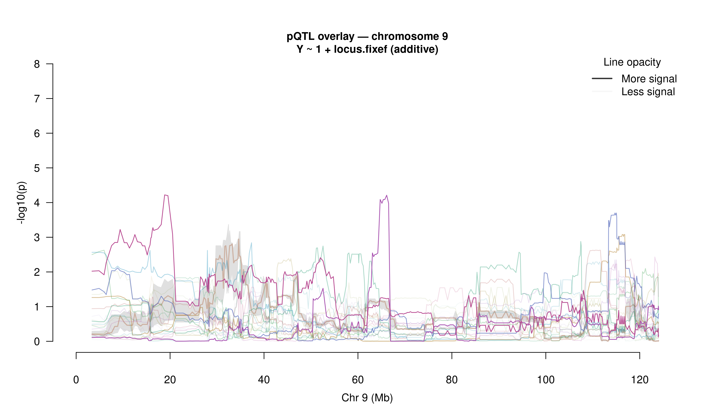

The v2 figure bundle also includes zoomed pQTL views for chromosomes 3, 16, 17, and 19: [chr3](figures/rerun_2026-09-24_v2/figure3_pqtl_zoom_chr3.png), [chr16](figures/rerun_2026-09-24_v2/figure3_pqtl_zoom_chr16.png), [chr17](figures/rerun_2026-09-24_v2/figure3_pqtl_zoom_chr17.png), and [chr19](figures/rerun_2026-09-24_v2/figure3_pqtl_zoom_chr19.png). The summary table links individual protein scan PDFs where available (21 of 26 reportable proteins); current scan PDFs are missing for CYP2D9, CYP2D10, CYP2E1, MRP2, and OCT1.2.

### eQTL

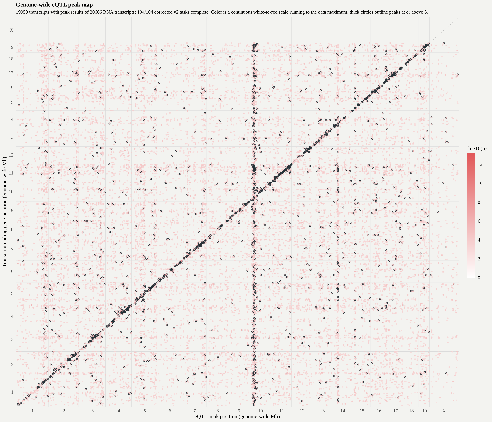

The merged corrected RNA-v2 eQTL table contains peak results for all 20,666 of 20,666 transcripts, with all 104 of 104 task outputs present. The location map plots the 19,959 transcripts with usable chromosome and genomic-position annotation on both axes; 707 eQTL results do not have complete positional annotation for this display. The point color shows uncapped −log₁₀(p). The refreshed plot and its underlying coordinates are in the [RNA-v2 figure bundle](figures/rerun_2026-09-27_rna_v2/).

## Protein variation and transcriptome context

### Protein PCA

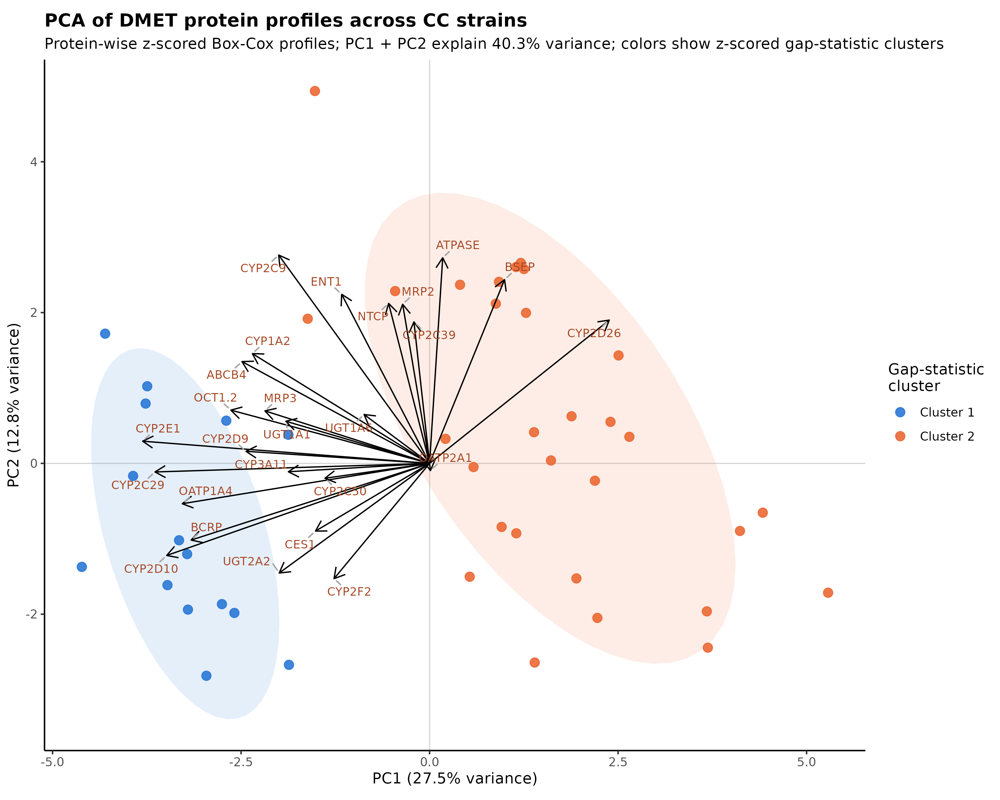

Additional protein PCA versions are available for [Box–Cox values](figures/rerun_2026-09-24_v2/protein_pca_biplot_boxcox.png) and [z-scored values](figures/rerun_2026-09-24_v2/protein_pca_biplot_zscore.png). The [gap-statistic curve](figures/rerun_2026-09-24_v2/protein_cluster_gapstat.png) and [k=3 strain-cluster heatmap](figures/rerun_2026-09-24_v2/protein_cluster_heatmap.png) show the companion clustering analysis.

### Transcriptome

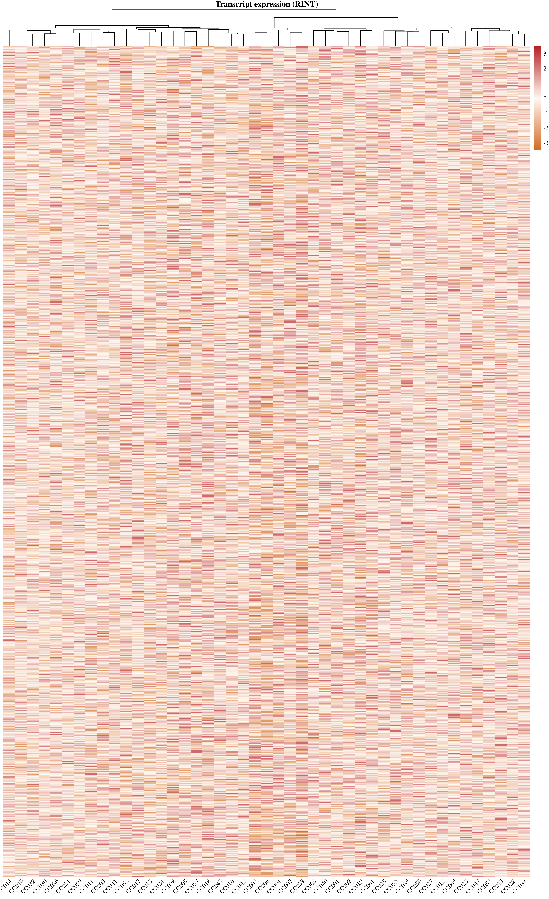

The correlation overview bins transcripts by expression variance for display; it does not show a complete 20,666 × 20,666 transcript correlation matrix.

## RNA mediation coverage

The 2026-09-27 targeted mediation array was submitted for eight proteins. Seven are reportable after excluding CES2: Bsep, Cyp2c39, Cyp2c50, Cyp2d26, Cyp3a11, Ent1, Oatp2a1. Available chromosome overlays and posterior-bar plots are copied below; this is targeted locus follow-up, not panel-wide mediation.

| Protein | Available mediation figures |
|---|---|
| Bsep | [overlay 16 withgenes](figures/rerun_2026-09-24_v2/mediation_rna_v2/Bsep/mediation_overlay_chr16_withgenes.png), [posterior bars chr16](figures/rerun_2026-09-24_v2/mediation_rna_v2/Bsep/targeted_mediation_chr16_posterior_bars.pdf) |
| Cyp2c39 | [overlay 19 withgenes](figures/rerun_2026-09-24_v2/mediation_rna_v2/Cyp2c39/mediation_overlay_chr19_withgenes.png), [posterior bars chr19](figures/rerun_2026-09-24_v2/mediation_rna_v2/Cyp2c39/targeted_mediation_chr19_posterior_bars.pdf) |
| Cyp2c50 | [overlay 19 withgenes](figures/rerun_2026-09-24_v2/mediation_rna_v2/Cyp2c50/mediation_overlay_chr19_withgenes.png), [overlay 3 withgenes](figures/rerun_2026-09-24_v2/mediation_rna_v2/Cyp2c50/mediation_overlay_chr3_withgenes.png), [posterior bars chr19](figures/rerun_2026-09-24_v2/mediation_rna_v2/Cyp2c50/targeted_mediation_chr19_posterior_bars.pdf), [posterior bars chr3](figures/rerun_2026-09-24_v2/mediation_rna_v2/Cyp2c50/targeted_mediation_chr3_posterior_bars.pdf) |
| Cyp2d26 | [overlay 3 withgenes](figures/rerun_2026-09-24_v2/mediation_rna_v2/Cyp2d26/mediation_overlay_chr3_withgenes.png), [posterior bars chr3](figures/rerun_2026-09-24_v2/mediation_rna_v2/Cyp2d26/targeted_mediation_chr3_posterior_bars.pdf) |
| Cyp3a11 | [overlay 3 withgenes](figures/rerun_2026-09-24_v2/mediation_rna_v2/Cyp3a11/mediation_overlay_chr3_withgenes.png), [posterior bars chr3](figures/rerun_2026-09-24_v2/mediation_rna_v2/Cyp3a11/targeted_mediation_chr3_posterior_bars.pdf) |
| Ent1 | [overlay 17 withgenes](figures/rerun_2026-09-24_v2/mediation_rna_v2/Ent1/mediation_overlay_chr17_withgenes.png), [posterior bars chr17](figures/rerun_2026-09-24_v2/mediation_rna_v2/Ent1/targeted_mediation_chr17_posterior_bars.pdf) |
| Oatp2a1 | [overlay 16 withgenes](figures/rerun_2026-09-24_v2/mediation_rna_v2/Oatp2a1/mediation_overlay_chr16_withgenes.png), [posterior bars chr16](figures/rerun_2026-09-24_v2/mediation_rna_v2/Oatp2a1/targeted_mediation_chr16_posterior_bars.pdf) |

The report previously showed no mediation figures because its builder only copied cross-panel plots and pQTL scans from the 2026-09-24 folder; it did not collect the separate 2026-09-27 RNA mediation folder. The other 19 QC-retained proteins have no plots in this RNA-v2 folder because they were not included in the explicit SLURM mediation protein list. CES2 outputs are omitted from the report because of its protein QC issue.

## Remaining reporting gaps

- **Genetic covariance uncertainty:** current covariance and correlation matrices are point estimates; confidence intervals or bootstrap uncertainty are not yet estimated.
- **eQTL positional annotation:** 20,666/20,666 transcripts have peak results, while 19,959 are plotted because 707 lack complete position annotation.
- **Coding transcript matching:** six of the 26 QC-retained protein rows lack a gene-specific original-array transcript match, so their transcript H² is not estimated.
- **OCT1.2 pQTL:** its protein H² is available, but the v2 integrated summary and per-protein scan figure are absent.
- **Mediation and fine mapping:** mediation covers seven reportable proteins from the targeted array. Merge/diplotype results remain locus-specific follow-up, not a uniform panel-wide report.
