# Results overview {.unnumbered}

This is the cross-protein overview of the **repbc_2026-10-01** analysis: protein phenotypes were Box-Cox normalized on the individual replicates, scanned for pQTL with wisam-weighted miqtl models, and followed up at each significant locus with credible intervals, Merge, TIMBR and RNA mediation. Protein symbols are uppercase; **CES2 is excluded** because of a protein QC issue. Every figure is shown here and can be downloaded with the link beneath it; per-protein results are in the protein chapters.

## Cross-protein summary

One row per protein: normalization λ, the strongest pQTL, significant peaks with their cis/trans type, protein broad-sense H², and the paired transcript with its H². A † marks a transcript measured by a shared multi-gene probe. [Download the table (CSV)](figures/repbc_2026-10-01/integrated_summary.csv){download="integrated_summary.csv"}.

| Protein | λ | Strongest pQTL (chr:Mb) | P | Adjusted P | Significant peaks (type) | Protein H² (95% CI) | Paired transcript | Transcript H² (95% CI) | Transcript BH P | eQTL top locus | eQTL top P | Fisher combined q |
|---|---:|---|---:|---:|---|---:|---|---:|---:|---|---:|---:|
| ATPASE | 0.64 | 6:139.86 | 2.57e-04 | 4.99e-01 | 0 | 0.33 (0.20, 0.48) | Atp1a1 | 0.51 (0.36, 0.64) | 1.49e-12 | UNC15620182 | 3.02e-04 | 1.54e-06 |
| ABCB4 | 0.90 | 3:46.19 | 2.83e-04 | 5.42e-01 | 0 | 0.46 (0.28, 0.61) | Abcb4 | 0.28 (0.10, 0.42) | 1.37e-04 | JAX00393151 | 8.07e-04 | 3.72e-06 |
| BCRP | 0.13 | 3:61.22 | 6.73e-05 | 2.31e-01 | 0 | 0.87 (0.79, 0.91) | Abcg2 | 0.47 (0.32, 0.60) | 6.33e-09 | JAX00582322 | 1.15e-03 | 1.54e-06 |
| BSEP | 0.55 | 16:38.15 | 3.32e-07 | 1.48e-03 | 2 (trans) | 0.58 (0.41, 0.69) | Abcb11 | 0.22 (0.06, 0.36) | 4.24e-03 | JAX00108339 | 1.04e-04 | 3.46e-09 |
| CES1 | 0.59 | 16:28.27 | 4.15e-04 | 6.35e-01 | 0 | 0.65 (0.53, 0.75) | — | — | — | — | — | — |
| CYP1A2 | 0.34 | 10:24.70 | 7.60e-05 | 2.48e-01 | 0 | 0.62 (0.49, 0.75) | Cyp1a2 | 0.16 (0.02, 0.30) | 1.99e-02 | UNC6582126 | 8.83e-04 | 1.48e-06 |
| CYP2C29 | 0.05 | 6:38.19 | 7.28e-06 | 4.02e-02 | 1 (trans) | 0.93 (0.88, 0.95) | Cyp2c29 | 0.33 (0.16, 0.47) | 1.47e-05 | UNC17083073 | 1.28e-04 | 4.76e-08 |
| CYP2C39 | 0.19 | 19:39.93 | 5.40e-19 | 2.22e-16 | 1 (cis) | 0.90 (0.85, 0.94) | Cyp2c39 | 0.69 (0.55, 0.79) | 1.38e-23 | UNC30286399 | 6.96e-06 | 4.95e-21 |
| CYP2C9 | 0.12 | 12:113.58 | 1.73e-05 | 8.68e-02 | 1 () | 0.58 (0.42, 0.69) | — | — | — | — | — | — |
| CYP2C50 | 0.21 | 19:37.99 | 3.89e-13 | 2.22e-16 | 2 (cis/trans) | 0.85 (0.78, 0.90) | Cyp2c50 +1 † | 0.42 (0.24, 0.56) | 1.70e-08 | JAX00695246 | 1.25e-04 | 2.25e-14 |
| CYP2D9 | 0.16 | 14:28.94 | 5.91e-05 | 2.04e-01 | 0 | 0.57 (0.43, 0.68) | Cyp2d9 | 0.41 (0.27, 0.55) | 1.43e-08 | UNC26731863 | 1.94e-05 | 4.76e-08 |
| CYP2D10 | -0.06 | 15:83.56 | 1.70e-04 | 4.05e-01 | 0 | 0.92 (0.87, 0.95) | Cyp2d10 | 0.21 (0.05, 0.35) | 3.76e-03 | UNC6293850 | 6.84e-05 | 2.98e-07 |
| CYP2D26 | 0.38 | 3:61.22 | 1.28e-05 | 6.25e-02 | 1 () | 0.80 (0.70, 0.86) | Cyp2d26 | 0.53 (0.37, 0.64) | 7.64e-13 | UNC21196693 | 8.22e-05 | 4.76e-08 |
| CYP2E1 | 0.07 | 3:59.86 | 6.04e-06 | 3.57e-02 | 1 (trans) | 0.90 (0.84, 0.93) | Cyp2e1 | 0.25 (0.07, 0.40) | 6.89e-04 | UNC28522047 | 9.66e-04 | 1.75e-07 |
| CYP2F2 | 0.17 | 10:89.93 | 9.31e-05 | 2.86e-01 | 0 | 0.55 (0.41, 0.66) | Cyp2f2 | 0.39 (0.17, 0.55) | 1.53e-06 | UNC12521663 | 1.02e-04 | 2.62e-07 |
| CYP3A11 | 0.65 | 3:41.34 | 4.65e-06 | 2.48e-02 | 2 (trans) | 0.60 (0.44, 0.71) | Cyp3a11 | 0.20 (0.03, 0.34) | 4.89e-03 | UNC21786664 | 3.86e-04 | 6.51e-08 |
| ENT1 | 0.20 | 17:47.35 | 2.62e-06 | 1.54e-02 | 1 (cis) | 0.74 (0.63, 0.82) | Slc29a1 | 0.47 (0.29, 0.61) | 1.64e-10 | JAX00558638 | 2.15e-07 | 1.32e-10 |
| MRP2 | 0.75 | 6:110.84 | 3.17e-04 | 5.72e-01 | 0 | 0.31 (0.10, 0.46) | Abcc2 | 0.41 (0.23, 0.56) | 1.75e-08 | UNC19000946 | 4.08e-04 | 2.27e-06 |
| MRP3 | 0.58 | 12:77.11 | 5.37e-05 | 1.92e-01 | 0 | 0.51 (0.38, 0.64) | Abcc3 | 0.48 (0.32, 0.63) | 3.87e-11 | UNC26318869 | 1.35e-05 | 4.26e-08 |
| NTCP | 0.58 | 2:19.65 | 4.32e-06 | 2.45e-02 | 1 (trans) | 0.72 (0.58, 0.79) | Slc10a1 | 0.22 (0.07, 0.37) | 3.62e-03 | UNC23829429 | 7.37e-06 | 3.46e-09 |
| OATP1A4 | 0.32 | 12:108.26 | 1.36e-04 | 3.52e-01 | 0 | 0.94 (0.91, 0.96) | Slco1a4 | 0.50 (0.34, 0.64) | 1.48e-11 | JAX00558638 | 2.15e-07 | 3.46e-09 |
| OATP2A1 | 0.36 | 9:113.11 | 2.26e-04 | 4.81e-01 | 0 | 0.38 (0.22, 0.52) | Slco2a1 | 0.57 (0.42, 0.70) | 7.56e-15 | UNC16989070 | 3.21e-07 | 6.06e-09 |
| OCT1.2 | 0.92 | 16:77.90 | 1.70e-04 | 4.01e-01 | 0 | 0.42 (0.29, 0.56) | Slc22a1 | 0.60 (0.45, 0.71) | 1.29e-13 | JAX00531690 | 3.42e-06 | 3.90e-08 |
| UGT1A1 | 0.09 | 1:87.59 | 1.41e-04 | 3.72e-01 | 0 | 0.77 (0.67, 0.84) | Ugt1a1 +7 † | 0.39 (0.19, 0.55) | 9.36e-08 | UNC4607341 | 3.67e-05 | 1.67e-07 |
| UGT1A6 | 0.62 | 1:84.18 | 3.26e-05 | 1.32e-01 | 0 | 0.74 (0.63, 0.82) | Ugt1a1 +7 † | 0.39 (0.19, 0.55) | 9.36e-08 | UNC4607341 | 3.67e-05 | 4.76e-08 |
| UGT2A2 | 0.11 | 16:8.05 | 5.56e-04 | 7.08e-01 | 0 | 0.34 (0.20, 0.47) | Ugt2a1 +1 † | 0.05 (0.00, 0.18) | 2.79e-01 | UNC10325544 | 1.99e-04 | 2.06e-06 |

## Significant pQTL

13 genome-wide significant peaks in 10 proteins (plus 1 in the zero-inflated subset scan). A peak is **cis** when the gene encoding the protein lies within its 90% credible interval and **trans** otherwise ([CSV](figures/repbc_2026-10-01/pqtl_cis_trans.csv){download="pqtl_cis_trans.csv"}). Credible intervals, gene tracks and follow-up for each are in the [credible-interval appendix](credible_intervals.qmd) and the protein chapters.

| Protein | Peak (chr:Mb) | Adjusted P | 90% CI (Mb) | Encoding gene | pQTL type |
|---|---|---:|---|---|---|
| ENT1 | 17:47.35 | 1.54e-02 | 28.9–47.9 | Slc29a1 | **cis** |
| NTCP | 2:19.65 | 2.45e-02 | 19.2–20.7 | Slc10a1 | **trans** |
| CYP2C50 | 19:37.99 | 2.22e-16 | 37.4–48.5 | Cyp2c50 | **cis** |
| CYP2C50 | 3:60.51 | 5.32e-03 | 47.2–87.6 | Cyp2c50 | **trans** |
| CYP2E1 | 3:59.86 | 3.57e-02 | 15.0–66.5 | Cyp2e1 | **trans** |
| CYP2C29 | 6:38.19 | 4.02e-02 | 36.7–144.3 | Cyp2c29 | **trans** |
| BSEP | 16:38.15 | 1.48e-03 | 35.1–43.7 | Abcb11 | **trans** |
| CYP2C39 | 19:39.93 | 2.22e-16 | 38.2–40.4 | Cyp2c39 | **cis** |
| CYP3A11 | 3:41.34 | 2.48e-02 | 38.0–104.2 | Cyp3a11 | **trans** |
| CYP3A11 | 6:52.95 | 2.67e-02 | 18.0–64.6 | Cyp3a11 | **trans** |
| CYP2D26 | 3:61.22 | — | 60.5–96.2 | — | **—** |
| CYP2C9 | 12:113.58 | — | 86.5–118.1 | — | **—** |
| BSEP | 17:55.41 | — | 43.6–56.9 | — | **—** |
| CYP2C39 (subset scan) | 19:39.93 | 5.79e-07 | 38.0–41.3 | Cyp2c39 | **cis** |

## Heritability and strain structure

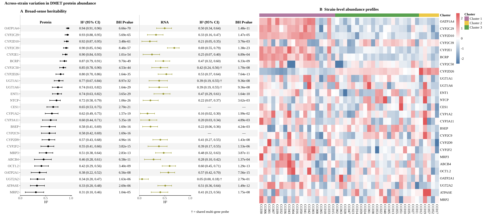{fig-align="center" width="95%"}

::: {.fig-downloads}
Download: [PNG](figures/repbc_2026-10-01/figure2_heritability_profiles_split.png){download="figure2_heritability_profiles_split.png"} · [PDF](figures/repbc_2026-10-01/figure2_heritability_profiles_split.pdf){download="figure2_heritability_profiles_split.pdf"} · [CSV](figures/repbc_2026-10-01/figure2_heritability_protein_and_transcript.csv){download="figure2_heritability_protein_and_transcript.csv"}
:::

Protein H² is the strain share of replicate variance (random-intercept REML on the Box-Cox replicates) with parametric-bootstrap 95% intervals; transcript H² uses individual-sample RINT values with scan date as a fixed effect. † marks a shared multi-gene probe and — a protein without a defensible transcript pair. Alternative layouts: [single panel (PNG)](figures/repbc_2026-10-01/figure2_heritability_profiles_blackgreen.png){download="figure2_heritability_profiles_blackgreen.png"} · [combined colours (PNG)](figures/repbc_2026-10-01/figure2_heritability_profiles.png){download="figure2_heritability_profiles.png"}.

### Protein–transcript pairing

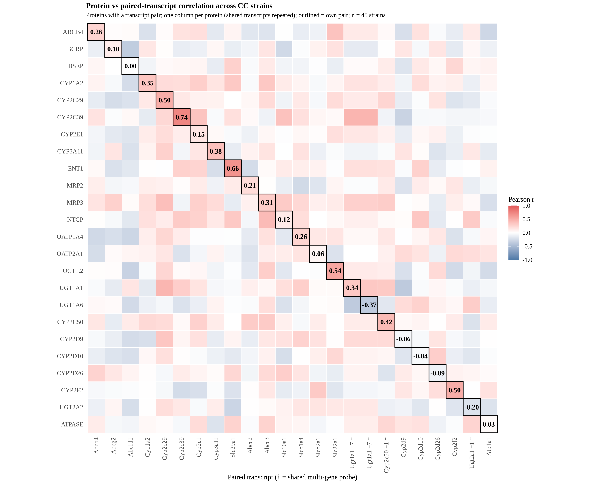{fig-align="center" width="95%"}

::: {.fig-downloads}
Download: [PNG](figures/repbc_2026-10-01/protein_transcript_correlation_heatmap.png){download="protein_transcript_correlation_heatmap.png"} · [PDF](figures/repbc_2026-10-01/protein_transcript_correlation_heatmap.pdf){download="protein_transcript_correlation_heatmap.pdf"}
:::

Proteins were paired to transcripts from the measured peptide, not the protein name ([pairing table (CSV)](figures/repbc_2026-10-01/protein_transcript_pairs.csv){download="protein_transcript_pairs.csv"}). Proteins with no pair (CES1, CYP2C9) are omitted.

### Protein correlations

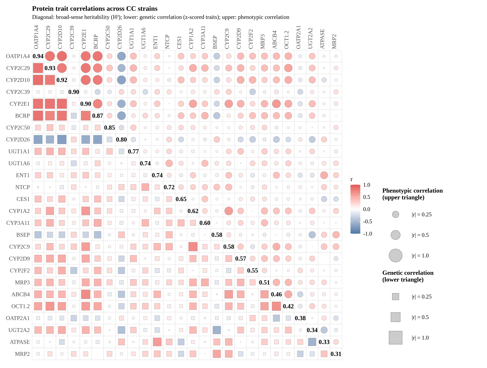{fig-align="center" width="95%"}

::: {.fig-downloads}
Download: [PNG](figures/repbc_2026-10-01/protein_genetic_phenotypic_correlation_heatmap.png){download="protein_genetic_phenotypic_correlation_heatmap.png"} · [PDF](figures/repbc_2026-10-01/protein_genetic_phenotypic_correlation_heatmap.pdf){download="protein_genetic_phenotypic_correlation_heatmap.pdf"}
:::

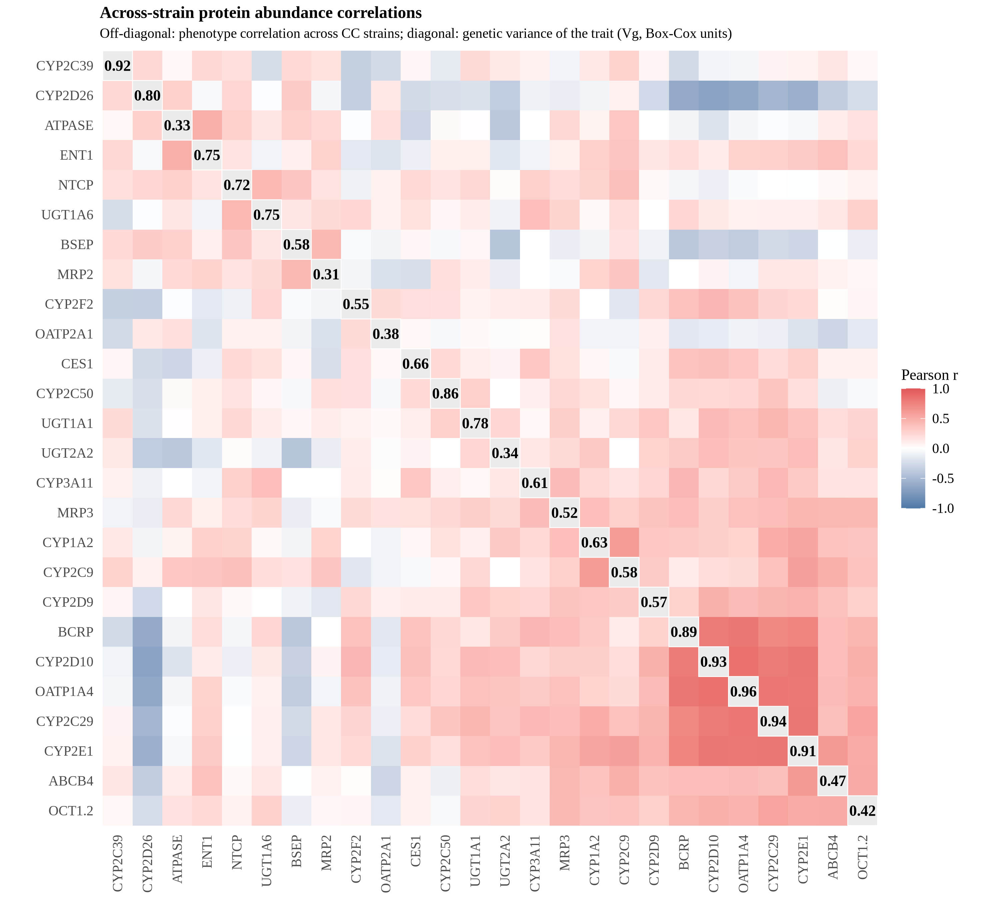{fig-align="center" width="95%"}

::: {.fig-downloads}
Download: [PNG](figures/repbc_2026-10-01/protein_phenotype_correlation_heatmap.png){download="protein_phenotype_correlation_heatmap.png"} · [PDF](figures/repbc_2026-10-01/protein_phenotype_correlation_heatmap.pdf){download="protein_phenotype_correlation_heatmap.pdf"}
:::

Genetic covariance was estimated on z-scored traits (method of moments on CC-line means, REML genetic variances), so genetic variances are on a common scale; correlations and H² are unaffected by the scaling. Matrices: [genetic covariance (CSV)](figures/repbc_2026-10-01/protein_genetic_correlation_H2_diagonal_genetic_covariance.csv){download="protein_genetic_correlation_H2_diagonal_genetic_covariance.csv"} · [genetic correlation (CSV)](figures/repbc_2026-10-01/protein_genetic_correlation_H2_diagonal_genetic_correlation.csv){download="protein_genetic_correlation_H2_diagonal_genetic_correlation.csv"}.

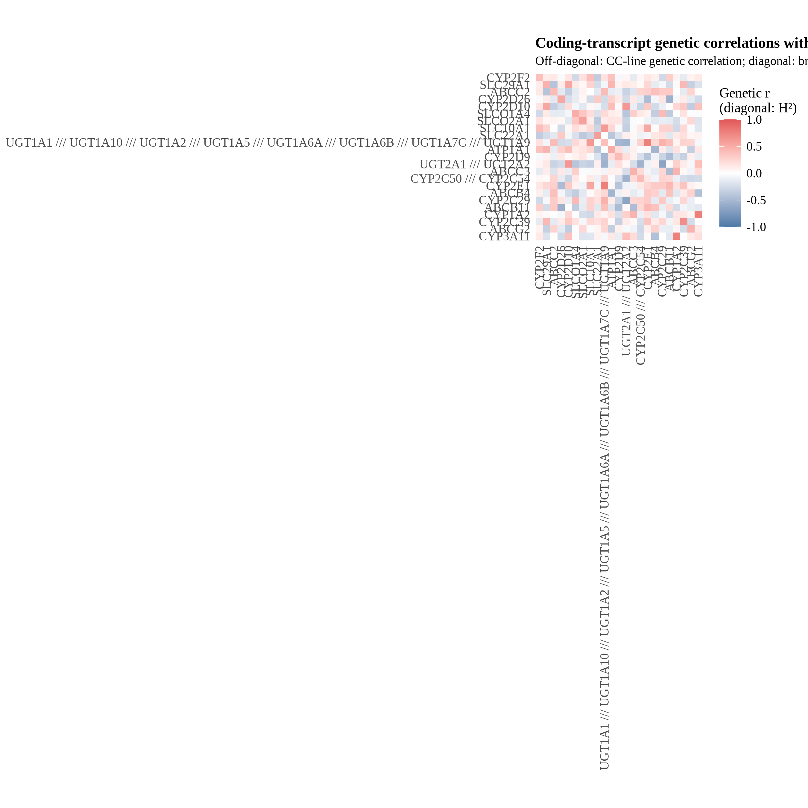{fig-align="center" width="95%"}

::: {.fig-downloads}
Download: [PNG](figures/repbc_2026-10-01/transcript_genetic_correlation_H2_diagonal.png){download="transcript_genetic_correlation_H2_diagonal.png"} · [PDF](figures/repbc_2026-10-01/transcript_genetic_correlation_H2_diagonal.pdf){download="transcript_genetic_correlation_H2_diagonal.pdf"}
:::

## Genome-wide QTL overview

### pQTL

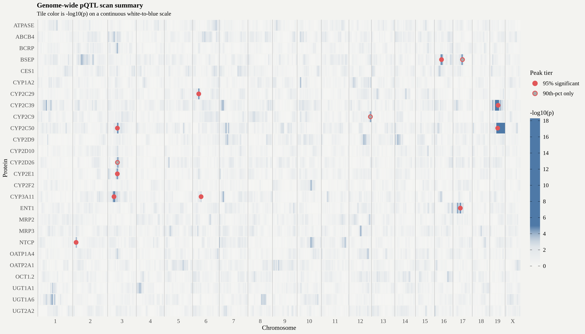{fig-align="center" width="95%"}

::: {.fig-downloads}
Download: [PNG](figures/repbc_2026-10-01/figure3_pqtl_genome_heatmap.png){download="figure3_pqtl_genome_heatmap.png"} · [PDF](figures/repbc_2026-10-01/figure3_pqtl_genome_heatmap.pdf){download="figure3_pqtl_genome_heatmap.pdf"} · [CSV](figures/repbc_2026-10-01/figure3_pqtl_scan_values.csv){download="figure3_pqtl_scan_values.csv"} · [CSV](figures/repbc_2026-10-01/figure3_pqtl_significant_peaks.csv){download="figure3_pqtl_significant_peaks.csv"}
:::

Chromosomes with significant peaks for two or more proteins are shown as overlays (line opacity scales with the chromosome-wide signal) and as zoomed heatmaps.

{fig-align="center" width="95%"}

::: {.fig-downloads}
Download: [PNG](figures/repbc_2026-10-01/figure3_pqtl_overlay_chr12.png){download="figure3_pqtl_overlay_chr12.png"} · [PDF](figures/repbc_2026-10-01/figure3_pqtl_overlay_chr12.pdf){download="figure3_pqtl_overlay_chr12.pdf"}
:::

{fig-align="center" width="95%"}

::: {.fig-downloads}
Download: [PNG](figures/repbc_2026-10-01/figure3_pqtl_overlay_chr12_with90.png){download="figure3_pqtl_overlay_chr12_with90.png"} · [PDF](figures/repbc_2026-10-01/figure3_pqtl_overlay_chr12_with90.pdf){download="figure3_pqtl_overlay_chr12_with90.pdf"}
:::

{fig-align="center" width="95%"}

::: {.fig-downloads}
Download: [PNG](figures/repbc_2026-10-01/figure3_pqtl_overlay_chr17.png){download="figure3_pqtl_overlay_chr17.png"} · [PDF](figures/repbc_2026-10-01/figure3_pqtl_overlay_chr17.pdf){download="figure3_pqtl_overlay_chr17.pdf"}
:::

{fig-align="center" width="95%"}

::: {.fig-downloads}
Download: [PNG](figures/repbc_2026-10-01/figure3_pqtl_overlay_chr17_with90.png){download="figure3_pqtl_overlay_chr17_with90.png"} · [PDF](figures/repbc_2026-10-01/figure3_pqtl_overlay_chr17_with90.pdf){download="figure3_pqtl_overlay_chr17_with90.pdf"}
:::

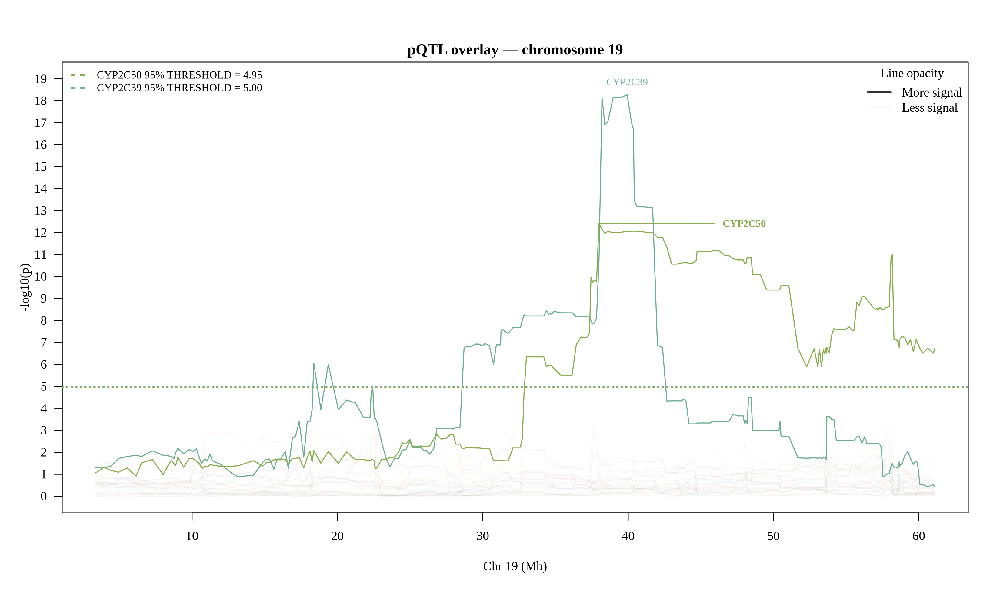{fig-align="center" width="95%"}

::: {.fig-downloads}
Download: [PNG](figures/repbc_2026-10-01/figure3_pqtl_overlay_chr19.png){download="figure3_pqtl_overlay_chr19.png"} · [PDF](figures/repbc_2026-10-01/figure3_pqtl_overlay_chr19.pdf){download="figure3_pqtl_overlay_chr19.pdf"}
:::

{fig-align="center" width="95%"}

::: {.fig-downloads}
Download: [PNG](figures/repbc_2026-10-01/figure3_pqtl_overlay_chr19_with90.png){download="figure3_pqtl_overlay_chr19_with90.png"} · [PDF](figures/repbc_2026-10-01/figure3_pqtl_overlay_chr19_with90.pdf){download="figure3_pqtl_overlay_chr19_with90.pdf"}
:::

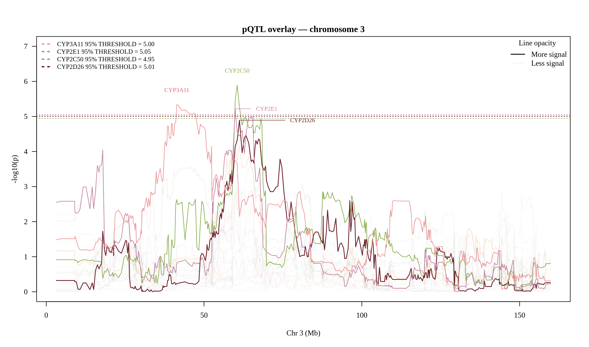{fig-align="center" width="95%"}

::: {.fig-downloads}
Download: [PNG](figures/repbc_2026-10-01/figure3_pqtl_overlay_chr3.png){download="figure3_pqtl_overlay_chr3.png"} · [PDF](figures/repbc_2026-10-01/figure3_pqtl_overlay_chr3.pdf){download="figure3_pqtl_overlay_chr3.pdf"}
:::

{fig-align="center" width="95%"}

::: {.fig-downloads}
Download: [PNG](figures/repbc_2026-10-01/figure3_pqtl_overlay_chr3_with90.png){download="figure3_pqtl_overlay_chr3_with90.png"} · [PDF](figures/repbc_2026-10-01/figure3_pqtl_overlay_chr3_with90.pdf){download="figure3_pqtl_overlay_chr3_with90.pdf"}
:::

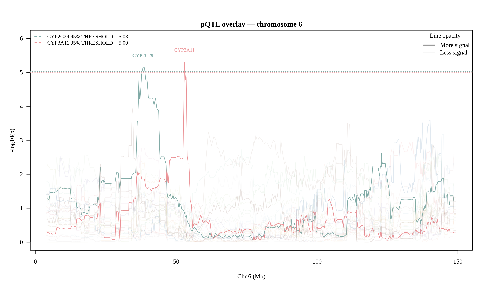{fig-align="center" width="95%"}

::: {.fig-downloads}
Download: [PNG](figures/repbc_2026-10-01/figure3_pqtl_overlay_chr6.png){download="figure3_pqtl_overlay_chr6.png"} · [PDF](figures/repbc_2026-10-01/figure3_pqtl_overlay_chr6.pdf){download="figure3_pqtl_overlay_chr6.pdf"}
:::

{fig-align="center" width="95%"}

::: {.fig-downloads}
Download: [PNG](figures/repbc_2026-10-01/figure3_pqtl_overlay_chr6_with90.png){download="figure3_pqtl_overlay_chr6_with90.png"} · [PDF](figures/repbc_2026-10-01/figure3_pqtl_overlay_chr6_with90.pdf){download="figure3_pqtl_overlay_chr6_with90.pdf"}
:::

_Figure not available yet: `figure3_pqtl_zoom_chr12`._

_Figure not available yet: `figure3_pqtl_zoom_chr12_with90`._

_Figure not available yet: `figure3_pqtl_zoom_chr17`._

_Figure not available yet: `figure3_pqtl_zoom_chr17_with90`._

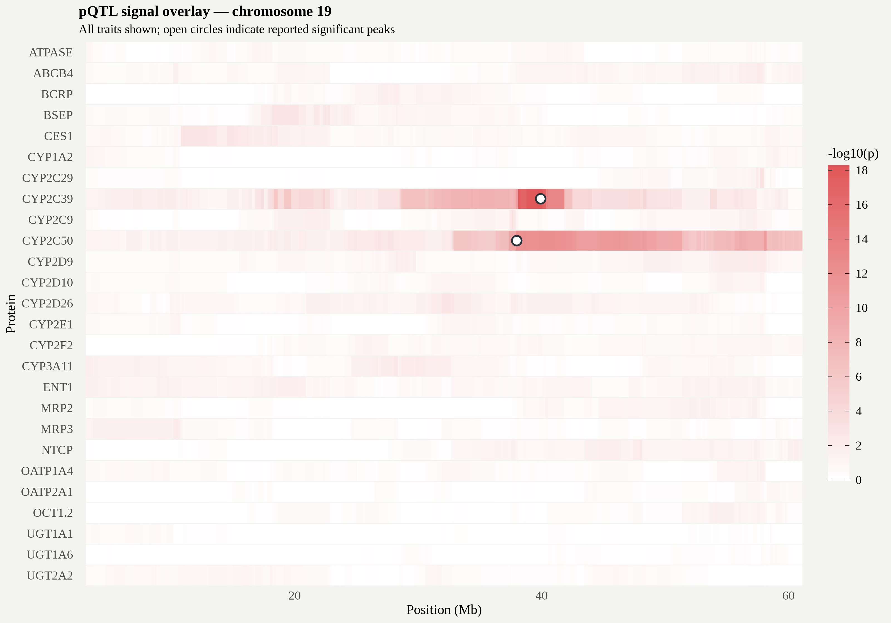{fig-align="center" width="95%"}

::: {.fig-downloads}
Download: [PNG](figures/repbc_2026-10-01/figure3_pqtl_zoom_chr19.png){download="figure3_pqtl_zoom_chr19.png"} · [PDF](figures/repbc_2026-10-01/figure3_pqtl_zoom_chr19.pdf){download="figure3_pqtl_zoom_chr19.pdf"}
:::

_Figure not available yet: `figure3_pqtl_zoom_chr19_with90`._

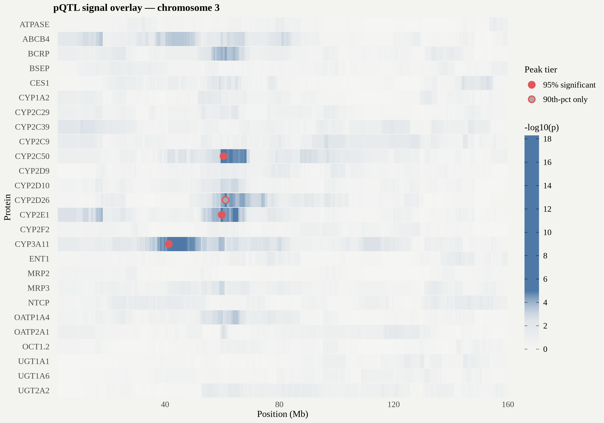{fig-align="center" width="95%"}

::: {.fig-downloads}
Download: [PNG](figures/repbc_2026-10-01/figure3_pqtl_zoom_chr3.png){download="figure3_pqtl_zoom_chr3.png"} · [PDF](figures/repbc_2026-10-01/figure3_pqtl_zoom_chr3.pdf){download="figure3_pqtl_zoom_chr3.pdf"}
:::

_Figure not available yet: `figure3_pqtl_zoom_chr3_with90`._

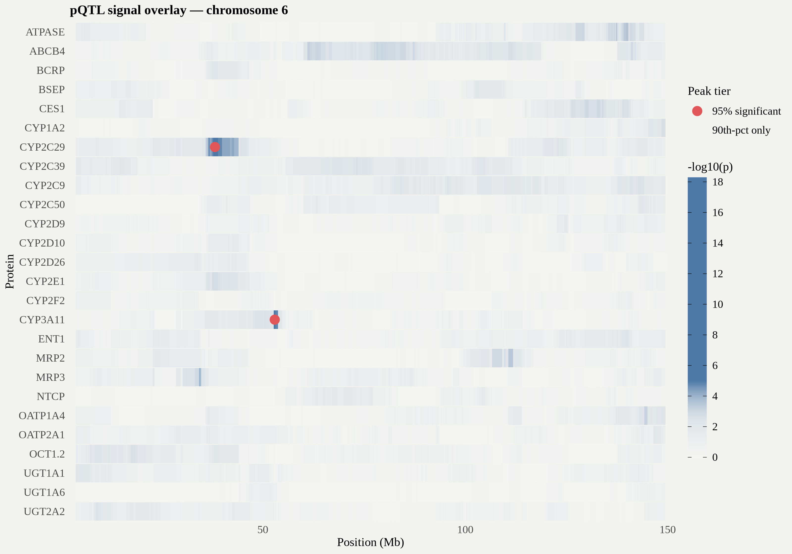{fig-align="center" width="95%"}

::: {.fig-downloads}
Download: [PNG](figures/repbc_2026-10-01/figure3_pqtl_zoom_chr6.png){download="figure3_pqtl_zoom_chr6.png"} · [PDF](figures/repbc_2026-10-01/figure3_pqtl_zoom_chr6.pdf){download="figure3_pqtl_zoom_chr6.pdf"}
:::

_Figure not available yet: `figure3_pqtl_zoom_chr6_with90`._

### eQTL

{fig-align="center" width="95%"}

::: {.fig-downloads}
Download: [PNG](figures/repbc_2026-10-01/figure3_eqtl_location_heatmap.png){download="figure3_eqtl_location_heatmap.png"} · [PDF](figures/repbc_2026-10-01/figure3_eqtl_location_heatmap.pdf){download="figure3_eqtl_location_heatmap.pdf"}
:::

The eQTL map is built from the corrected RNA data (rerun_2026-09-27_rna_v2); it does not depend on the protein normalization.

## Protein variation and transcriptome context

### Protein clustering

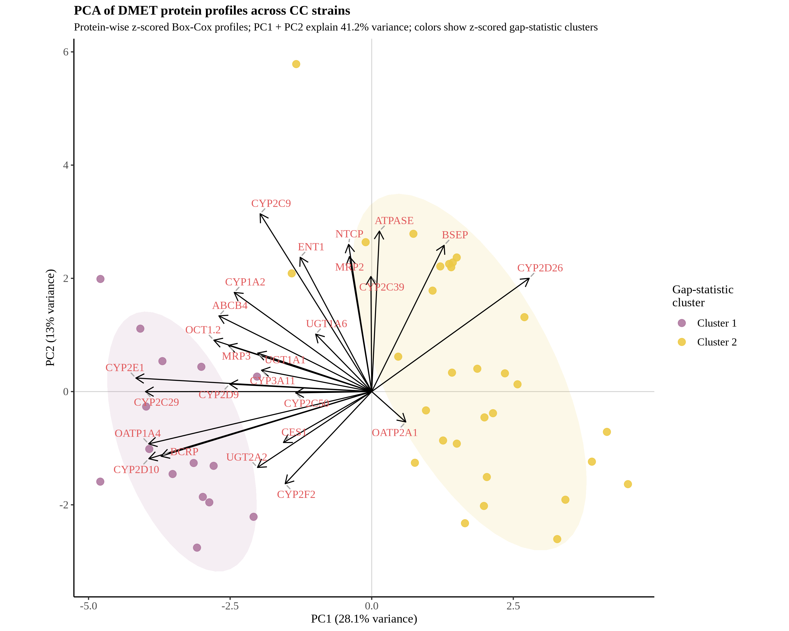{fig-align="center" width="95%"}

::: {.fig-downloads}
Download: [PNG](figures/repbc_2026-10-01/protein_pca_biplot.png){download="protein_pca_biplot.png"} · [PDF](figures/repbc_2026-10-01/protein_pca_biplot.pdf){download="protein_pca_biplot.pdf"}
:::

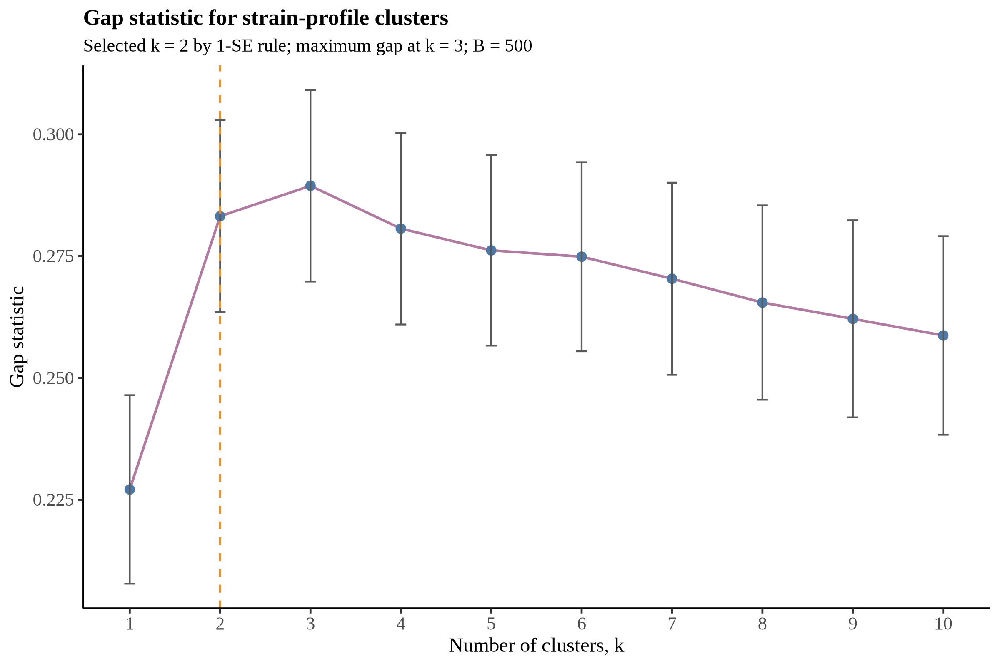{fig-align="center" width="60%"}

::: {.fig-downloads}
Download: [PNG](figures/repbc_2026-10-01/protein_cluster_gapstat.png){download="protein_cluster_gapstat.png"} · [PDF](figures/repbc_2026-10-01/protein_cluster_gapstat.pdf){download="protein_cluster_gapstat.pdf"}
:::

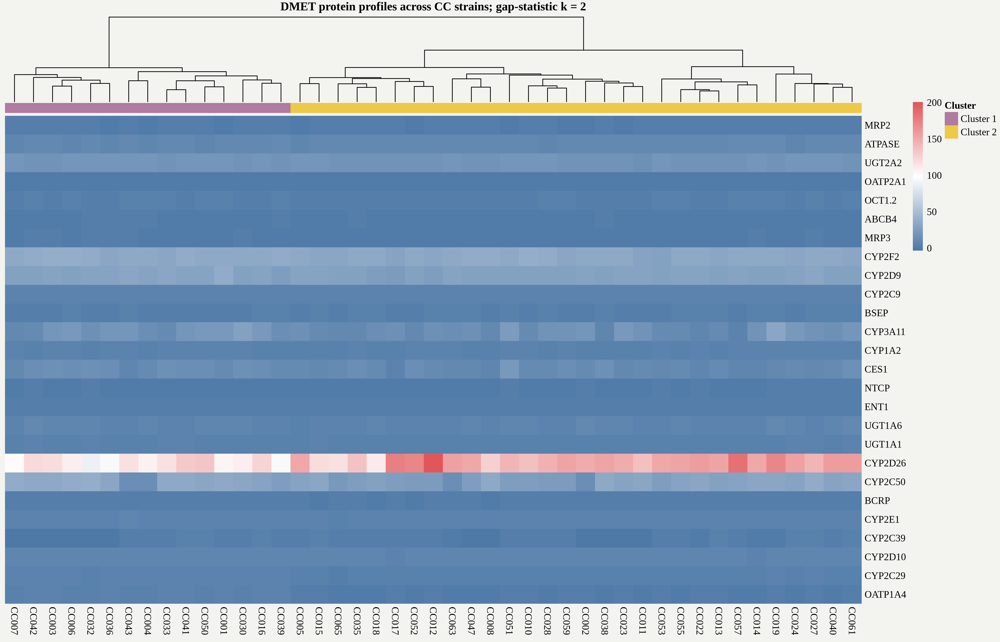{fig-align="center" width="95%"}

::: {.fig-downloads}
Download: [PNG](figures/repbc_2026-10-01/protein_cluster_heatmap.png){download="protein_cluster_heatmap.png"} · [PDF](figures/repbc_2026-10-01/protein_cluster_heatmap.pdf){download="protein_cluster_heatmap.pdf"}
:::

### Transcriptome

{fig-align="center" width="95%"}

::: {.fig-downloads}
Download: [PNG](figures/repbc_2026-10-01/transcriptome_rint_hierarchical_heatmap.png){download="transcriptome_rint_hierarchical_heatmap.png"} · [PDF](figures/repbc_2026-10-01/transcriptome_rint_hierarchical_heatmap.pdf){download="transcriptome_rint_hierarchical_heatmap.pdf"}
:::

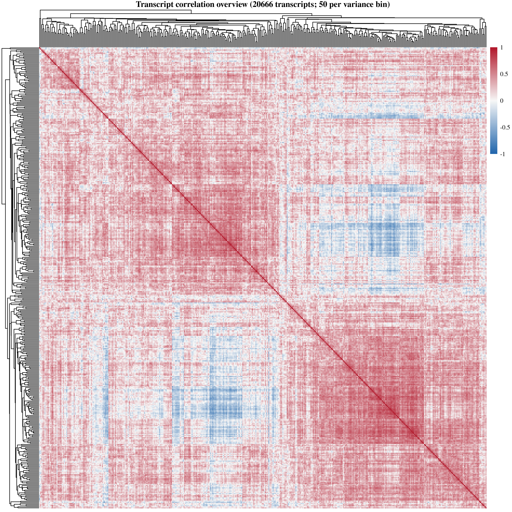{fig-align="center" width="95%"}

::: {.fig-downloads}
Download: [PNG](figures/repbc_2026-10-01/transcriptome_rint_all_transcript_binned_correlation.png){download="transcriptome_rint_all_transcript_binned_correlation.png"} · [PDF](figures/repbc_2026-10-01/transcriptome_rint_all_transcript_binned_correlation.pdf){download="transcriptome_rint_all_transcript_binned_correlation.pdf"}
:::

The correlation overview bins transcripts by expression variance for display; it is not the full 20,666 × 20,666 matrix.

## Follow-up coverage

Mediation, TIMBR and Merge were run at every significant locus; what is currently available is itemised in [Analysis progress](status.qmd).

### Locus follow-up summary

Per significant locus: the top Merge SDP (founder-haplotype split), the highest-posterior TIMBR allelic series at the peak, and the transcripts for which mediation is the top-supported model. [Download (CSV)](figures/repbc_2026-10-01/pqtl_followup_summary.csv){download="pqtl_followup_summary.csv"}.

| Protein | Peak (chr:Mb) | pQTL type | Top SDP | Top TIMBR allelic series | Mediators |
|---|---|---|---|---|---|
| ENT1 | 17:47.35 | cis | 0,0,0,0,1,0,0,1 | 0,0,0,0,0,0,0,1 | Glo1, Pex6, Ppp1r10, Slc29a1 |
| NTCP | 2:19.65 | trans | 0,1,2,0,1,1,1,0 | 0,0,1,0,0,0,0,0 | — |
| CYP2C50 | 19:37.99 | cis | 0,1,0,0,1,1,2,0 | 0,1,0,0,0,1,2,0 | Cyp2c37, Cyp2c38, Cyp2c39, Mms19 |
| CYP2C50 | 3:60.51 | trans | 0,1,1,1,1,1,0,1 | 0,1,1,1,1,1,0,1 | E130311K13Rik, Mfsd1, Sfxn2, Sh3pxd2a, Tmem144 |
| CYP2E1 | 3:59.86 | trans | 0,1,1,2,2,0,1,2 | 0,1,1,1,1,0,1,1 | — |
| CYP2C29 | 6:38.19 | trans | 0,1,2,2,1,1,1,2 | 0,1,0,1,1,1,1,1 | Fam13a, Snx10, Tpk1 |
| BSEP | 16:38.15 | trans | 0,1,2,3,3,0,4,5 | 0,1,0,1,1,0,0,1 | — |
| CYP2C39 | 19:39.93 | cis | 0,1,0,0,0,2,2,0 | 0,1,0,0,0,2,2,0 | Cyp2c38, Cyp2c39 |
| CYP3A11 | 3:41.34 | trans | 0,1,0,0,0,0,0,1 | 0,0,0,1,1,1,1,0 | Eif2a, Ggct |
| CYP3A11 | 6:52.95 | trans | 0,1,1,1,1,2,2,2 | 0,1,1,1,1,1,1,1 | Agbl3, Ggct, Tcaf1 |
